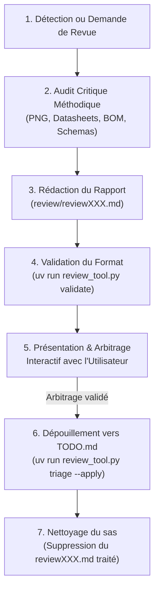

# Skill : Review (Audit Technique & Dépouillement de Revues Matérielles)

Ce skill fournit un **cadre méthodologique et algorithmique complet** pour la conduite, la validation formelle et le dépouillement interactif des revues de conception électronique (schéma, nomenclature BOM, layout PCB, routage et conformité automobile).

Conformément à la règle `## 0.` d'[`AGENTS.md`](../../../AGENTS.md), ce skill est **totalement agnostique** :
* Aucun composant, net ou valeur n'est codé en dur dans les scripts Python.
* Il manipule des abstractions (règles de conception, vérifications de seuils logiques, boucles de commutation, critères thermiques).
* Toutes les données d'entrée proviennent des fichiers du projet (`BOM.md`, `floorplan.json`, `review/*.md`), des arguments CLI ou des configurations JSON.

---

## 0. Posture de l'Auditeur : Tabula Rasa & Preuve Matérielle Exclusive

> [!IMPORTANT]
> **Règle d'Or de l'Audit : Oubli de Mémoire & Impartialité Totale**
> Pendant toute la durée de la revue technique, l'agent reviewer **doit impérativement faire abstraction totale de toute mémoire antérieure ou connaissance préalable du projet**. Il doit adopter la posture stricte et impartiale d'un auditeur externe découvrant le circuit pour la toute première fois.

1. **Aucun recours aux souvenirs ou présomptions :**
   L'agent ne doit jamais présumer qu'un choix est « normal », « déjà validé » ou « évident » sous prétexte qu'il en aurait été discuté dans des échanges antérieurs. Toute décision non formalisée dans les fichiers versionnés est réputée inexistante.
2. **Analyse basée exclusivement sur les fichiers physiques du projet (*Evidence-Based*) :**
   Chaque observation doit être solidement étayée par des éléments directement observables et vérifiables dans le dépôt :
   * **Exports graphiques haute résolution :** Inspection visuelle méticuleuse des schémas électriques ([`images/SCH_*.png`](../../../images/)), du circuit imprimé ([`images/PCB.png`](../../../images/PCB.png)) et des rendus mécaniques 3D.
   * **Documents contractuels et nomenclature :** [`BOM.md`](../../../BOM.md), [`HARDWARE.md`](../../../HARDWARE.md), [`floorplan.json`](../../../floorplan.json) et état d'avancement réel dans [`TODO.md`](../../../TODO.md).
   * **Datasheets constructeurs officielles :** Fichiers PDF originaux archivés dans [`datasheet/`](../../../datasheet/) et synthèse d'audit dans [`DATASHEETS.md`](../../../DATASHEETS.md).
3. **Confrontation critique obligatoire :**
   Une documentation interne ou une consigne préalable dans `TODO.md` ne doit jamais être prise pour argent comptant. L'auditeur a le devoir impératif de confronter chaque recommandation à la réalité de la datasheet constructeur (ex. vérifier la structure interne réelle d'une broche de transceiver avant de préconiser un changement de rail d'alimentation). Si les documents du projet contiennent une incohérence ou une fausse piste technique, l'auditeur doit la dénoncer et la réfuter avec calculs et extraits de datasheet à l'appui.

---

## 1. Arborescence du Skill

```
.agents/skills/review/
├── SKILL.md                          # Documentation et guide méthodologique (ce fichier)
├── scripts/
│   ├── review_tool.py                # Moteur CLI agnostique : génération, validation et dépouillement
│   └── schematic_auditor.py          # Auditeur algorithmique automatique contre règles de conception
└── templates/
    └── audit_rules.json              # Référentiel de règles d'audit (niveaux logiques, CEM, thermique)
```

> [!NOTE]
> **Source Unique de Vérité (SSOT) :** Le modèle type de revue n'est pas dupliqué. Il est extrait dynamiquement par `review_tool.py generate` directement depuis la Section 5 de [`review/guidelines.md`](../../../review/guidelines.md).

---

## 2. Grille d'Audit Méthodique en 6 Axes

Lors de toute revue de schéma électronique ou d'architecture, l'agent reviewer doit examiner systématiquement ces 6 axes critiques :

### Axe 1 : Alimentation & Survie Électrique
* **Plafond absolu de tension ($V_{IN\text{, abs}}$) :** Comparer la tension de serrage crête de la diode TVS ($V_{CL}$) avec le seuil destructeur absolu du régulateur aval (ex. Buck 30V max face à transitoires 12V alternateur).
* **Protection de grille des MOSFETs ($V_{GS}$) :** S'assurer que toute grille connectée à un potentiel d'entrée variable dispose d'un diviseur ou d'un clamp Zener pour ne jamais dépasser sa limite absolue ($\pm 20\,\text{V}$).
* **Anti-inversion & Fusible réarmable (PPTC) :** Vérifier l'orientation de la diode de substrat (body diode) du P-MOSFET et le déclassement thermique du fusible à 60°C–70°C en habitacle ($I_H$ réduit de ~30%).

### Axe 2 : Régulation & Boucles d'Asservissement
* **Régulateur à découpage (Buck) :**
  - Vérifier la présence d'un condensateur de démarrage progressif (*Slow-Start* sur broche SS) pour limiter l'inrush current et l'overshoot au branchement.
  - Vérifier le réseau de compensation petit-signal (marge de phase $\Phi_m > 60^\circ$ et marge de gain $> 10\,\text{dB}$).
* **Régulateur Linéaire LDO :**
  - Respect strict de la capacité de sortie minimale ($C_{OUT} \ge 4.7\,\mu\text{F}$) directement au contact de la broche $V_{OUT}$.
  - **Interdiction formelle** de placer une perle de ferrite directement en sortie sans condensateur amont (risque d'oscillation LC haute fréquence).

### Axe 3 : Transceivers de Bus & Adaptation Logique
* **Polarisations & Modes :**
  - Vérifier que les broches de contrôle de mode (ex. broche `S` Silent Mode sur transceiver CAN) sont tirées au potentiel actif (masse).
  - Vérifier que la masse de référence de chaque IC est bien raccordée à GND (absence de court-circuit VCC-GND).
* **Niveaux logiques et tolérance 5V :**
  - **Alerte absolue :** Les microcontrôleurs 3.3V (ex. ESP32-S3) ne tolèrent pas 5V ($V_{IO\text{, max}} = 3.60\,\text{V}$).
  - Vérifier si les sorties des transceivers possèdent une pull-up interne vers leur rail d'alimentation avant d'envisager une alimentation en 5V.
  - Utiliser une broche $V_{IO}$ dédiée (ex. TJA1051T/3) ou un translateur de niveau adapté.

### Axe 4 : Microcontrôleur & Strapping de Démarrage
* **Immunité du Reset ($EN$) :** Réseau RC externe (10 kΩ / 1 µF, $\tau \ge 10\,\text{ms}$) collé à la broche pour éviter les resets intempestifs sous émission RF.
* **Broches de Strapping (Boot) :** Pull-up externe solide (10 kΩ) sur les broches critiques (ex. GPIO0) pour immuniser le démarrage contre les bruits captés par les pastilles de test.
* **Assignation des broches (Pinout) :**
  - Éviter d'assigner des signaux de bus de puissance ou de communication sur les broches de console système (UART0) sous peine de cracher des trames ASCII au boot.
  - Vérifier la compatibilité des canaux analogiques ADC avec l'activation de la radio Wi-Fi.

### Axe 5 : CEM, Découplage & Protections Frontières
* **Frontière connecteur :** Diodes TVS, pontages et filtres ESD positionnés immédiatement aux broches d'entrée des connecteurs externes.
* **Découplage local :** Chaque broche d'alimentation d'IC doit posséder son condensateur céramique haute fréquence (100 nF) raccordé au plus court (< 2 mm).
* **Filtres en Pi :** Cellules $C - \text{Ferrite} - C$ bien amorties pour isoler les domaines numériques bruyants des domaines analogiques/RF.

### Axe 6 : Thermique, Boîtiers & Nomenclature (DFM)
* **Dissipation sous charge :** Calcul de $P_D = \Delta V \times I$ sur les régulateurs linéaires et diodes de redressement USB face aux consommations crêtes.
* **Bascule Basic Parts :** Remplacement systématique des composants passifs ou discrets *Extended* par des *Basic Parts* du catalogue d'assemblage CMS (JLCPCB) pour minimiser les coûts.

---

## 3. Utilisation de l'Outil CLI (`scripts/review_tool.py`)

> [!IMPORTANT]
> Tous les scripts doivent être exécutés via `uv run` conformément aux règles du projet.

### A. Générer un squelette de revue vierge normalisé
Extrait le modèle directement de la Section 5 de [`review/guidelines.md`](../../../review/guidelines.md) et génère le prochain fichier disponible (ex. `review/review001.md`, `review/review002.md`) :
```bash
uv run .agents/skills/review/scripts/review_tool.py generate
```
Pour spécifier un chemin précis ou pointer vers un autre fichier de guidelines :
```bash
uv run .agents/skills/review/scripts/review_tool.py generate -o review/review_audit.md --guidelines review/guidelines.md
```

### B. Valider la conformité d'un rapport de revue
Vérifie la présence de toutes les métadonnées obligatoires, du résumé exécutif et du formatage rigoureux de chaque observation (champs Composants, Constat, Justification, Solution) :
```bash
uv run .agents/skills/review/scripts/review_tool.py validate review/review.md
```
Pour intégration automatisée par un agent (sortie JSON) :
```bash
uv run .agents/skills/review/scripts/review_tool.py validate review/review.md --json
```

### C. Dépouiller une revue vers `TODO.md` (Triage & Arbitrage)
Affiche le bloc d'actions formaté en cases à cocher hiérarchisées (`🔴 Bloquant`, `🟠 Important`, `🟢 Mineur`) et détecte d'éventuelles collisions avec le `TODO.md` existant :
```bash
uv run .agents/skills/review/scripts/review_tool.py triage review/review.md --todo-file TODO.md
```

Après validation et accord explicite de l'utilisateur, insérer les tâches directement sous la section ciblée :
```bash
uv run .agents/skills/review/scripts/review_tool.py triage review/review.md --todo-file TODO.md --section "### 1.1 Correctifs critiques" --apply
```

Pour supprimer le fichier de revue traité une fois l'intégration terminée (conformément à la règle 5) :
```bash
uv run .agents/skills/review/scripts/review_tool.py triage review/review.md --todo-file TODO.md --apply --delete-review
```

---

## 4. Auditeur Automatique de Règles (`scripts/schematic_auditor.py`)

Permet d'exécuter un premier niveau de vérification statique agnostique sur une nomenclature Markdown ou une netlist :
```bash
uv run .agents/skills/review/scripts/schematic_auditor.py --rules .agents/skills/review/templates/audit_rules.json --bom BOM.md
```
Sortie JSON pour traitement programmatique :
```bash
uv run .agents/skills/review/scripts/schematic_auditor.py --rules .agents/skills/review/templates/audit_rules.json --bom BOM.md --json
```

---

## 5. Cycle de Vie d'une Revue (Règle 5 `AGENTS.md`)


