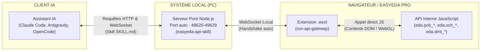

# Automatisation IA via EasyEDA Pro

Ce document détaille l'infrastructure logicielle permettant à un assistant IA (Claude Code, Antigravity, OpenCode, Codex...) de piloter directement le schéma et le PCB en temps réel dans EasyEDA Pro via le skill officiel [easyeda/easyeda-api-skill](https://github.com/easyeda/easyeda-api-skill).

---

## 1. Architecture du Pont d'Automatisation

L'API d'EasyEDA Pro n'existe que dans le contexte JavaScript du navigateur web. Pour permettre à une IA locale d'exécuter des commandes, un pont bidirectionnel est mis en place :



Deux briques distinctes composent ce pont :
- **Serveur Node.js :** Relancé à chaque session (ou via hook de cycle de vie automatique).
- **Extension `.eext` :** Importée une seule fois dans le client EasyEDA Pro (Settings → Extensions → Extension Manager).

---

## 2. Installation & Démarrage Manuel

### 2.1 Serveur de pont Node.js

```bash
git clone https://github.com/easyeda/easyeda-api-skill
cd easyeda-api-skill
npm install
npm run build:docs   # Génère la documentation API structurée
npm run server       # Démarre le pont WebSocket/HTTP (port 49620-49629)
```

### 2.2 Extension EasyEDA Pro (`run-api-gateway.eext`)

1. Télécharger `run-api-gateway.eext` depuis <https://jlc-ext.com/item/oshwhub/run-api-gateway>.
2. Dans EasyEDA Pro : **Settings → Extensions → Extension Manager → Import Extension**.
3. Sélectionner le fichier et vérifier que **"Allow External Interaction"** reste activé.
4. Ouvrir `ODB2-Scanner.eprj2` : l'extension se connecte automatiquement au serveur en validant le handshake (`service: "easyeda-bridge"`).

---

## 3. Automatisation sous Antigravity (Lifecycle Hook)

Pour éviter d'avoir à lancer manuellement le serveur à chaque session :

* **Hook de cycle de vie :** Configuré dans [`.agents/hooks.json`](.agents/hooks.json) appelant le script [`.agents/ensure-bridge.mjs`](.agents/ensure-bridge.mjs).
* **Déclenchement automatique :** Dès qu'une invite commence (`PreInvocation`), le script vérifie si le port `49620` répond. Si le pont est inactif, il est démarré automatiquement en arrière-plan détaché (logs dans `.agents/easyeda-bridge.log`).
* **Test manuel du pont :**
  ```bash
  # Vérifier l'état de santé
  curl http://localhost:49620/health

  # Exécuter une commande API
  curl -X POST http://localhost:49620/execute \
    -H "Content-Type: application/json" \
    -d '{"code": "return await eda.dmt_Project.getCurrentProjectInfo();"}'
  ```

---

## 4. Modules API Pertinents pour ce Projet

| Préfixe | Domaine | Classes clés utiles au projet `ODB2-Scanner` |
| :--- | :--- | :--- |
| `PCB_` | PCB & Footprint | `PrimitiveLine` (pistes), `PrimitiveVia` (vias), `PrimitivePour` (plans de masse), `PrimitivePad`, `Drc` (règles de conception), `Net`, `Layer` |
| `DMT_` | Gestion document | `Project`, `Pcb`, `Board`, `EditorControl` |
| `SCH_` | Schématique | `PrimitiveComponent`, `PrimitiveWire` |
| `EPCB_` / `ESCH_` | Énumérations | `LayerId`, `PrimitiveType`, `PadType` |

### Exemple de tracé de piste (coordonnées en mil)

```javascript
await eda.pcb_PrimitiveLine.create(
  "GND",              // Nom du net
  EPCB_LayerId.TOP,   // Couche (énumération)
  0, 0,               // startX, startY
  100, 0              // endX, endY
);
```

### Exemple de déplacement d'un élément existant (pattern asynchrone)

```javascript
const prim = await eda.pcb_PrimitiveVia.get([viaId]);
const asyncPrim = prim.toAsync();
asyncPrim.setState_X(newX);
asyncPrim.setState_Y(newY);
asyncPrim.done();
```

---

## 5. Bonnes Pratiques pour le Routage PCB piloté par IA

1. **Pas d'auto-routeur en aveugle :** L'auto-routeur intégré d'EasyEDA ne respecte pas les contraintes d'intégrité RF, différentielles ou thermiques. L'IA doit raisonner piste par piste.
2. **Relire les positions réelles des pastilles :** Toujours interroger l'API (`pcb_PrimitivePad.get(...)`) plutôt que de se fier à des coordonnées théoriques.
3. **DRC systématique après chaque lot :** Lancer `pcb_Drc` après chaque groupe de pistes tracées pour intercepter les anomalies immédiatement.
4. **Sauvegarde préalable :** Toujours versionner ou sauvegarder `ODB2-Scanner.eprj2` avant un lot de modifications en masse.
5. **Ordre rigoureux de routage :** Paires différentielles USB/CAN d'abord, signaux logiques sensibles ensuite, rails de puissance (12V, 5V, 3.3V) avec largeurs spécifiées enfin.

---

## 6. Répertoire des Skills Spécialisés du Projet

Le projet `ODB2-Scanner` embarque 3 compétences logicielles (*Skills*) autonomes sous `.agents/skills/` exploitées par l'agent IA :

| Skill | Emplacement | Domaine | Rôle & Utilité Opérationnelle |
| :--- | :--- | :--- | :--- |
| 🔌 **`easyeda-api`** | [`.agents/skills/easyeda-api/`](.agents/skills/easyeda-api/SKILL.md) | CAO & PCB | **Pont de pilotage en direct :** Fournit le serveur pont Node.js (port 49620), les types, la documentation des 120+ classes EasyEDA Pro et l'accès à l'API (`eda.pcb_*`, `eda.sch_*`, `eda.dmt_*`) pour automatiser le placement, le routage et les audits sans manipulation humaine hasardeuse. |
| ⚡ **`buck-compensation`** | [`.agents/skills/buck-compensation/`](.agents/skills/buck-compensation/SKILL.md) | Électronique de puissance | **Modélisation & Stabilité de boucle :** Outil de calcul analytique et petit-signal du régulateur Buck TI TPS54331 (réseau Type II Rz, Cz, Cp). Calcule la réponse fréquentielle (Bode), vérifie la stabilité (marge de phase ≥ 45°, marge de gain ≥ 10 dB) et optimise le choix des composants en composants de base (*Basic Parts*) JLCPCB. |
| 📐 **`pcb-placer`** | [`.agents/skills/pcb-placer/`](.agents/skills/pcb-placer/SKILL.md) | CAO & Floorplanning | **Auto-Placement par Contraintes :** Algorithme déterministe d'agencement 2D en une passe pour les 60 composants du PCB sous EasyEDA Pro. Intègre les contraintes CEM (découplage < 2 mm), thermiques (boucle Buck), d'exclusion RF (antenne ESP32-S3), d'audit géométrique pad-à-pad et d'injection en direct. |

---

## 7. Capitalisation Technique

Pour l'ensemble des subtilités d'implémentation, astuces d'API (unités mil, typage des couches, scripts de capture canvas Base64, pièges des signatures d'API), consulter :
👉 **[LEARNINGS.md](LEARNINGS.md)**.
