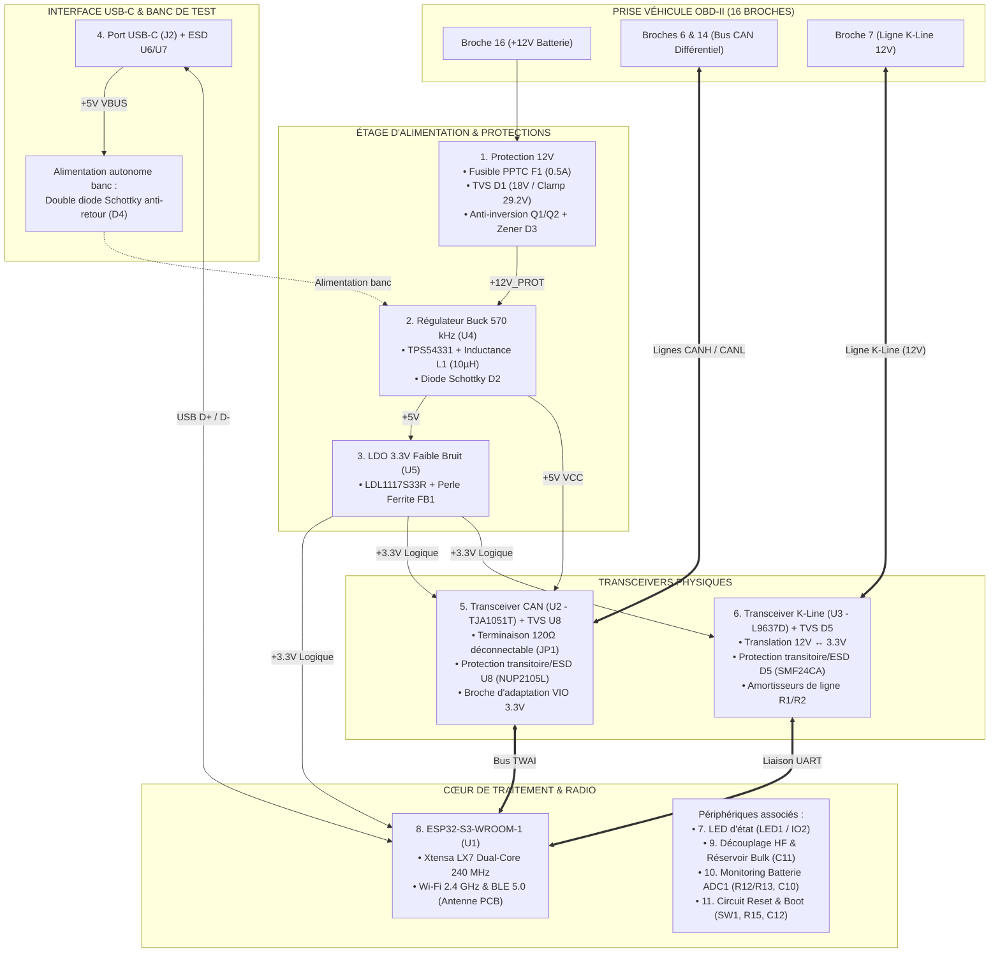
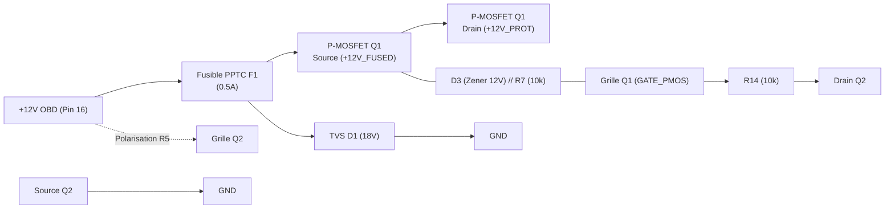
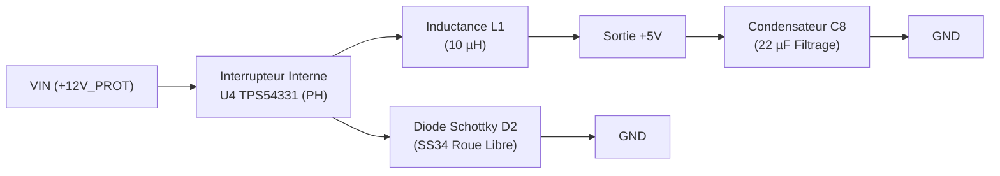
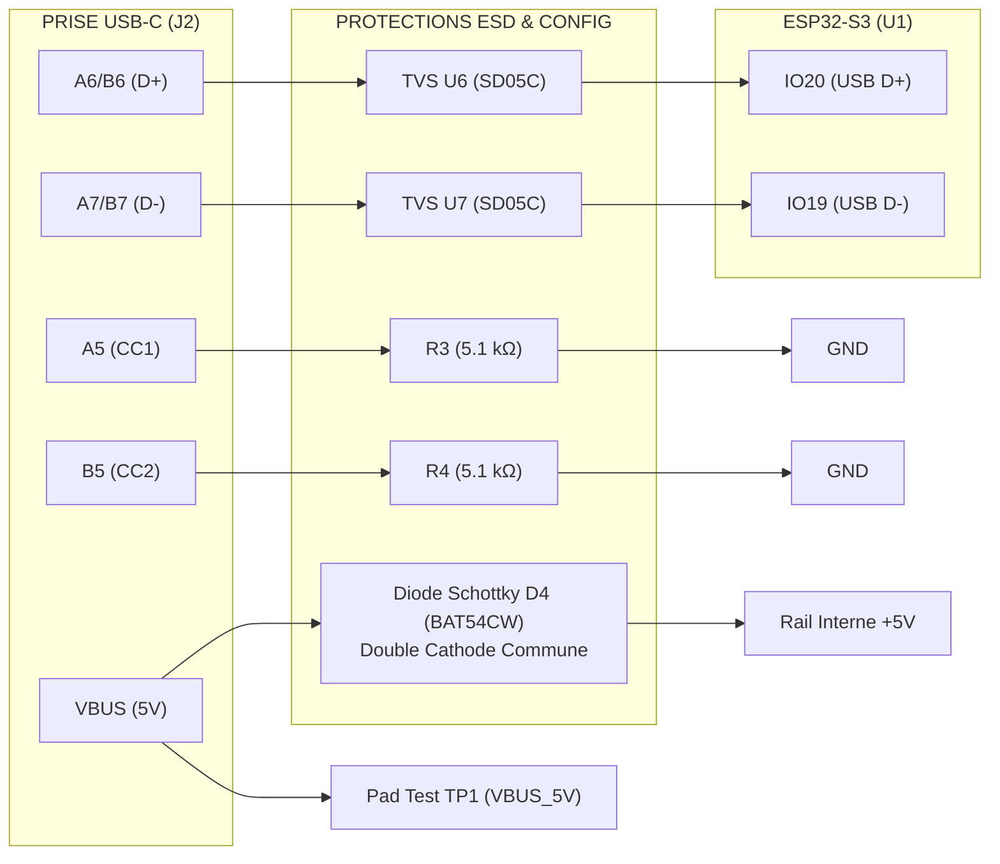
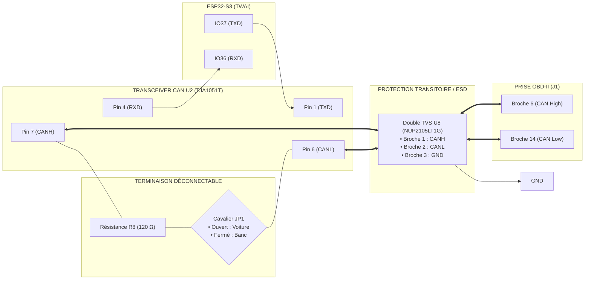
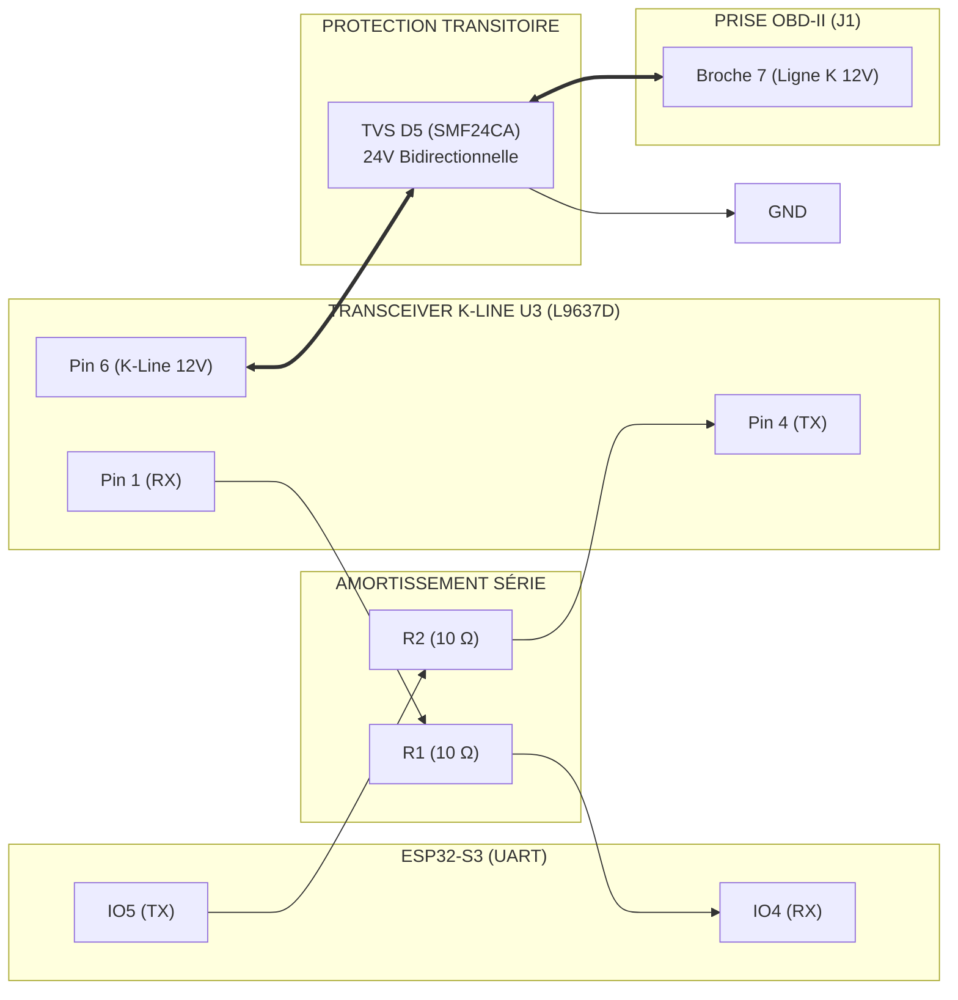
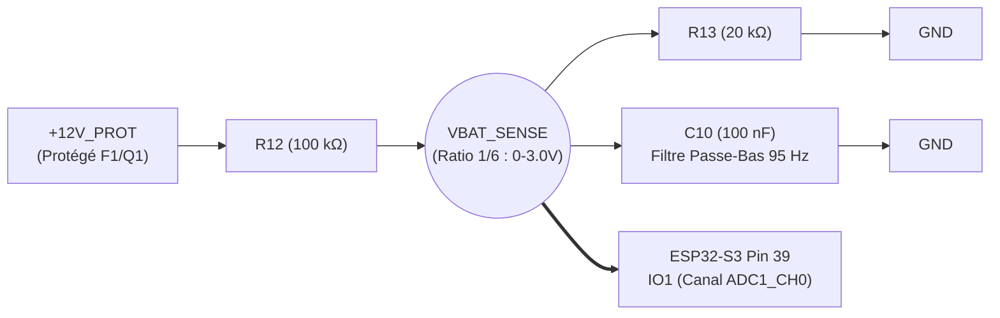
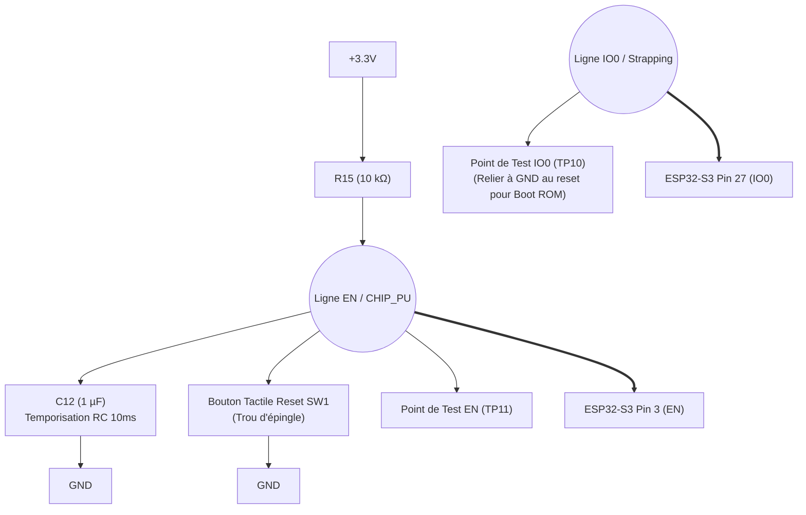

# Architecture Matérielle & Anatomie Électronique

Ce document détaille l'architecture électronique complète du scanner OBD-II ESP32 : les contraintes sévères du milieu automobile, le rôle physique de chaque groupe de composants, les équations de dimensionnement, la table des équipotentielles (nets) et les points de test.

---

## 1. Environnement Automobile & Contraintes Spécifiques

La batterie 12V d'un véhicule n'est ni stable, ni propre :
* **Démarrage moteur (*cranking*) :** Chutes brutales de tension pouvant descendre sous 8V ou 6V.
* **Pics inductifs (*Load Dump*) :** En cas de déconnexion accidentelle de batterie avec alternateur en charge, des pointes d'énergie peuvent dépasser **40V à 60V**.
* **Bruit haute fréquence :** Parasites d'allumage, hachage d'injecteurs, ondulation triphasée de l'alternateur.
* **Inversion de polarité :** Erreur de manipulation sur les pinces de démarrage.
* **Bus de communication hétérogènes :** Bus différentiel CAN (haute vitesse, 2.5V à 3.5V) et ligne K-Line mono-fil (half-duplex 0V / 12V batterie).

Le circuit imprimé est découpé en **11 blocs fonctionnels interconnectés**, organisés pour purifier l'énergie, protéger les composants sensibles et assurer une communication bidirectionnelle infaillible.

---

## 2. Schéma Fonctionnel Global & Arbre d'Énergie

---

## 3. Guide Pédagogique : Le Rôle de Chaque Bloc de Composants

### Bloc 1 : Protection 12V & Polarité (`F1`, `D1`, `Q1`, `Q2`, `R5`, `R7`, `D3`, `R14`)

* **Fusible Réarmable PPTC `F1` (0.5A - `MF-MSMF050-2`) :**
  * *Principe :* Contrairement à un fusible traditionnel à fil fusible qui brûle définitivement, un PPTC (*Polymeric Positive Temperature Coefficient*) est constitué d'un polymère conducteur. En cas de surintensité (> 500 mA), l'échauffement interne par effet Joule fait brutalement exploser sa résistance électrique, bloquant le courant. Une fois le court-circuit éliminé et le composant refroidi, il redevient conducteur automatiquement.
* **Diode TVS de Protection contre les Surtensions `D1` (18V - `SMBJ18A`) :**
  * *Principe :* Une diode TVS (*Transient Voltage Suppressor*) reste totalement transparente en temps normal sous la tension batterie (VRWM = 18.0V). Dès qu'une impulsion transitoire dépasse sa tension d'avalanche (VBR = 20.0V), elle devient conductrice en quelques picosecondes et court-circuite l'excédent d'énergie directement vers la masse (GND).
  * *Calibrage optimal pour le régulateur Buck :* Avec une tension de serrage crête VCL de **29.2V** sous choc d'impulsion de 20.5A (600W @ 10/1000 µs), la SMBJ18A garantit que la tension d'entrée ne dépasse jamais les **30.0V de limite absolue** du régulateur Buck U4 (TPS54331), éliminant tout risque de claquage du silicium.
* **Protection Anti-Inversion par P-MOSFET Q1 (CJ2309A) et N-MOSFET Q2 (2N7002) :**
  * *Pourquoi pas une simple diode ?* Une diode de redressement classique provoquerait une chute de tension permanente de 0.7V à 1.0V et dissiperait inutilement de la chaleur (P = V × I).
  * *Fonctionnement des MOSFETs :*
    * **En polarité normale (+12V branché correctement) :** La tension positive arrive sur la grille de Q2 via la résistance R5. Q2 devient passant et tire le bas de R14 vers la masse (0V). La différence de potentiel Grille-Source Vgs de Q1 devient négative (~ -12V, bornée par D3), ce qui sature complètement Q1. Le modèle CJ2309A (VDS max 60V, ID 2A en boîtier SOT-23) offre une résistance interne Rds(on) très faible (~ 0.25 Ω), avec une chute de tension négligeable (< 0.05V). Sa tenue VDS de 60V encaisse sans faillir les transitoires et l'écrêtage de la diode TVS D1 (~29.2V).
    * **En cas d'inversion accidentelle de polarité :** La grille de Q2 n'est pas alimentée, Q2 reste bloqué, la grille de Q1 reste au même potentiel que sa source (Vgs = 0V via R7) : Q1 est hermétiquement ouvert. Aucun courant inverse destructeur ne pénètre dans la carte.
* **Protection de Grille par Diode Zener `D3` (12V - `BZX84C12`) & Résistance Série `R14` (10 kΩ) :**
  * *Pourquoi borner Vgs ?* L'oxyde de grille du MOSFET Q1 ne tolère qu'une tension Vgs absolue maximale de ±20V. Lors d'un transitoire automobile où le rail 12V monte à près de 30V, sans diode Zener, la grille tirée vers 0V verrait un Vgs destructeur de près de -30V.
  * *Rôle de D3 et R14 :* D3 est connectée en parallèle direct entre la Source (`+12V_FUSED`) et la Grille de Q1. Dès que Vgs atteint 12V, D3 entre en avalanche Zener et verrouille strictement Vgs à un maximum de -12V. La résistance R14 (10 kΩ) placée en série avec le drain de Q2 absorbe la chute de tension excédentaire et borne le courant Zener à moins de 2 mA.

---

### Bloc 2 : Buck 12V -> 5V (TPS54331 - 570kHz) (`U4`, `L1`, `D2`, `C5`, `C7`, `C8`, `R9`, `R10`, `R11`, `C9`)

L'ESP32 et les circuits logiques consomment jusqu'à 300 mA à 500 mA lors des transmissions radio Wi-Fi.
* Si on utilisait un simple régulateur linéaire pour abaisser 12V en 5V sous 500 mA, la puissance perdue en pure chaleur serait de :
  > **P_dissipée = (Vin - Vout) × I = (12V - 5V) × 0.5A = 3.5 Watts !**
* Le **convertisseur Buck (`U4` - TPS54331DR)** découpe la tension à haute fréquence (**570 kHz**) avec un rendement supérieur à **85%**.

* **Inductance de Puissance `L1` (10 µH blindée - `YNR6045-100M`) :** Réservoir d'inertie magnétique. Quand le transistor interne s'ouvre, elle s'oppose à l'interruption du courant (V = L · di/dt) et restitue son énergie emmagasinée.
* **Diode Schottky de Roue Libre `D2` (3A / 40V - `SS34`) :** Permet au courant de circuler en boucle fermée depuis la masse vers l'inductance sans interruption avec un temps de recouvrement ultra-court (< 10 ns) et une chute de tension minime (~0.35V).
* **Condensateur de Bootstrap `C5` (1 µF - `C0603`) :** Connecté entre `BOOT` et `PH`, forme une pompe de charge qui rehausse la tension de commande pour saturer le N-MOSFET High-Side interne.
* **Condensateur Réservoir d'Entrée `C7` (10 µF céramique 50V X5R - `CL31A106KBHNNNE` / `C1206`) :** Fournit les fortes impulsions de hachage à 570 kHz avec une marge de sécurité totale sous 50V.
* **Condensateur de Sortie `C8` (22 µF céramique 25V X5R - `C1206`) :** Lisse la tension 5V pour maintenir une ondulation résiduelle (*ripple*) < 20 mV.
* **Pont Diviseur de Contre-Réaction `R9` (10 kΩ) et `R10` (1.91 kΩ) :**
  > **Vout = 0.8V × (1 + R9 / R10) = 0.8V × (1 + 10 000 / 1 910) = 0.8 × 6.2356 ≈ 4.988 V ≈ 5.0 V**
* **Réseau de Compensation `R11` (10 kΩ) et `C9` (3.3 nF) :** Correcteur proportionnel-intégral assurant une marge de phase sécurisée sur la boucle d'asservissement.

---

### Bloc 3 : LDO 3.3V & Filtre HF (`U5`, `FB1`, `C6`)

Le convertisseur Buck génère des bruits harmoniques à 570 kHz. Le SoC ESP32-S3 et son transceiver RF 2.4 GHz exigent une tension exempte de perturbations.

* **Régulateur Linéaire LDO `U5` (`LDL1117S33R` - SOT-223) :** Fournit un 3.3V continu stable avec une réjection d'alimentation (PSRR) > 75 dB.
* **Perle de Ferrite `FB1` (`BLM18PG121SN1D` - boîtier 0603) :** Présente une impédance inductive de **120 Ω à 100 MHz**, empêchant le bruit numérique du microcontrôleur de refluer vers les capteurs et transceivers.
* **Condensateur Réservoir `C6` (1 µF céramique - `C0603`) :** Stabilise la sortie et amortit les variations d'impédance de la perle ferrite.

---

### Bloc 4 : USB-C, Alimentation Banc & Protections ESD (`J2`, `D4`, `U6`, `U7`, `R3`, `R4`)

* **Diode Schottky Double Cathode Commune `D4` (`BAT54CW` - SOT-323 / LCSC `C962771`) :**
  * *Alimentation autonome sur table :* Permet d'alimenter toute la logique (LDO 3.3V, ESP32, transceiver CAN) via le port USB-C sans source 12V OBD.
  * *Protection anti-retour absolue :* Dès que la carte est sur véhicule (12V présent, Buck actif), la cathode est portée à 5V, polarisant la diode en inverse et interdisant tout refoulement vers le port USB de l'ordinateur.
  * *Mise en parallèle :* Les broches 1 et 2 sont pontées, doublant le courant admissible (400 mA continu, 600 mA crête).
* **Résistances de Configuration `R3` et `R4` (5.1 kΩ pull-down - `R0805`) :** Indispensables en USB-C pour que la source délivre le 5V (négociation en appareil récepteur / *Sink*).
* **Diodes de Protection Antistatique ESD `U6` et `U7` (`SD05C` - SOD-323) :** TVS bidirectionnelles canalisant les décharges jusqu'à ±30 kV en < 1 ns avec une capacité parasite infime (< 3 pF).

---

### Bloc 5 : Transceiver CAN (TJA1051T) & Protection ESD (`U2`, `U8`, `R8`, `JP1`)

* **Principe Différentiel (`CANH` et `CANL`) :**
  * Bit récessif (1) : CANH = 2.5V, CANL = 2.5V (différence = 0V).
  * Bit dominant (0) : CANH = 3.5V, CANL = 1.5V (différence = +2.0V).
  * Tout parasite affecte identiquement les deux lignes et s'annule par soustraction différentielle.
* **Double Diode TVS Bidirectionnelle `U8` (`NUP2105LT1G` - SOT-23 / LCSC `C5983786` / `C14486`) :**
  * *Rôle frontière :* Implantée au plus près des broches 6 et 14 du connecteur `J1`, elle dérive immédiatement vers la masse `GND` les décharges électrostatiques (jusqu'à ±30 kV contact/air selon IEC 61000-4-2) et les surtensions transitoires du faisceau véhicule avant qu'elles n'atteignent le transceiver `U2`.
  * *Tension de maintien VRWM = 24 V :* Tolère sans conduction les excursions de mode commun automobile (-12V à +12V) et les anomalies 24V.
  * *Capacité parasite ultra-faible (< 10 pF à 30 pF) :* Préserve l'intégrité des fronts rapides du bus CAN haute vitesse jusqu'à 1 Mbps.
* **Résistance de Terminaison `R8` (120 Ω) & Cavalier Sélecteur `JP1` :**
  * *En voiture (prise OBD-II) :* Le réseau automobile possède déjà ses deux terminaisons de 120 Ω (60 Ω équivalents). **Le cavalier JP1 reste ouvert (SANS shunt)**.
  * *Sur banc de test / simulateur :* Aucun terminateur sur table. **On place un cavalier standard 2.54 mm sur JP1** pour activer R8.
* **Adaptation Logique VIO (Pin 5) :** Reliée au 3.3V pour adapter directement les signaux logiques TXD/RXD aux niveaux du SoC ESP32.

---

### Bloc 6 : Transceiver K-Line (L9637D) & Protection ESD (`U3`, `D5`, `R1`, `R2`)

* **Protocole ISO 9141-2 / ISO 14230 (Daewoo Kalos) :** Liaison mono-fil bidirectionnelle *half-duplex* sous tension batterie (0V = bas, 12V = haut).
* **Diode TVS Bidirectionnelle `D5` (`SMF24CA` - SOD-123FL / LCSC `C3117728` / `C2843513`) :**
  * *Rôle frontière :* Connectée directement entre la broche 7 de `J1` (`K_LINE`) et la masse `GND`, elle encaisse les décharges électrostatiques et transitoires sévères générés par le système d'allumage ou les commutations de relais moteur.
  * *Tension de maintien VRWM = 24 V :* Reste transparente en régime permanent sous 12V-14.4V et lors des commutations K-Line sans écrêtage intempestif.
  * *Tension d'avalanche VBR = 26.7 V et serrage crête VCL = 38.9 V (200W @ 8/20 µs) :* Borne strictement la surtension sous la limite destructive de la broche 6 du transceiver `U3`.
* **Transceiver Dédié `U3` (`L9637D013TR`) :** Translation bidirectionnelle robuste 12V ↔ 3.3V avec protection contre les courts-circuits et coupure thermique.
* **Résistances d'Amortissement `R1` et `R2` (10 Ω - `R0805`) :** Atténuent les réflexions parasites et bornent le courant des micro-décharges sur les GPIOs de l'ESP32.

---

### Bloc 7 : LED d'État (`LED1`, `R6`)

* **LED Verte `LED1` (0603) & Résistance `R6` (100 Ω) :** Pilotée par la broche `IO2` du microcontrôleur (compatible modulation PWM matérielle via périphérique LEDC).
* **Courant de Fonctionnement & Visibilité Diurne :**
  > **I_LED = (3.30V - 2.85V) / (100 Ω + 25 Ω) ≈ 3.6 mA** (luminosité de ~280 mcd pour une visibilité franche en plein jour dans l'habitacle ; dissipation thermique de R6 négligeable à ~1.3 mW pour un boîtier 0805 de 125 mW).

---

### Bloc 8 : SoC ESP32-S3-WROOM-1 (`U1`)

* Microcontrôleur Xtensa LX7 double cœur 32 bits à 240 MHz avec **16 Mo Flash** et **8 Mo PSRAM**.
* Contrôleur USB OTG natif (flash et debug direct sans convertisseur USB-série externe).
* Contrôleur matériel **TWAI** (compatible CAN 2.0B).
* Antenne méandre 2.4 GHz gravée sur PCB (Wi-Fi 802.11 b/g/n + BLE 5.0).

---

### Bloc 9 : Découplage HF & Réservoir Bulk (`C1-C4`, `C11`)

* **Condensateurs de Découplage HF `C1` à `C4` (100 nF - `0603`) :** Céramiques MLCC implantés à moins de 2 mm de chaque broche d'alimentation pour filtrer les commutations rapides (> 10 MHz).
* **Condensateur Réservoir Bulk `C11` (10 µF 25V X5R 0805 - LCSC `C15850`) :**
  * *Rôle critique anti-brownout :* Les salves radio Wi-Fi provoquent des appels de courant massifs de **450 à 500 mA** pendant plusieurs centaines de microsecondes. `C11` agit comme une réserve locale pour empêcher la tension de chuter sous le seuil de coupure de l'ESP32 (2.8V).
  * *Implantation impérative :* Raccordé à moins de 2 à 3 mm des broches 1 (`GND`) et 2 (`3V3`) de l'ESP32.
  * *Tenue 25V (Anti DC-bias) :* Conserve plus de 85% de sa capacité nominale sous 3.3V (contrairement aux modèles 6.3V).

---

### Bloc 10 : Monitoring Tension Batterie (`R12`, `R13`, `C10`)

* **Pont Diviseur (Ratio 1/6) :**
  > **k = R13 / (R12 + R13) = 20 / 120 = 1/6 ≈ 0.1667**
  * 12.0V batterie → 2.00V ADC.
  * 14.4V (alternateur actif) → 2.40V ADC.
  * 18.0V (tension crête admissible) → 3.00V ADC.
* **Courant de Fuite :** `I = 12V / 120 kΩ = 100 µA` (décharge batterie négligeable).
* **Filtre Passe-Bas Anti-Bruit `C10` (100 nF) :** Avec `Req = 100k // 20k ≈ 16.7 kΩ`, fréquence de coupure `fc ≈ 95 Hz` éliminant le hachage alternateur et les parasites d'allumage.
* **Canal ADC1 :** La broche `IO1` appartient à **ADC1**, garantissant une mesure analogique non perturbée pendant les émissions radio (contrairement à ADC2).

---

### Bloc 11 : Circuit de Reset Sécurisé & Bootloader (`SW1`, `R15`, `C12`, `TP10`, `TP11`)

* **Temporisation Power-On-Reset `R15` (10 kΩ) & `C12` (1 µF) :** Constante de temps `τ = 10 ms` garantissant que le rail 3.3V est parfaitement établi avant le réveil de l'ESP32.
* **Bouton Tactile de Reset Matériel `SW1` (`TS-1187A`) :** Permet de réinitialiser la carte via un trou d'épingle sans forcer sur la prise OBD (effort d'insertion de 40 à 60 N).
* **Point de Test Bootloader Secours `TP10` (`IO0`) :** Permet de forcer manuellement le téléchargement ROM en reliant le pad à la masse au reset en cas de boucle de plantage (*bootloop*).
* **Implantation :** `C12` et `R15` à moins de 2 mm de la broche 3 (`EN`) pour immuniser cette ligne haute impédance contre le champ radio 2.4 GHz de l'antenne.

---

## 4. Tableau de Synthèse : Contraintes Véhicule vs Solutions Électroniques

| Contrainte du Véhicule | Risque pour l'Électronique | Solution Technique Implémentée | Composants Dédiés |
| :--- | :--- | :--- | :--- |
| **Pics de surtension alternateur (*Load Dump*)** | Destruction instantanée par claquage (> 30V) | Écrêtage sous 29.2V vers la masse | TVS 18V `D1` (`SMBJ18A`) |
| **Inversion accidentelle de polarité** | Court-circuit destructeur des circuits intégrés | Commutation automatique sans perte par MOSFET | P-MOS `Q1` (60V) + N-MOS `Q2` |
| **Court-circuit accidentel faisceau** | Échauffement critique, fonte des pistes | Coupure thermique réarmable sans intervention | Fusible PPTC 0.5A `F1` |
| **Chute de tension 12V → 5V à fort courant** | Surchauffe extrême si régulateur linéaire classique | Conversion à découpage 570 kHz (rdt > 85%) | Buck `U4` (`TPS54331`) + `L1` + `D2` |
| **Bruit de hachage sur la radio** | Portée Wi-Fi/BLE dégradée, instabilité ADC | Double filtrage : Régulateur LDO + Perle de ferrite | LDO `U5` (`LDL1117`) + `FB1` + `C6` |
| **Micro-coupures & pics RF Wi-Fi de l'ESP32** | Chute sous 2.8V, redémarrage intempestif (*brownout*) | Découplage HF à < 2 mm + Réservoir local Bulk 10 µF | Condensateurs `C1`-`C4` + Bulk `C11` (25V 0805) |
| **Surveillance batterie & détection contact** | Impossibilité de diagnostiquer l'alternateur | Pont diviseur 1/6 protégé + filtrage passe-bas 95 Hz | `R12`, `R13` + `C10` vers ADC1 (`IO1`) |
| **Parasites d'allumage moteur sur bus CAN** | Trames de diagnostic corrompues ou illisibles | Transmission différentielle symétrique + terminaison | Transceiver CAN `U2` + Terminaison `R8`/`JP1` |
| **Signaux 12V de la ligne K-Line Daewoo** | Destruction des broches MCU limitées à 3.3V | Translation de niveau bidirectionnelle 12V ↔ 3.3V | Transceiver K-Line `U3` + `R1`, `R2` |
| **Décharges électrostatiques (ESD) USB** | Claquage des broches USB internes du silicium | Dérivation des pointes 30 kV en < 1 ns | Diodes ESD bidirectionnelles `U6`, `U7` |
| **Décharges statiques & transitoires bus CAN** | Claquage différentiel des entrées transceiver U2 | Écrêtage bidirectionnel 24V ultra-rapide (< 10 pF) | Double TVS 24V `U8` (`NUP2105LT1G`) |
| **Décharges statiques & transitoires K-Line** | Claquage de l'étage de sortie haute tension U3 | Dérivation des pointes transitoires 24V à la masse | Diode TVS 24V `D5` (`SMF24CA`) |
| **Négociation de charge USB Type-C** | Absence de tension 5V délivrée par le chargeur | Détection automatique d'appareil consommateur (Sink) | Résistances pull-down 5.1 kΩ `R3`, `R4` |
| **Alimentation sur banc & anti-retour USB** | Refoulement 5V Buck vers le PC ou banc impossible | Diode Schottky double à cathode commune | Diode Schottky `D4` (`BAT54CW`) |

---

## 5. Répertoire des Équipotentielles (Nets)

| Nom du Net | Composants Reliés (Broches) | Rôle & Fonction Électrique | Domaine / Bloc |
| :--- | :--- | :--- | :--- |
| **`+12V`** | OBD-II (Pin 16), `D1(1)`, `F1(1)` | Alimentation batterie brute issue de la prise OBD-II. | Alimentation / Entrée |
| **`+12V_FUSED`** | `F1(2)`, `Q1(3)`, `D3(3)`, `R7(1)` | Alimentation 12V protégée en surintensité par le fusible PPTC. | Alimentation / Sécurité |
| **`+12V_PROT`** | `Q1(2)`, `C7(1)`, `U4(2)`, `R12(1)` | Rail 12V sécurisé anti-inversion alimentant le Buck et le diviseur batterie. | Alimentation / Sécurité |
| **`GATE_PMOS`** | `Q1(1)`, `D3(1)`, `R7(2)`, `R14(1)` | Commande de grille P-MOS bornée à 12V par Zener D3 et tirée par Q2 via R14. | Commutation / Contrôle |
| **`DRAIN_NMOS`** | `Q2(3)`, `R14(2)` | Liaison entre le drain du N-MOS Q2 et la résistance R14. | Commutation / Contrôle |
| **`GATE_NMOS`** | `Q2(1)`, `R5(2)` | Polarisation de grille du N-MOS Q2 depuis le 12V à travers R5. | Commutation / Contrôle |
| **`VBAT_SENSE`** | `R12(2)`, `R13(1)`, `C10(1)`, `U1(39)` | Tension batterie atténuée au ratio 1/6 vers le canal ADC1_CH0 (`IO1`). | Mesure Batterie |
| **`PH_BUCK`** | `U4(8)`, `L1(1)`, `D2(1)`, `C5(2)` | Nœud de commutation haute fréquence (570 kHz). | Alimentation / Buck |
| **`BOOT_BUCK`** | `U4(1)`, `C5(1)` | Ligne bootstrap rehaussant la tension de commande du MOSFET High-Side. | Alimentation / Buck |
| **`VSENSE_BUCK`** | `U4(5)`, `R9(1)`, `R10(1)` | Point milieu du feedback asservissant le 5V sur la référence interne 0.8V. | Alimentation / Buck |
| **`COMP_BUCK`** | `U4(6)`, `R11(1)` | Sortie de l'amplificateur d'erreur reliée au réseau de compensation. | Alimentation / Buck |
| **`RC_COMP`** | `R11(2)`, `C9(1)` | Nœud série du correcteur RC de phase. | Alimentation / Buck |
| **`+5V`** | `L1(2)`, `C8(1)`, `U5(3)`, `R9(2)`, `U2(3)`, `TP5`, `D4(3)` | Rail 5.0V régulé issu du Buck ou injecté via USB-C par D4. | Alimentation / Rail 5V |
| **`3.3V_PRE`** | `U5(4)`, `FB1(1)` | Sortie 3.3V brute du LDO avant élimination des harmoniques RF. | Alimentation / LDO |
| **`3.3V`** | `FB1(2)`, `C6(1)`, `C1-C4(1)`, `C11(1)`, `U1(2)`, `U2(5)`, `U3(3)`, `R15(1)`, `TP6` | Rail logique 3.3V purifié pour l'ESP32 et les transceivers. | Alimentation / Rail 3.3V |
| **`GND`** | Plans de masse, blindages, condensateurs, transceivers, `U8(3)`, `D5(2)` | Potentiel de référence zéro volt (0V) commun. | Référence / Masse |
| **`LED_STATUS`** | `U1(38)` (`IO2`), `R6(1)` | Commande numérique d'allumage du voyant de fonctionnement. | Interface / Statut |
| **`LED_ANODE`** | `R6(2)`, `LED1(1)` | Liaison à courant limité (3.6 mA) vers l'anode de la LED verte. | Interface / Statut |
| **`VBUS_5V`** | `J2(A4,B9,A9,B4)`, `TP1`, `D4(1,2)` | Alimentation 5V issue du câble USB-C hôte. | Interface / USB-C |
| **`USB_CC1`** | `J2(A5)`, `R3(1)` | Ligne de configuration USB-C canal 1 (détection Sink 5.1 kΩ). | Interface / USB-C |
| **`USB_CC2`** | `J2(B5)`, `R4(1)` | Ligne de configuration USB-C canal 2 (détection Sink 5.1 kΩ). | Interface / USB-C |
| **`USB_D+`** | `J2(A6,B6)`, `U6(1)`, `U1(14)` (`IO20`) | Ligne de données différentielle USB positive. | Interface / USB-C |
| **`USB_D-`** | `J2(A7,B7)`, `U7(1)`, `U1(13)` (`IO19`) | Ligne de données différentielle USB négative. | Interface / USB-C |
| **`CANH`** | `U2(7)`, `R8(1)`, `U8(1)`, OBD-II (Pin 6), `TP7` | Ligne de bus CAN différentielle niveau haut protégée ESD. | Communication / CAN |
| **`CAN_TERM_MID`** | `R8(2)`, `JP1(1)` | Nœud série entre la terminaison 120 Ω et le cavalier de sélection. | Communication / CAN |
| **`CANL`** | `U2(6)`, `JP1(2)`, `U8(2)`, OBD-II (Pin 14), `TP8` | Ligne de bus CAN différentielle niveau bas protégée ESD. | Communication / CAN |
| **`TXD`** | `U1(37)`, `U2(1)` | Émission TWAI 3.3V depuis le SoC vers le transceiver CAN. | Communication / CAN |
| **`RXD`** | `U1(36)`, `U2(4)` | Réception TWAI 3.3V depuis le transceiver CAN vers le SoC. | Communication / CAN |
| **`K_LINE`** | `U3(6)`, `D5(1)`, OBD-II (Pin 7), `TP2` | Ligne de communication bidirectionnelle automobile 12V protégée TVS. | Communication / K-Line |
| **`K_RX_IC`** | `U3(1)`, `R1(1)` | Réception 3.3V du transceiver K-Line avant résistance d'amortissement. | Communication / K-Line |
| **`UART_RX_MCU`** | `R1(2)`, `U1(4)` (`IO4`) | Signal de réception UART amorti arrivant sur l'ESP32. | Communication / K-Line |
| **`K_TX_IC`** | `U3(4)`, `R2(1)` | Émission vers le transceiver K-Line après résistance d'amortissement. | Communication / K-Line |
| **`UART_TX_MCU`** | `R2(2)`, `U1(5)` (`IO5`) | Émission UART issue de l'ESP32 vers la résistance d'amortissement. | Communication / K-Line |
| **`ESP_EN`** | `U1(3)`, `R15(2)`, `C12(1)`, `SW1(1,2)`, `TP11` | Signal de reset matériel et mise sous tension de l'ESP32. | Contrôle / Reset |
| **`IO0`** | `U1(27)`, `TP10` | Ligne de strapping bootloader pour forcer la programmation ROM. | Contrôle / Bootloader |

---

## 6. Répertoire Consolidé des Points de Test (TP1 à TP11)

| Désignateur | Net Associé | Domaine Fonctionnel | Coordonnées Schéma | Tension / Signal Attendu | Rôle & Condition de Test |
| :--- | :--- | :--- | :--- | :--- | :--- |
| **`TP1`** | **`VBUS_5V`** | Alimentation USB | (X=575, Y=760) | +5.0 V DC (± 5%) | Contrôle de la présence du rail 5V câble USB-C hôte. |
| **`TP2`** | **`K_LINE`** | Diagnostic K-Line | (X=765, Y=395) | 12.0 V repos / 0 V actif | Contrôle trames série 10.4 kbps et initialisation 5-baud. |
| **`TP3`** | **`GND`** | Référence / Masse | (X=640, Y=275) | 0.0 V (Masse) | Masse de référence commune locale pour pince crocodile / sonde oscilloscope. |
| **`TP4`** | **`+12V_PROT`** | Alimentation Véhicule | (X=325, Y=375) | +11.5 V à +14.8 V DC | Rail 12V sécurisé après fusible réarmable F1 et anti-inversion Q1. |
| **`TP5`** | **`+5V`** | Alimentation Régulée | (X=360, Y=665) | +5.00 V DC (± 2%) | Rail 5V régulé issu de l'étage Buck U4. |
| **`TP6`** | **`3.3V`** | Alimentation Logique | (X=520, Y=650) | +3.30 V DC (± 1.5%) | Rail logique 3.3V purifié en sortie du régulateur LDO U5 et de FB1. |
| **`TP7`** | **`CANH`** | Bus CAN Différentiel | (X=700, Y=555) | 2.5 V récessif / 3.5 V dominant | Ligne différentielle haute du bus CAN. Contrôle terminaison 120 Ω. |
| **`TP8`** | **`CANL`** | Bus CAN Différentiel | (X=700, Y=515) | 2.5 V récessif / 1.5 V dominant | Ligne différentielle basse du bus CAN. Mesure Vdiff = CANH - CANL. |
| **`TP9`** | **`VBAT_SENSE`** | Mesure Analogique ADC | (X=400, Y=755) | ~ 2.0 V (pour 12V bat, ratio 1/6) | Étalonnage ADC et contrôle du filtrage passe-bas 95 Hz (C10). |
| **`TP10`** | **`IO0`** | Bootloader Secours | (X=1060, Y=570) | 3.3 V repos / 0 V pour forcer ROM | Mise à la masse pour forcer le téléchargement ROM si firmware bloqué. |
| **`TP11`** | **`ESP_EN`** | Contrôle Reset | (X=650, Y=295) | 3.3 V repos / 0 V appui reset | Mesure directe de la rampe de charge RC de Power-On-Reset (10 ms). |
