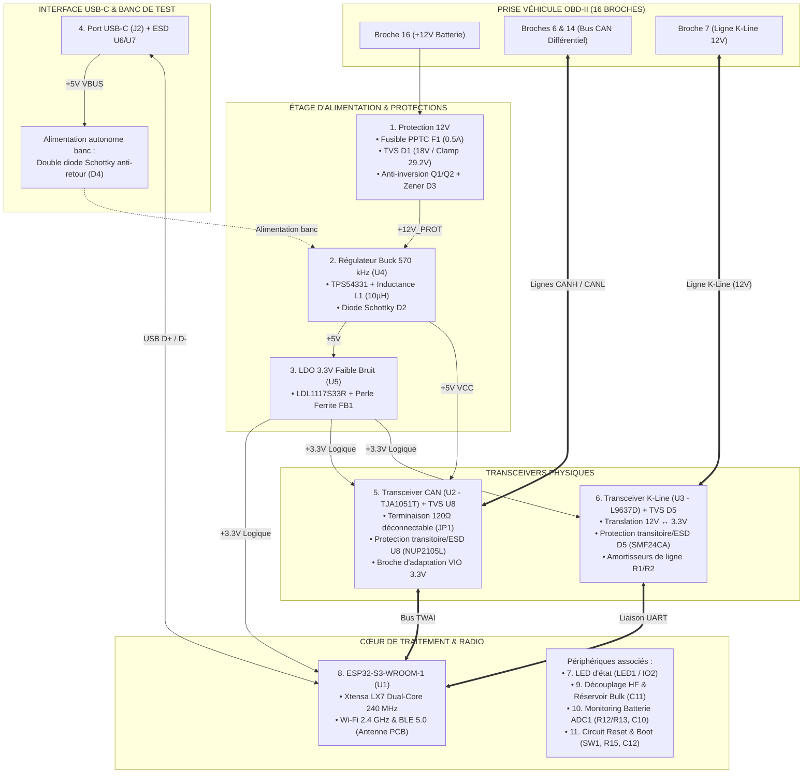

# Scanner OBD-II ESP32

Projet de conception matérielle (schématique et PCB) et logicielle d'un scanner de diagnostic automobile OBD-II intelligent, communicant et sécurisé.

---

## 1. Objectifs du Projet

> [!IMPORTANT]
> **Périmètre d'application exclusif : Voitures particulières (Réseau 12V)**
> Ce scanner est conçu et dimensionné exclusivement pour les véhicules légers équipés d'un **réseau de bord 12V** (batterie 12V nominale, prise standard SAE J1962 Type A). Il **ne doit en aucun cas** être branché sur des poids lourds, camions, bus ou engins fonctionnant en **24V** (prises Type B ou adaptateurs Deutsch J1939), ni utilisé lors d'un dépannage avec booster 24V, sous peine de destruction irréversible de l'étage de régulation et des entrées de mesure.

* **Diagnostic embarqué :** Lecture en temps réel des données moteur et des codes défauts (DTC) via la prise standard automobile OBD-II (16 broches).
* **Connectivité sans fil :** Module **ESP32-S3** assurant la liaison sans fil (Wi-Fi 2.4 GHz / BLE 5.0) vers une application mobile.
* **Support multi-protocoles :**
  * **Ligne K-Line (ISO 9141-2 / ISO 14230 KWP2000) :** Spécifiquement calibré pour les calculateurs Daewoo Kalos (2003) et véhicules similaires.
  * **Bus CAN (ISO 15765-4) :** Diagnostic haute vitesse et compatibilité avec les véhicules récents.
* **Alimentation robuste & sécurisée :**
  * Alimentation directe depuis le 12V batterie automobile.
  * Protections complètes : fusible réarmable PPTC `F1`, diode TVS `D1` (écrêtage 29.2V pour limite 30V), protection anti-inversion par MOSFETs `Q1`/`Q2` (avec Zener `D3` de grille).
  * Double étage d'alimentation : abaisseur à découpage Buck 12V → 5V à 570 kHz (`U4` / `L1`) suivi d'un régulateur linéaire LDO 3.3V ultra-propre (`U5` / `FB1`) pour l'ESP32 et la logique.
  * Alimentation autonome sur table via port USB-C protégée par diode anti-retour `D4`.

---

## 2. Architecture Fonctionnelle Globale

---

## 3. Visuels du Projet

### Schéma Électronique Modulaire (4 Blocs Fonctionnels)

#### 1. Étage d'Alimentation & Protections 12V

#### 2. Transceiver CAN (TJA1051T & Terminaison 120Ω)

#### 3. Transceiver K-Line (L9637D Daewoo Kalos)

#### 4. Microcontrôleur ESP32-S3 & Périphériques

### Circuit Imprimé (PCB)

### Modélisation 3D

---

## 4. État Actuel (work in progress) & Prochaine Étape

* **Schématique :** Schéma complet modulaire découpé en 4 pages fonctionnelles (Alimentation, Transceiver CAN, Transceiver K-Line, ESP32-S3), 60 composants au total avec intégration des protections transitoires/ESD `U8` (CAN) et `D5` (K-Line), résistance `R6` ajustée à 100 Ω pour visibilité LED plein jour, ERC strict = 0 sous EasyEDA Pro.
* **Placement PCB :** Placement 2D validé pour l'ensemble des composants avec connecteur OBD-II `J1` coudé à 90°, prise USB-C `J2` affleurante et contour de carte ajusté (81.28 × 35.56 mm), DRC = 0.
* **Prochaine étape immédiate :** Synchroniser le layout PCB depuis le schéma (`Design > Update PCB`) pour instancier les empreintes de `U8` (SOT-23) et `D5` (SOD-123FL), finaliser le placement au plus près de `J1`, puis engager le routage des pistes prioritaires (paires différentielles USB/CAN, signaux critiques, rails de puissance).

---

## 5. Guide de Navigation du Dépôt

L'ensemble de la documentation technique et opérationnelle est structuré dans les documents dédiés suivants :

| Document | Description |
| :--- | :--- |
| 📋 **[TODO.md](TODO.md)** | **Feuille de route active & checklist complète** : suivi détaillé des 8 phases de conception (mécanique, schéma, floorplanning, routage, plans de masse, contrôles, fabrication). |
| 📦 **[BOM.md](BOM.md)** | **Nomenclature complète des 60 composants** : références fabricants, codes LCSC, boîtiers d'empreinte et sélection des pièces de base JLCPCB (*Basic Parts*). |
| 🔬 **[HARDWARE.md](HARDWARE.md)** | **Architecture matérielle & anatomie détaillée** : guide pédagogique des 11 blocs, calculs théoriques (Buck, LDO, pont diviseur, Zener), table complète des nets et répertoire des 11 points de test (`TP1` à `TP11`). |
| 🤖 **[AUTOMATION.md](AUTOMATION.md)** | **Automatisation IA via EasyEDA Pro** : architecture du pont Node.js, extension `.eext`, configuration des hooks de cycle de vie Antigravity et règles de routage IA. |
| 💡 **[LEARNINGS.md](LEARNINGS.md)** | **Capitalisation technique** : journal d'apprentissage, spécificités d'API EasyEDA Pro, formats d'unités et pièges évités. |
| 📜 **[AGENTS.md](AGENTS.md)** | **Règles de gouvernance IA** : consignes méthodologiques strictes, sécurité du pont et protocole de dépouillement des revues. |
| 📥 **[REVIEW.md](REVIEW.md)** | **Sas d'entrée pour revues techniques** : fichier réceptacle pour coller une revue (schéma, PCB, firmware) avant arbitrage avec l'utilisateur et transfert vers `TODO.md`. |
| 📁 **`ODB2-Scanner.eprj2`** | **Fichier projet natif EasyEDA Pro v2** : contient le schéma schématique `P1` et la carte de circuit imprimé `PCB1`. |

---

## 6. Outils & Skills Spécialisés d'Automatisation

Le projet intègre et exploite 3 compétences logicielles dédiées (*Skills*) pour assister l'agent IA et fiabiliser les étapes critiques de modélisation théorique, de CAO et d'agencement physique :

| Skill | Emplacement | Rôle & Fonctionnalités |
| :--- | :--- | :--- |
| ⚡ **`buck-compensation`** | [`.agents/skills/buck-compensation/`](.agents/skills/buck-compensation/SKILL.md) | **Modélisation petit-signal & Stabilité Buck :** Outil de calcul mathématique et d'optimisation paramétrique du réseau de compensation Type II pour le régulateur TI TPS54331 (évaluation Bode, fréquence de coupure fco, marge de phase ≥ 45°, marge de gain ≥ 10 dB, et sélection optimale du triplet Rz, Cz, Cp sur le catalogue Basic Parts JLCPCB). |
| 🔌 **`easyeda-api`** | [`.agents/skills/easyeda-api/`](.agents/skills/easyeda-api/SKILL.md) | **Contrôle programmatique EasyEDA Pro :** Pont bidirectionnel local (WebSocket/HTTP sur port 49620) permettant d'interroger, d'auditer et d'automatiser le schéma et le PCB en temps réel sans manipulation manuelle à risque, avec accès aux 120+ classes de l'API officielle. |
| 📐 **`pcb-placer`** | [`.agents/skills/pcb-placer/`](.agents/skills/pcb-placer/SKILL.md) | **Moteur d'Auto-Placement par Contraintes :** Algorithme déterministe d'agencement 2D en une passe pour les 60 composants du PCB sous EasyEDA Pro. Intègre les contraintes CEM (découplage < 2 mm), thermiques (boucle Buck), d'exclusion RF (antenne ESP32-S3), d'audit géométrique pad-à-pad et d'injection en direct. |

---

## 7. Démarrage Rapide

1. **Ouvrir le projet :** Lancer EasyEDA Pro (version bureau ou web) et ouvrir le fichier `ODB2-Scanner.eprj2`.
2. **Contrôle d'intégrité :**
   - Schéma : Menu `Design` → `Check ERC` (doit retourner 0 erreur, 0 avertissement).
   - PCB : Menu `Design` → `Check DRC` (doit retourner 0 erreur).
3. **Pilotage IA :** Démarrer le pont local via le skill EasyEDA pour activer la manipulation automatisée (voir [AUTOMATION.md](AUTOMATION.md)).