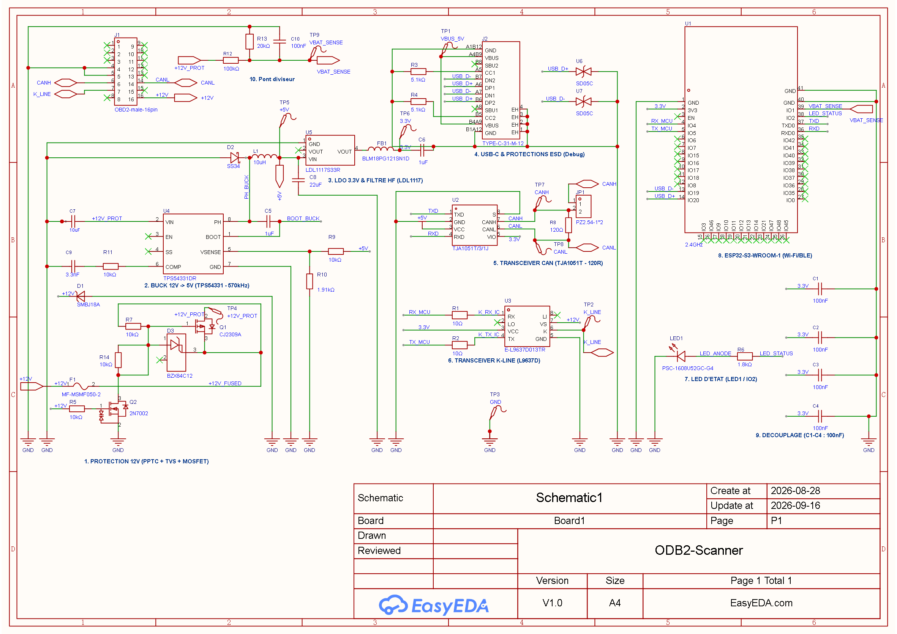

# Scanner OBD-II ESP32

Projet de conception matérielle (schématique et PCB) d'un scanner de diagnostic automobile OBD-II intelligent et communicant.

---

## 1. Objectifs du Projet

* **Diagnostic embarqué :** Lecture des données moteur en temps réel et des codes défauts (DTC) via la prise standard OBD-II (16 broches).
* **Connectivité sans fil :** Module **ESP32** assurant la liaison sans fil (Wi-Fi / Bluetooth) vers une application smartphone Android dédiée.
* **Support multi-protocoles :**
  * **Ligne K-Line (ISO 9141-2 / ISO 14230 KWP2000).
  * **Bus CAN (ISO 15765-4) :** Diagnostic haute vitesse et compatibilité véhicules modernes.
* **Alimentation robuste & sécurisée :**
  * Alimentation directe depuis le 12V batterie de la prise diagnostic.
  * Protection contre les surtensions, inversions de polarité et surintensités (fusible réarmable PPTC `F1`, diode TVS `D1`, MOSFETs de protection `Q1`/`Q2`).
  * Double étage de conversion : abaisseur à découpage performant 12V → 5V (`U4` / `L1`) suivi d'un régulateur linéaire ultra-propre 3.3V (`U5` / `FB1`) pour l'ESP32 et la logique.

---

## 2. Architecture Matérielle & Anatomie Électronique

Pour comprendre le fonctionnement de ce scanner, il faut d'abord appréhender l'environnement très particulier d'un véhicule automobile : la batterie 12V d'une voiture n'est ni stable, ni propre (pics de surtension de l'alternateur, étincelles d'allumage, bruit des injecteurs), et les calculateurs (ECU) communiquent via des protocoles spécifiques (K-Line à 12V et bus différentiel CAN).

Le circuit imprimé est découpé en **9 blocs fonctionnels interconnectés**, organisés pour purifier l'énergie, protéger les composants sensibles et assurer une communication bidirectionnelle infaillible.

---

### 2.1 Schéma Fonctionnel Global & Arbre d'Énergie

```
               PRISE DIAGNOSTIC OBD-II (16 BROCHES)
                │                  │               │
  Broche 16 (+12V Batterie)   Broches 6 & 14    Broche 7 (K-Line)
                │              (Bus CAN Diff)          │
                ▼                  │                   ▼
    ┌─────────────────────────┐    │       ┌───────────────────────┐
    │  1. PROTECTION 12V      │    │       │  6. TRANSCEIVER       │
    │  • Fusible PPTC F1      │    │       │     K-LINE (U3)       │
    │  • Diode TVS D1         │    │       │  Traduction 12V ↔ 3.3V│
    │  • Anti-inversion Q1/Q2 │    │       └───────────┬───────────┘
    └───────────┬─────────────┘    │                   │ UART_RX / TX
                │ +12V_PROT        │                   │ (avec amortisseurs R2/R3)
                ▼                  ▼                   │
    ┌─────────────────────────┐  ┌────────────────┐    │
    │  2. BUCK 12V -> 5V      │  │ 5. TRANSCEIVER │    │
    │     (TPS54331 - 570kHz) │  │ CAN (TJA1051T) │    │
    │  • Inductance L1 (10µH) │  │ • Term. R11    │    │
    │  • Diode Schottky D2    │  │ • Adapt. VIO   │    │
    │  • Bootstrap C5         │  └────────┬───────┘    │
    │  • Feedback R12/R13     │           │ TWAI_RX/TX │
    └───────────┬─────────────┘           │ (CAN)      │
                │ +5V                     │            │
                ├─────────────────────────┼────────────┤
                │                         │            │
                ▼                         │            │
    ┌─────────────────────────┐           │            │
    │  3. LDO 3.3V & FILTRE HF│           │            │
    │     (LDL1117)           │           │            │
    │  • Filtrage HF (FB1)    │           │            │
    │  • Condensateur C6      │           │            │
    └───────────┬─────────────┘           │            │
                │ +3.3V Logique           │            │
                ▼                         ▼            ▼
    ┌──────────────────────────────────────────────────────────────┐
    │  8. ESP32-S3-WROOM-1 (Wi-Fi/BLE) (U1)                        │
    │  • Microcontrôleur 32-bit dual-core Xtensa LX7               │
    │  • Radio Wi-Fi 2.4 GHz & Bluetooth 5.0 (Antenne PCB intégrée)│
    │                                                              │
    │  7. LED D'ETAT (LED1 / IO2) (pilotée par IO2 via R8)         │
    │  9. DECOUPLAGE (C1-C4 : 100nF) (micro-réservoirs locaux HF)  │
    └──────────────────────────────┬───────────────────────────────┘
                                   │ USB_D+ / USB_D-
                                   ▼
    ┌──────────────────────────────────────────────────────────────┐
    │  4. USB-C & PROTECTIONS ESD (Debug) (J2, U7, U8)             │
    │  • Résistances de configuration CC1/CC2 (R4, R5 : 5.1 kΩ)    │
    │  • Diodes de protection antistatique ESD (U7, U8 : SD05C)    │
    └──────────────────────────────────────────────────────────────┘
```

---

### 2.2 Guide Pédagogique : Le Rôle de Chaque Groupe de Composants

---

#### Bloc 1 : 1. PROTECTION 12V (PPTC + TVS + MOSFET) / 1. PROTECTION 12V & POLARITE (`F1`, `D1`, `Q1`, `Q2`, `R5`, `R7`, `D3`, `R14`)

Le réseau électrique d'une voiture est l'un des environnements les plus agressifs pour l'électronique :
* Démarrage du moteur : chutes brutales de tension (cranking).
* Déconnexion accidentelle d'une batterie en charge (*Load Dump*) : pics d'énergie inductifs pouvant dépasser **40V à 60V**.
* Mauvaise manipulation : inversion des pinces de démarrage (+12V et masse inversés).

```
   +12V OBD (Pin 16) ────► [ Fusible F1 ] ──┬──► [ P-MOSFET Q1 (Source) ] ──► +12V_PROT (Drain)
                             (0.5A PPTC)    │          ▲
                                            │          │ [ D3 (Zener 12V) // R7 (10k) ]
                                            │          ▼
                                        [ D1 ]    [ R14 (10k) ] (limiteur courant)
                                        (TVS 18V)      │
                                            │          ▼
                                           GND    [ N-MOSFET Q2 ] ◄── Polarisation R5
```

* **Fusible Réarmable PPTC `F1` (0.5A - `MF-MSMF050-2`) :**
  * *Principe :* Contrairement à un fusible traditionnel à fil fusible qui brûle définitivement, un PPTC (*Polymeric Positive Temperature Coefficient*) est constitué d'un polymère conducteur. En cas de surintensité (> 500 mA), l'échauffement interne par effet Joule fait brutalement exploser sa résistance électrique, bloquant le courant. Une fois le court-circuit éliminé et le composant refroidi, il redevient conducteur automatiquement.
* **Diode TVS de Protection contre les Surtensions `D1` (18V - `SMBJ18A`) :**
  * *Principe :* Une diode TVS (*Transient Voltage Suppressor*) reste totalement transparente en temps normal sous la tension batterie (VRWM = 18.0V). Dès qu'une impulsion transitoire dépasse sa tension d'avalanche (VBR = 20.0V), elle devient conductrice en quelques picosecondes et court-circuite l'excédent d'énergie directement vers la terre (GND).
  * *Calibrage optimal pour le régulateur Buck :* Avec une tension de serrage crête VCL de **29.2V** sous choc d'impulsion de 20.5A (600W @ 10/1000 µs), la SMBJ18A garantit que la tension d'entrée ne dépasse jamais les **30.0V de limite absolue** du régulateur Buck U4 (TPS54331), éliminant tout risque de claquage du silicium.
* **Protection Anti-Inversion par P-MOSFET Q1 (CJ2309A) et N-MOSFET Q2 (2N7002) :**
  * *Pourquoi pas une simple diode ?* Une diode de redressement classique provoquerait une chute de tension permanente de 0.7V à 1.0V et dissiperait inutilement de la chaleur (P = V × I).
  * *Fonctionnement ingénieux des MOSFETs :*
    * **En polarité normale (+12V branché correctement) :** La tension positive arrive sur la grille de Q2 via la résistance R5. Q2 devient passant et tire le bas de R14 vers la masse (0V). La différence de potentiel Grille-Source Vgs de Q1 devient négative (~ -12V, bornée par D3), ce qui sature complètement Q1. Le composant sélectionné est un CJ2309A (VDS max 60V, ID 2A en boîtier SOT-23) garantissant une résistance interne Rds(on) très faible (~ 0.25 Ω), avec une chute de tension négligeable (< 0.05V) sous le courant de fonctionnement du scanner. Sa tenue VDS de 60V encaisse sans faillir les transitoires et l'écrêtage de la diode TVS D1 (~39V).
    * **En cas d'inversion accidentelle de polarité :** La grille de Q2 n'est pas alimentée, Q2 reste bloqué, la grille de Q1 reste au même potentiel que sa source (Vgs = 0V via R7) : Q1 est hermétiquement ouvert. Aucun courant inverse destructeur ne pénètre dans la carte.
* **Protection de Grille par Diode Zener `D3` (12V - `BZX84C12`) & Résistance Série `R14` (10 kΩ) :**
  * *Pourquoi borner Vgs ?* L'oxyde de grille du MOSFET Q1 ne tolère qu'une tension Vgs absolue maximale de ±20V. Lors d'un transitoire automobile où le rail 12V monte à 38.9V (écrêtage de D1), sans diode Zener, la grille tirée vers 0V verrait un Vgs destructeur de près de -39V !
  * *Rôle de D3 et R14 :* D3 est connectée en parallèle direct entre la Source (`+12V_FUSED`) et la Grille de Q1. Dès que Vgs atteint 12V, D3 entre en avalanche Zener et verrouille strictement Vgs à un maximum de -12V. La résistance R14 (10 kΩ) placée en série avec le drain de Q2 absorbe la chute de tension excédentaire et borne le courant Zener à moins de 2.7 mA, protégeant ainsi l'oxyde de grille de Q1, la diode D3 et le transistor Q2.

---

#### Bloc 2 : 2. BUCK 12V -> 5V (TPS54331 - 570kHz) (`U4`, `L1`, `D2`, `C5`, `C7`, `C8`, `R9`, `R10`, `R11`, `C9`)

L'ESP32 et les circuits logiques consomment jusqu'à 300 mA à 500 mA lors des transmissions radio Wi-Fi.
* Si on utilisait un simple régulateur linéaire pour abaisser 12V en 5V sous 500 mA, la puissance perdue en pure chaleur serait de :
  > **P_dissipée = (Vin - Vout) × I = (12V - 5V) × 0.5A = 3.5 Watts !**
  Le régulateur brûlerait en quelques secondes sans un radiateur métallique volumineux.
* Le **convertisseur Buck (`U4` - TPS54331DR)** découpe la tension à haute fréquence (**570 kHz**, soit 570 000 fois par seconde) avec un rendement exceptionnel supérieur à **85%**.

```
                        Inductance L1 (10µH)
                     ┌───── 3000000 ─────┐
                     │                   │
  VIN (12V) ──► [ Interrupteur ] ──┬─────┴───────────────► Sortie +5V
                Interne U4 (PH)    │                         │
                                   ▼                         ▼
                                [ D2 ] (Schottky)       [ C8 ] (22µF)
                                 Roue libre              Filtrage
                                   │                         │
                                  GND                       GND
```

* **Inductance de Puissance `L1` (10 µH blindée - `YNR6045-100M`) :**
  * *Rôle :* C'est le réservoir d'inertie magnétique. Quand le transistor interne de `U4` est fermé (ON), le courant traverse `L1` et charge son champ magnétique tout en alimentant la charge. Quand le transistor s'ouvre (OFF), l'inductance s'oppose à l'interruption du courant (V = L · di/dt) et restitue son énergie emmagasinée.
* **Diode Schottky de Roue Libre `D2` (3A / 40V - `SS34`) :**
  * *Rôle :* Quand le transistor interne de `U4` s'ouvre, l'inductance cherche à puiser du courant. La diode `D2` (cathode sur `PH`, anode sur `GND`) devient alors passante et permet au courant de circuler en boucle fermée depuis la masse vers l'inductance sans interruption.
  * *Pourquoi une diode Schottky ?* Elle offre un temps de commutation ultra-rapide (< 10 ns) et une chute de tension minime (~0.35V à 0.4V), minimisant drastiquement les pertes de puissance.
* **Condensateur de Bootstrap `C5` (1 µF - `C0603`) :**
  * *Rôle :* Le transistor de découpage interne de `U4` est un N-MOSFET placé côté "haut" (High-Side). Pour saturer un N-MOSFET dont la source est à 5V, il faut appliquer sur sa grille une tension supérieure à son drain (Vg ≈ 12V + 5V = 17V). Le condensateur `C5` connecté entre `BOOT` (broche 1) et `PH` (broche 8) forme une **pompe de charge** qui emmagasine de l'énergie et rehausse le potentiel de commande de grille.
* **Condensateurs Réservoirs d'Entrée `C7` (10 µF céramique 50V X5R - `CL31A106KBHNNNE` / `C1206`) et Sortie `C8` (22 µF céramique 25V X5R - `C1206`) :**
  * `C7` (10 µF, 50V) fournit instantanément les fortes impulsions de courant demandées par le hachage à 570 kHz tout en supportant avec une marge de sécurité totale les transitoires jusqu'à 39V lors de l'écrêtage de la diode TVS D1.
  * `C8` (22 µF, 25V) accumule le courant triangulaire issu de l'inductance `L1` et lisse la tension de sortie 5V pour ne laisser qu'une ondulation résiduelle (*ripple*) infime (< 20 mV).
* **Pont Diviseur de Contre-Réaction `R9` (10 kΩ) et `R10` (1.91 kΩ) :**
  * *Rôle :* Le régulateur `U4` possède un amplificateur interne comparant la tension sur sa broche `VSENSE` à une référence interne très stable de **0.800 V**.
  * La formule de calcul de la tension de sortie régulée est :
    > **Vout = 0.8V × (1 + R9 / R10) = 0.8V × (1 + 10 000 / 1 910) = 0.8 × 6.2356 ≈ 4.988 V ≈ 5.0 V**
* **Réseau de Compensation de Boucle `R11` (10 kΩ) et `C9` (3.3 nF) :**
  * *Rôle :* Dans tout système asservi en boucle fermée, un déphasage excessif entre la commande et la sortie peut transformer le régulateur en oscillateur instable. Le circuit RC série sur la broche `COMP` compense la réponse en fréquence (correcteur proportionnel-intégral) et garantit une marge de phase sécurisée quelles que soient les fluctuations de charge de l'ESP32.

---

#### Bloc 3 : 3. LDO 3.3V & FILTRE HF (LDL1117) (`U5`, `FB1`, `C6`)

Bien que le régulateur Buck soit très efficace, son découpage haute fréquence génère des bruits harmoniques. Le microcontrôleur ESP32-S3 et son transceiver radio 2.4 GHz exigent une alimentation d'une pureté absolue pour garantir une portée Wi-Fi/Bluetooth maximale et éviter les erreurs de conversion analogique.

```
  +5V (Buck) ──► [ Régulateur LDO U5 ] ──► [ Perle Ferrite FB1 ] ──┬──► Rail Logique +3.3V
                 (LDL1117S33R : 1.2A)       (Filtre bruit HF)     │
                                                               [ C6 ] (1µF)
                                                                  │
                                                                 GND
```

* **Régulateur Linéaire LDO `U5` (`LDL1117S33R` - SOT-223) :**
  * *Rôle :* Un régulateur LDO (*Low Drop-Out*) agit comme une résistance variable ultrarapide asservie. Il "rabote" le 5V pour fournir un **3.3V continu parfaitement plat**, avec une réjection de bruit (PSRR) de plus de 75 dB. La chute de tension n'étant que de 5V - 3.3V = 1.7V, l'échauffement reste très faible et facilement dissipé par le plan de masse du PCB.
* **Perle de Ferrite `FB1` (`BLM18PG121SN1D` - boîtier 0603) :**
  * *Principe :* Une perle de ferrite se comporte comme un fil ordinaire à résistance nulle pour le courant continu (DC), mais présente une impédance inductive élevée (**120 Ω à 100 MHz**) pour les parasites électromagnétiques et le bruit radiofréquence. Elle agit comme une barrière étanche empêchant le bruit numérique de l'ESP32 de refluer vers les capteurs et transceivers.
* **Condensateur Réservoir `C6` (1 µF céramique - `C0603`) :**
  * *Rôle :* Stabilise la boucle de régulation interne du LDL1117 et amortit les variations d'impédance de la perle de ferrite.

---

#### Bloc 4 : 4. USB-C & PROTECTIONS ESD (Debug) (`J2`, `U6`, `U7`, `R3`, `R4`, `VBUS_5V`)

Le connecteur USB-C permet de flasher le firmware dans l'ESP32, d'afficher les logs série de débogage et de tester la carte sur un banc de test sans être branché sur la voiture.

```
       Prise USB-C (J2)                     Protections ESD             ESP32-S3 (U1)
  ┌─────────────────────────┐             ┌─────────────────┐         ┌───────────────┐
  │ Broche A6/B6 (D+) ──────┼──────────┬──┤ U6 (SD05C TVS)  │────────►│ IO20 (USB D+) │
  │                         │          │  └────────┬────────┘         │               │
  │ Broche A7/B7 (D-) ──────┼────┬─────┼──┤ U7 (SD05C TVS)  │────────►│ IO19 (USB D-) │
  │                         │    │     │  └────────┬────────┘         └───────────────┘
  │ Broches A5 (CC1) ──[R3]─┼─┐  │     │           │
  │ Broches B5 (CC2) ──[R4]─┼─┤  │     │          GND
  │              (5.1 kΩ)   │ │  │     │
  │                         │ ▼  ▼     ▼
  └─────────────────────────┴─┴──┴─────┴───────────────────────────────────────────────
```

* **Résistances de Configuration `R3` et `R4` (5.1 kΩ pull-down - `R0805`) :**
  * *Pourquoi sont-elles obligatoires en USB-C ?* Dans la norme USB-C, les broches `CC1` et `CC2` déterminent qui alimente qui. Les alimentations et chargeurs modernes USB-C (Power Delivery / chargeurs intelligents) ne délivrent **aucun courant** tant qu'ils ne détectent pas une résistance de 5.1 kΩ reliée à la masse sur la broche CC. Sans `R3` et `R4`, la carte ne recevrait jamais de courant 5V sur un chargeur USB-C !
* **Diodes de Protection Antistatique ESD `U6` et `U7` (`SD05C` - boîtier SOD-323) :**
  * *Danger de l'électricité statique :* En touchant les contacts métalliques d'un câble USB, le corps humain peut décharger des milliers de volts (décharge électrostatique ESD).
  * Les diodes `U6` et `U7` sont des diodes TVS bidirectionnelles ultra-rapides capables de canaliser une décharge de **±30 000 Volts** à la masse en moins d'une nanoseconde, tout en présentant une capacité parasite quasi-nulle (< 3 pF) pour ne pas déformer les signaux USB haute vitesse (12 Mbit/s).
* **Point de Test Cuivre `VBUS_5V` (`TP1` - `Test-Point-0.5mm`) :**
  * Pad cuivre rond permettant de vérifier facilement au multimètre ou à l'oscilloscope la présence de la tension d'alimentation 5V issue du câble USB lors de la mise au point sur table.

---

#### Bloc 5 : 5. TRANSCEIVER CAN (TJA1051T - 120R & CAVALIER) (`U2`, `R8`, `JP1`)

Le bus CAN (*Controller Area Network*) est la norme universelle de communication dans les véhicules récents (haute vitesse jusqu'à 1 Mbit/s).

```
   ESP32 (TWAI Controller)              Transceiver CAN U2                  Prise OBD-II
  ┌───────────────────────┐            ┌──────────────────┐               ┌──────────────┐
  │ IO37 (TXD) ───────────┼───────────►│ Pin 1 (TXD)      │               │              │
  │                       │            │       Pin 7 (CANH) ───┬─────────►│ Broche 6     │
  │ IO36 (RXD) ◄──────────┼────────────┤ Pin 4 (RXD)      │   [ R8 ]      │              │
  │                       │            │                  │  (120 Ω)      │              │
  │                       │            │                  │    │          │              │
  │                       │            │                  │  [ JP1 ]      │              │
  │                       │            │                  │ (Cavalier)    │              │
  │                       │            │       Pin 6 (CANL) ───┴─────────►│ Broche 14    │
  └───────────────────────┘            │                  │               └──────────────┘
                                       │ Pin 5 (VIO=3.3V) │  Terminaison
                                       │ Pin 3 (VCC=5.0V) │  déconnectable
                                       └──────────────────┘
```

* **Principe du Signal Différentiel (`CANH` et `CANL`) :**
  * Au lieu de transmettre un signal par rapport à la masse (vulnérable aux parasites), le bus CAN utilise deux fils torsadés symétriques :
    * **Bit récessif (Niveau logique "1") :** CANH = 2.5V, CANL = 2.5V → Différence = 0V.
    * **Bit dominant (Niveau logique "0") :** CANH = 3.5V, CANL = 1.5V → Différence = **+2.0V**.
  * *Immunité totale au bruit :* Si un parasite électromagnétique (ex. étincelle d'allumage) frappe le faisceau automobile, il affecte simultanément et identiquement les deux fils (CANH = 8.5V, CANL = 6.5V). À l'arrivée, le récepteur soustrait les deux tensions : (8.5V - 6.5V) = 2.0V ! **Le parasite est mathématiquement éliminé.**
* **Résistance de Terminaison `R8` (120 Ω - `R0805`) & Cavalier Sélecteur `JP1` (`PZ2.54-1*2`) :**
  * *Rôle de la terminaison :* Un câble de transmission se comporte comme un guide d'ondes à haute fréquence. Deux résistances de 120 Ω doivent terminer chaque extrémité du bus (impédance équivalente de 60 Ω) pour absorber l'onde sans réflexion.
  * *Configuration à double usage (Voiture vs Banc de test) :*
    * **Par défaut en voiture (prise OBD-II) — Cavalier ouvert (SANS shunt) :** Le bus CAN d'un véhicule réel est déjà terminé à 60 Ω par les calculateurs d'origine (ECU et tableau de bord). Le cavalier JP1 reste ouvert (ou le shunt est stocké sur une seule broche) pour ne pas écraser l'impédance du véhicule à 40 Ω. Le scanner est directement utilisable en voiture dans cette configuration par défaut.
    * **Sur banc de test / simulateur d'ECU — Cavalier fermé (AVEC shunt) :** Lors des essais sur table de laboratoire avec un simulateur d'ECU ou un banc autonome sans réseau véhicule, il n'y a aucune terminaison externe. Il faut impérativement **enfiler un cavalier/shunt standard 2.54 mm sur JP1** pour fermer le circuit de R8 (120 Ω), sans quoi les trames CAN ne peuvent pas être acquittées.
* **Broche d'Adaptation de Niveau Logique `VIO` (Broche 5 de `U2`) :**
  * Le circuit analogique de `U2` nécessite 5V sur sa broche `VCC` pour émettre les tensions requises sur le bus automobile.
  * Cependant, les broches de l'ESP32 ne tolèrent que **3.3V max**. En connectant `VIO` au rail 3.3V, `U2` adapte automatiquement ses signaux logiques `TXD` et `RXD` à 3.3V, garantissant une sécurité absolue pour le microcontrôleur.

---

#### Bloc 6 : 6. TRANSCEIVER K-LINE (L9637D) (`U3`, `R1`, `R2`)

La Daewoo Kalos (2003) utilise principalement la ligne **K-Line** pour son calculateur moteur (ECU).

```
   ESP32 (UART)                        Transceiver K-Line U3               Prise OBD-II
  ┌─────────────────────┐            ┌──────────────────────┐             ┌──────────────┐
  │ IO5 (TX) ──► [ R2 ] ─┼───────────►│ Pin 4 (TX)           │             │              │
  │              (10 Ω) │            │                      │             │              │
  │ IO4 (RX) ◄── [ R1 ] ─┼────────────┤ Pin 1 (RX)           │             │              │
  │              (10 Ω) │            │                      │             │              │
  └─────────────────────┘            │ Pin 6 (K) ───────────┼────────────►│ Broche 7     │
                                     │                      │             │ (Ligne K 12V)│
                                     │ Pin 7 (VS = 12V)     │             └──────────────┘
                                     │ Pin 3 (VCC = 3.3V)   │
                                     └──────────────────────┘
```

* **Principe de la Ligne K-Line (ISO 9141 / ISO 14230 KWP2000) :**
  * C'est une ligne de communication **bidirectionnelle mono-fil** (*half-duplex*) fonctionnant aux niveaux de tension de la batterie automobile (**0V = état bas, 12V = état haut**).
* **Transceiver Spécialisé `U3` (`L9637D013TR`) :**
  * Il convertit les niveaux 12V de la voiture en signaux logiques 3.3V pour l'ESP32, et inversement. Il intègre des protections contre les courts-circuits permanents à la masse ou au 12V et une sécurité thermique.
* **Résistances d'Amortissement Série `R1` et `R2` (10 Ω - `R0805`) :**
  * *Rôle :* Placés en série sur les lignes numériques `UART_RX` et `UART_TX`, ces résistances étouffent les réflexions parasites (*damping*) et limitent le courant d'éventuelles décharges électrostatiques sur les broches GPIO de l'ESP32.

---

#### Bloc 7 : 7. LED D'ETAT (LED1 / IO2) (`LED1`, `R6`)

* **LED d'État `LED1` (Verte - `0603`) & Résistance de Limitation `R6` (1.8 kΩ) :**
  * Pilotée par la broche `IO2` de l'ESP32.
  * *Rôle :* Témoin visuel de fonctionnement et d'activité du scanner.
  * *Calcul de la résistance de limitation :* Avec une tension de sortie de 3.3V et une tension de seuil de LED verte de Vf ≈ 2.1V :
    > **I_LED = (Vio - Vf) / R6 = (3.3V - 2.1V) / 1 800 Ω = 1.2V / 1 800 Ω ≈ 0.67 mA**
    Cette valeur garantit un voyant parfaitement visible tout en consommant un courant dérisoire sans échauffement ni surcharge de la broche du microcontrôleur.

---

#### Bloc 8 : 8. ESP32-S3-WROOM-1 (Wi-Fi/BLE) (`U1`)

* **SoC `U1` (`ESP32-S3-WROOM-1-N16R8`) :**
  * Processeur 32-bit double cœur cadencé à 240 MHz avec **16 Mo de mémoire Flash** et **8 Mo de PSRAM**.
  * Intègre nativement le contrôleur USB OTG (pas besoin de puce convertisseur série externe type CH340/CP2102).
  * Intègre le contrôleur matériel **TWAI** (*Two-Wire Automotive Interface*), 100% compatible avec la norme CAN 2.0B.
  * Antenne 2.4 GHz gravée sur le PCB assurant la liaison sans fil Wi-Fi et Bluetooth Low Energy (BLE) avec l'application mobile.

---

#### Bloc 9 : 9. DECOUPLAGE (C1-C4 : 100nF) (`C1`, `C2`, `C3`, `C4`)

* **Pourquoi a-t-on besoin de condensateurs de 100 nF au plus près de chaque puce ?**
  * Une piste de cuivre sur un circuit imprimé possède une inductance parasite naturelle d'environ 1 nanohenry par millimètre (L ~ 1 nH/mm).
  * Quand l'ESP32 bascule l'état de ses transistors internes en moins d'une nanoseconde (dt < 1 ns), l'appel de courant brusque di/dt provoque une chute de tension fugitive (V = L * di/dt) qui peut faire chuter le 3.3V local et provoquer un plantage ou un redémarrage intempestif du microcontrôleur (*brownout reset*).
  * **La solution :** Les condensateurs `C1` et `C2` (pour l'ESP32 `U1`), `C3` (pour la puce CAN `U2`) et `C4` (pour la puce K-Line `U3`) sont des condensateurs céramiques multi-couches (MLCC) placés à **moins de 2 mm des broches d'alimentation**. Ils agissent comme des micro-réservoirs d'énergie locale qui fournissent instantanément ces charges haute fréquence.

---

#### Bloc 10 : 10. MONITORING TENSION BATTERIE (R12, R13, C10)

Permet à l'ESP32-S3 de mesurer en temps réel la tension de la batterie du véhicule pour diagnostiquer l'état de charge (au repos ~12.6V, décharge < 11.8V, alternateur en fonctionnement 13.8V - 14.7V) et détecter les coupures de contact.

```
   +12V_PROT ──► [ R12: 100 kΩ ] ──┬──► VBAT_SENSE ──► ESP32-S3 Pin 3 (IO1 / ADC1_CH0)
                                    │
                                 [ R13: 20 kΩ ]
                                    │
                                 [ C10: 100 nF ] (Filtrage HF & réservoir ADC)
                                    │
                                   GND
```

* **Rapport du Pont Diviseur (1/6) :**
  * Résistance haute `R12` (100 kΩ) raccordée au rail sécurisé `+12V_PROT` (protégé par le fusible `F1` et le MOSFET anti-inversion `Q1`).
  * Résistance basse `R13` (20 kΩ) raccordée à la masse `GND`.
  * Rapport de division : **k = R13 / (R12 + R13) = 20 / 120 = 1/6 ~ 0.1667**.
  * Échelle de conversion :
    * 12.0V batterie -> **2.00V** à l'entrée ADC de l'ESP32.
    * 14.4V (charge alternateur normale) -> **2.40V**.
    * 18.0V (tension crête admissible) -> **3.00V** (dans la plage linéaire optimale de l'ADC avec atténuation 11 dB).
    * Plafond absolu 19.8V batterie avant d'atteindre le seuil maximal 3.3V du microcontrôleur.
* **Courant de Fuite Négligeable (100 µA) :**
  * La résistance totale vue par la batterie est R_total = 120 kΩ. Sous 12V, le courant dérivé en permanence n'est que de **I = 12V / 120 kΩ = 0.10 mA (100 µA)**, ce qui évite toute décharge de la batterie même véhicule stationné plusieurs mois.
* **Condensateur de Filtrage HF `C10` (100 nF - `0603`) :**
  * En parallèle avec `R13` vers la masse.
  * Forme un filtre passe-bas avec l'impédance équivalente Thévenin (R_eq = 100 kΩ // 20 kΩ ~ 16.7 kΩ) ayant une fréquence de coupure **fc = 1 / (2 * pi * R_eq * C10) ~ 95 Hz**.
  * Rôle : Supprime l'ondulation résiduelle triphasée de l'alternateur (~1 kHz à régime moteur moyen) ainsi que les parasites d'allumage haute fréquence, tout en fournissant une réserve locale de charges pour le convertisseur analogique-numérique (SAR ADC).
* **Choix de la Broche ESP32-S3 (IO1 / ADC1_CH0) :**
  * Située sur la broche 3 du module ESP32-S3-WROOM-1, rattachée au contrôleur matériel **ADC1**.
  * Avantage critique : Le contrôleur ADC1 reste **pleinement opérationnel et non perturbé pendant l'émission Wi-Fi et Bluetooth**, contrairement aux canaux ADC2 qui sont neutralisés par le driver RF d'Espressif.

---

### 2.3 Tableau de Synthèse : "Contraintes du Véhicule vs Solutions Électroniques"

| Contrainte du Véhicule | Risque pour l'Électronique | Solution Technique Implémentée | Composants Dédiés |
| :--- | :--- | :--- | :--- |
| **Pics de surtension alternateur (*Load Dump*)** | Destruction instantanée par claquage diélectrique (> 30V) | Écrêtage transitoire sous 29.2V vers la masse | Diode TVS 18V [`D1`](file:///D:/Dev/ODB/README.md#L58) |
| **Inversion accidentelle de polarité batterie** | Court-circuit destructeur de tous les circuits intégrés | Commutation automatique sans perte par MOSFET | P-MOSFET [`Q1`](file:///D:/Dev/ODB/README.md#L65) + N-MOSFET [`Q2`](file:///D:/Dev/ODB/README.md#L66) |
| **Court-circuit accidentel sur le faisceau** | Échauffement critique, fonte des pistes, risque d'incendie | Coupure thermique réarmable sans intervention | Fusible PPTC réarmable [`F1`](file:///D:/Dev/ODB/README.md#L60) |
| **Chute de tension 12V → 5V à fort courant** | Surchauffe extrême si régulateur linéaire classique (3.5W dissipés) | Conversion à découpage haute fréquence (570 kHz, rdt > 85%) | Étage Buck [`U4`](file:///D:/Dev/ODB/README.md#L81) + Inductance [`L1`](file:///D:/Dev/ODB/README.md#L63) + Diode [`D2`](file:///D:/Dev/ODB/README.md#L59) |
| **Bruit de hachage électromagnétique sur la radio** | Portée Wi-Fi/Bluetooth dégradée, instabilité analogique | Double filtrage : Régulateur linéaire LDO + Perle de ferrite | LDO 3.3V [`U5`](file:///D:/Dev/ODB/README.md#L82) + Ferrite [`FB1`](file:///D:/Dev/ODB/README.md#L61) + [`C6`](file:///D:/Dev/ODB/README.md#L54) |
| **Micro-coupures lors des commutations de l'ESP32** | Chute fugitive de tension locale, redémarrage (*brownout*) | Réservoirs d'énergie locale placés à < 2 mm des broches | Condensateurs céramiques [`C1`, `C2`, `C3`, `C4`](file:///D:/Dev/ODB/README.md#L49-L52) |
| **Surveillance de santé batterie & détection contact** | Impossibilité de diagnostiquer l'alternateur ou la batterie | Pont diviseur 1/6 protégé + filtrage anti-bruit HF | Résistances [`R12`, `R13`](file:///D:/Dev/ODB/README.md) + Condensateur [`C10`](file:///D:/Dev/ODB/README.md) vers ADC1 |
| **Parasites d'allumage moteur sur le bus CAN** | Trames de diagnostic corrompues ou illisibles | Transmission différentielle symétrique + adaptation d'impédance | Transceiver CAN [`U2`](file:///D:/Dev/ODB/README.md#L79) + Terminaison 120 Ω [`R8`](file:///D:/Dev/ODB/README.md#L74) |
| **Signaux 12V de la ligne K-Line Daewoo Kalos** | Destruction des broches du microcontrôleur limitées à 3.3V | Translation de niveau bidirectionnelle 12V ↔ 3.3V | Transceiver K-Line [`U3`](file:///D:/Dev/ODB/README.md#L80) + Résistances série [`R1`, `R2`](file:///D:/Dev/ODB/README.md#L67-L68) |
| **Décharges électrostatiques (ESD) lors du branchement USB** | Claquage des broches USB internes du silicium ESP32 | Dérivation des étincelles (jusqu'à 30 kV) en < 1 ns | Diodes ESD bidirectionnelles [`U6`, `U7`](file:///D:/Dev/ODB/README.md#L83-L84) |
| **Négociation de charge USB Type-C** | Pas de tension 5V délivrée par les chargeurs récents | Détection automatique d'appareil consommateur (Sink) | Résistances pull-down 5.1 kΩ [`R3`, `R4`](file:///D:/Dev/ODB/README.md#L69-L70) |

---

#### 2.4 Nomenclature Complète du Schéma (51 composants)

Inventaire extrait directement du projet actif via l'API EasyEDA Pro (schéma complet DRC OK) :

| Désignateur | Valeur (`Value`) | Référence Fabricant (`Device`) | Empreinte (`Footprint`) | Description / Fonction |
| :--- | :--- | :--- | :--- | :--- |
| **C1** | 100nF | CL10B104KB8NNNC | `C0603` | Découplage alimentation ESP32 (rail 3.3V) |
| **C2** | 100nF | CL10B104KB8NNNC | `C0603` | Découplage alimentation ESP32 (rail 3.3V) |
| **C3** | 100nF | CL10B104KB8NNNC | `C0603` | Découplage alimentation transceiver CAN `U2` |
| **C4** | 100nF | CL10B104KB8NNNC | `C0603` | Découplage alimentation transceiver K-Line `U3` |
| **C5** | 1uF | CL10A105KA8NNNC | `C0603` | Bootstrap convertisseur Buck `U4` (broches BOOT → PH) |
| **C6** | 1uF | CL10A105KA8NNNC | `C0603` | Filtrage sortie régulateur LDO `U5` (rail 3.3V) |
| **C7** | 10uF | CL31A106KBHNNNE (C14236) | `C1206` | Condensateur réservoir entrée Buck `U4` qualifié 50V X5R (Basic Part JLCPCB) |
| **C8** | 22uF | TCC1206X5R226K250HT | `C1206` | Condensateur filtrage sortie Buck `U4` (dérivation rail 5V vers GND) |
| **C9** | 3.3nF | CL10B332KB8NNNC | `C0603` | Condensateur de compensation de boucle Buck `U4` (broche COMP vers GND) |
| **C10** | 100nF | CL10B104KB8NNNC | `C0603` | Filtrage HF et réservoir de charge ADC pont diviseur batterie `VBAT_SENSE` |
| **D1** | *—* | SMBJ18A_C5860928 | `SMB_L4.6-W3.6-LS5.3-RD` | Diode TVS 18V unidirectionnelle (écrêtage 29.2V protégeant U4 TPS54331) |
| **D2** | *—* | SS34_C52023881 | `SMA_L4.3-W2.6-LS5.1-RD` | Diode Schottky 40V 3A de roue libre (Cathode sur PH, Anode sur GND) pour convertisseur Buck `U4` |
| **D3** | *—* | BZX84C12 | `SOT-23-3_L2.9-W1.3-P1.90-LS2.4-BR` | Diode Zener 12V d'écrêtage tension Grille-Source Vgs P-MOSFET Q1 |
| **F1** | *—* | MF-MSMF050-2 | `F1812` | Fusible réarmable PPTC 0.5A protection ligne 12V |
| **FB1** | *—* | BLM18PG121SN1D_C14709 | `L0603` | Perle de ferrite pour filtrage HF du rail 3.3V LDO |
| **J1** | *—* | OBD2-M-90D | `CONN-TH_OBD2` | Connecteur mâle OBD-II standard SAE J1962 coudé 90° (16 broches traversantes) |
| **J2** | *—* | TYPE-C-31-M-12 | `USB-C_SMD-TYPE-C-31-M-12_1` | Connecteur USB Type-C 16 broches horizontal CMS (flash, debug et banc 5V) |
| **JP1** | PZ2.54-1*2 | PZ2.54-1*2 (C6180457) | `hdr-th_2p-p2.54-v-m-3` | Cavalier sélecteur terminaison CAN 120Ω (Shunt requis sur banc de test ; ouvert par défaut en voiture) |
| **L1** | 10uH | YNR6045-100M | `IND-SMD_L6.0-W6.0` | Inductance blindée 10µH étage Buck `U4` |
| **LED1** | *—* | PSC-1608U52GC-G4 | `LED0603-RD_GREEN` | LED d'état verte pilotée par la broche IO2 de l'ESP32 |
| **Q1** | *—* | CJ2309A | `SOT-23-3_L2.9-W1.6-P1.90-LS2.8-BR` | P-MOSFET 60V 2A protection contre l'inversion de polarité 12V |
| **Q2** | *—* | 2N7002_C50176485 | `SOT-23-3_L2.9-W1.3-P1.90-LS2.4-BR` | N-MOSFET commande et commutation alimentation |
| **R1** | 10Ω | FRC0805F10R0TS | `R0805` | Résistance série amortissement ligne K-Line RX |
| **R2** | 10Ω | FRC0805F10R0TS | `R0805` | Résistance série amortissement ligne K-Line TX |
| **R3** | 5.1kΩ | 0805W8F5101T5E | `R0805` | Résistance pull-down USB-C configuration CC1 |
| **R4** | 5.1kΩ | 0805W8F5101T5E | `R0805` | Résistance pull-down USB-C configuration CC2 |
| **R5** | 10kΩ | 0805W8F1002T5E | `R0805` | Résistance de polarisation grille N-MOSFET Q2 |
| **R6** | 1.8kΩ | FRC0805J182 TS | `R0805` | Résistance de limitation de courant LED1 (0.67 mA) |
| **R7** | 10kΩ | 0805W8F1002T5E | `R0805` | Résistance de maintien pull-up grille P-MOSFET Q1 |
| **R8** | 120Ω | 0805W8F1200T5E | `R0805` | Résistance de terminaison de ligne différentielle CAN |
| **R9** | 10kΩ | 0805W8F1002T5E | `R0805` | Résistance haute pont diviseur feedback Buck `U4` (rail 5V vers VSENSE) |
| **R10** | 1.91kΩ | 0805W8F1911T5E | `R0805` | Résistance basse pont diviseur feedback Buck `U4` (VSENSE vers GND) |
| **R11** | 10kΩ | 0805W8F1002T5E | `R0805` | Résistance série compensation de boucle Buck `U4` (broche COMP) |
| **R12** | 100kΩ | 0805W8F1003T5E | `R0805` | Résistance haute pont diviseur monitoring tension batterie (+12V_PROT vers VBAT_SENSE) |
| **R13** | 20kΩ | 0805W8F2002T5E | `R0805` | Résistance basse pont diviseur monitoring tension batterie (VBAT_SENSE vers GND) |
| **R14** | 10kΩ | 0805W8F1002T5E | `R0805` | Résistance série limitation courant Zener D3 commande grille Q1 |
| **TP1** | *—* | Test-Point | `Test-Point-0.5mm` | Point de test pad cuivre pour le rail 5V USB (`VBUS_5V`) |
| **TP2** | K_LINE | Test-Point | `Test-Point-0.5mm` | Point de test pad cuivre pour la ligne K-Line ISO 9141-2 (`K_LINE`) |
| **TP3** | GND | Test-Point | `Test-Point-0.5mm` | Point de test pad cuivre pour la masse commune de référence (`GND`) |
| **TP4** | +12V_PROT | Test-Point | `Test-Point-0.5mm` | Point de test pad cuivre pour le rail 12V sécurisé (`+12V_PROT`) |
| **TP5** | +5V | Test-Point | `Test-Point-0.5mm` | Point de test pad cuivre pour le rail 5V régulé Buck (`+5V`) |
| **TP6** | 3.3V | Test-Point | `Test-Point-0.5mm` | Point de test pad cuivre pour le rail logique 3.3V filtré (`3.3V`) |
| **TP7** | CANH | Test-Point | `Test-Point-0.5mm` | Point de test pad cuivre pour la ligne différentielle CAN High (`CANH`) |
| **TP8** | CANL | Test-Point | `Test-Point-0.5mm` | Point de test pad cuivre pour la ligne différentielle CAN Low (`CANL`) |
| **TP9** | VBAT_SENSE | Test-Point | `Test-Point-0.5mm` | Point de test pad cuivre pour la mesure analogique tension batterie (`VBAT_SENSE`) |
| **U1** | 2.4GHz | ESP32-S3-WROOM-1-N16R8 | `WIRELM-SMD_ESP32-S3-WROOM-1` | SoC ESP32-S3 Wi-Fi 2.4 GHz + BLE 5.0 (16MB Flash / 8MB PSRAM) |
| **U2** | *—* | TJA1051T/3/1J | `SOIC-8_L4.9-W3.9-P1.27-LS6.0-BL` | Transceiver CAN haute vitesse avec broche VIO (3.3V) |
| **U3** | *—* | E-L9637D013TR | `SOIC-8_L4.9-W3.9-P1.27-LS6.0-BL` | Transceiver K-Line ISO 9141 / KWP2000 |
| **U4** | *—* | TPS54331DR | `SOIC-8_L5.0-W4.0-P1.27-LS6.0-BL` | Régulateur abaisseur Step-Down Buck 12V → 5V, 3A |
| **U5** | *—* | LDL1117S33R | `SOT-223-4_L6.5-W3.5-P2.30-LS7.0-BR` | Régulateur linéaire LDO 5V → 3.3V faible bruit, 1.2A |
| **U6** | *—* | SD05C_C53238084 | `SOD-323_L1.7-W1.3-LS2.5-BI` | Diode ESD bidirectionnelle protection ligne USB D+ |
| **U7** | *—* | SD05C_C53238084 | `SOD-323_L1.7-W1.3-LS2.5-BI` | Diode ESD bidirectionnelle protection ligne USB D- |

---

### 2.5 Répertoire des Équipotentielles & Signaux du Scanner (Nets)

Pour garantir une lisibilité absolue lors de la conception, du débogage et du routage, chaque liaison électrique (Net) du projet est rigoureusement identifiée par un nom fonctionnel explicite, éliminant tout identifiant anonyme générique auto-généré :

| Nom du Net | Composants Reliés (Broches) | Rôle & Fonction Électrique | Domaine / Bloc |
| :--- | :--- | :--- | :--- |
| **`+12V`** | OBD-II (Pin 16), `D1(1)`, `F1(1)` | Alimentation batterie brute issue de la prise OBD-II (écrêtée à 24V par la diode TVS `D1`). | Alimentation / Entrée |
| **`+12V_FUSED`** | `F1(2)`, `Q1(3)` (Source), `D3(3)` (Cathode), `R7(1)` | Alimentation 12V protégée en surintensité en sortie du fusible réarmable PPTC 0.5A. | Alimentation / Sécurité |
| **`+12V_PROT`** | `Q1(2)` (Drain), `C7(1)`, `U4(2)` (`VIN`), `R12(1)` | Rail 12V sécurisé contre l'inversion de polarité, alimentant le convertisseur Buck, son condensateur réservoir et le pont diviseur batterie. | Alimentation / Sécurité |
| **`VBAT_SENSE`** | `R12(2)`, `R13(1)`, `C10(1)`, `U1(3)` (`IO1`) | Tension batterie atténuée au ratio 1/6 (0-18V -> 0-3.0V) vers le canal ADC1_CH0 de l'ESP32 pour la mesure analogique. | Alimentation / Mesure |
| **`PH_BUCK`** | `U4(8)` (`PH`), `L1(1)`, `D2(1)` (Cathode), `C5(2)` | Nœud de découpage haute fréquence (570 kHz) reliant le transistor interne, l'inductance et la diode Schottky de roue libre. | Alimentation / Buck |
| **`BOOT_BUCK`** | `U4(1)` (`BOOT`), `C5(1)` | Ligne de pompe de charge bootstrap rehaussant la tension de grille pour piloter le MOSFET High-Side interne. | Alimentation / Buck |
| **`VSENSE_BUCK`** | `U4(5)` (`VSENSE`), `R9(1)`, `R10(1)` | Point milieu du diviseur de tension de contre-réaction asservissant la sortie 5.0V sur la référence interne 0.800V. | Alimentation / Buck |
| **`COMP_BUCK`** | `U4(6)` (`COMP`), `R11(1)` | Sortie de l'amplificateur d'erreur transconductance reliée au filtre de compensation de boucle de régulation. | Alimentation / Buck |
| **`RC_COMP`** | `R11(2)`, `C9(1)` | Nœud intermédiaire série du réseau RC de compensation de phase (stabilité dynamique). | Alimentation / Buck |
| **`+5V`** | `L1(2)`, `C8(1)`, `U5(3)` (`VIN`), `R9(2)`, `U2(3)` (`VCC`) | Rail d'alimentation 5.0V régulé issu de l'étage Buck, distribuant la puissance au régulateur LDO et au transceiver CAN. | Alimentation / Rail 5V |
| **`3.3V_PRE`** | `U5(4)` (`VOUT` / Tab), `FB1(1)` | Sortie 3.3V brute du régulateur linéaire LDO avant élimination des harmoniques radiofréquences. | Alimentation / LDO |
| **`3.3V`** | `FB1(2)`, `C6(1)`, `C1(1)`, `C2(1)`, `C3(1)`, `C4(1)`, `U1(2)`, `U2(5)` (`VIO`), `U3(3)` (`VCC`) | Rail d'alimentation logique 3.3V purifié et filtré, alimentant le microcontrôleur ESP32 et les étages logiques. | Alimentation / Rail 3.3V |
| **`GND`** | Plan de masse, pads thermiques, blindages, condensateurs, transceivers | Potentiel de référence zéro volt (0V) commun assurant le retour des courants et le blindage électromagnétique. | Référence / Masse |
| **`GATE_PMOS`** | `Q1(1)` (Grille), `D3(1)` (Anode), `R7(2)`, `R14(1)` | Commande de grille du P-MOSFET bornée à 12V par la Zener D3 et tirée vers la masse via R14 par le N-MOSFET Q2. | Commutation / Contrôle |
| **`DRAIN_NMOS`** | `Q2(3)` (Drain), `R14(2)` | Liaison de commutation entre le drain du N-MOSFET Q2 et la résistance limiteuse R14. | Commutation / Contrôle |
| **`GATE_NMOS`** | `Q2(1)` (Grille), `R5(2)` | Polarisation de grille du N-MOSFET de commande depuis le 12V à travers la résistance `R5`. | Commutation / Contrôle |
| **`LED_STATUS`** | `U1(38)` (`IO2`), `R6(1)` | Sortie numérique du microcontrôleur pilotant l'allumage du témoin visuel de fonctionnement. | Interface / Statut |
| **`LED_ANODE`** | `R6(2)`, `LED1(1)` (Anode) | Liaison à courant limité (0.67 mA) entre la résistance de limitation `R6` et la LED d'état verte. | Interface / Statut |
| **`VBUS_USB`** | `J2` (`A4, B9, A9, B4`), `VBUS_5V` (Point de test) | Tension d'alimentation 5V issue du câble USB-C hôte, accessible sur pad de test pour les mesures sur banc. | Interface / USB-C |
| **`USB_CC1`** | `J2(A5)` (`CC1`), `R3(1)` (5.1 kΩ) | Ligne de configuration USB Type-C canal 1 permettant la détection d'un appareil récepteur (*Sink*). | Interface / USB-C |
| **`USB_CC2`** | `J2(B5)` (`CC2`), `R4(1)` (5.1 kΩ) | Ligne de configuration USB Type-C canal 2 permettant la détection d'un appareil récepteur (*Sink*). | Interface / USB-C |
| **`USB_D+`** | `J2` (`A6, B6`), `U6(1)` (TVS ESD), `U1(14)` (`IO20`) | Ligne de données différentielle USB positive haute vitesse avec protection antistatique 30 kV. | Interface / USB-C |
| **`USB_D-`** | `J2` (`A7, B7`), `U7(1)` (TVS ESD), `U1(13)` (`IO19`) | Ligne de données différentielle USB négative haute vitesse avec protection antistatique 30 kV. | Interface / USB-C |
| **`CANH`** | `U2(7)` (`CANH`), `R8(1)` (120 Ω), OBD-II (Pin 6), `TP7` | Ligne de bus CAN différentielle niveau haut (2.5V récessif / 3.5V dominant). | Communication / CAN |
| **`CAN_TERM_MID`** | `R8(2)`, `JP1(1)` | Nœud intermédiaire série entre la résistance de terminaison R8 et le cavalier de sélection JP1. | Communication / CAN |
| **`CANL`** | `U2(6)` (`CANL`), `JP1(2)`, OBD-II (Pin 14), `TP8` | Ligne de bus CAN différentielle niveau bas (2.5V récessif / 1.5V dominant). | Communication / CAN |
| **`TXD`** | `U1(37)` (`TXD0`), `U2(1)` (`TXD`) | Signal d'émission logique 3.3V du contrôleur TWAI de l'ESP32 vers le transceiver CAN. | Communication / CAN |
| **`RXD`** | `U1(36)` (`RXD0`), `U2(4)` (`RXD`) | Signal de réception logique 3.3V du transceiver CAN vers le contrôleur TWAI de l'ESP32. | Communication / CAN |
| **`K_LINE`** | `U3(6)` (`K`), OBD-II (Pin 7) | Ligne de diagnostic bidirectionnelle automobile 12V (protocole ISO 9141-2 / Daewoo Kalos). | Communication / K-Line |
| **`K_RX_IC`** | `U3(1)` (`RX`), `R1(1)` (10 Ω) | Sortie numérique 3.3V du récepteur K-Line avant amortissement de ligne. | Communication / K-Line |
| **`UART_RX_MCU`** | `R1(2)` (10 Ω), `U1(4)` (`IO4`) | Signal de réception UART amorti arrivant sur la broche du microcontrôleur ESP32. | Communication / K-Line |
| **`K_TX_IC`** | `U3(4)` (`TX`), `R2(1)` (10 Ω) | Entrée d'émission du transceiver K-Line après amortissement de ligne. | Communication / K-Line |
| **`UART_TX_MCU`** | `R2(2)` (10 Ω), `U1(5)` (`IO5`) | Signal d'émission UART issu du microcontrôleur ESP32 vers la résistance d'amortissement. | Communication / K-Line |

---

### 2.6 Répertoire Consolidé des Points de Test (Test Points - Schéma DRC OK)

Les points de test (`test-point-0.5mm`) sont intégrés sur le schéma (validé DRC / ERC = 0) pour permettre la qualification sur banc, la mesure précise au multimètre et le diagnostic oscilloscope / analyseur logique sans aucune intervention intrusive sur les composants ou les pistes.

#### Tableau Récapitulatif des 9 Points de Test

| Désignateur | Net Associé | Domaine Fonctionnel | Coordonnées Schéma | Tension / Signal Attendu | Rôle & Condition de Test |
| :--- | :--- | :--- | :--- | :--- | :--- |
| **`TP1`** | **`VBUS_5V`** | Alimentation USB | (X=575, Y=760) | +5.0 V DC (± 5%) | Présence et stabilité du rail 5V issu du câble USB-C hôte (flash firmware, alimentation sur banc de test). |
| **`TP2`** | **`K_LINE`** | Diagnostic K-Line | (X=765, Y=395) | 12.0 V repos / 0 V actif | Ligne de diagnostic automobile ISO 9141-2 (broche 7 OBD-II). Analyse des trames série 10.4 kbps et initialisation 5-baud. |
| **`TP3`** | **`GND`** | Référence / Masse | (X=640, Y=275) | 0.0 V (Masse) | Masse de référence commune locale pour la pince crocodile ou la sonde d'oscilloscope / multimètre. |
| **`TP4`** | **`+12V_PROT`** | Alimentation Véhicule | (X=325, Y=375) | +11.5 V à +14.8 V DC | Rail 12V sécurisé après fusible réarmable PPTC `F1` et transistor anti-inversion `Q1`. Alimente le Buck `U4` et `R12`. |
| **`TP5`** | **`+5V`** | Alimentation Régulée | (X=360, Y=665) | +5.00 V DC (± 2%) | Rail d'alimentation intermédiaire 5V régulé issu de l'étage Buck `U4` (TPS54331). Alimente le LDO 3.3V et le transceiver CAN. |
| **`TP6`** | **`3.3V`** | Alimentation Logique | (X=520, Y=650) | +3.30 V DC (± 1.5%) | Rail d'alimentation logique 3.3V purifié en sortie du régulateur LDO `U5` (LDL1117) et de la perle `FB1`. Alimente l'ESP32. |
| **`TP7`** | **`CANH`** | Bus CAN Différentiel | (X=700, Y=555) | 2.5 V récessif / 3.5 V dominant | Ligne différentielle haute du bus CAN (broche 6 OBD-II). Mesure d'amplitude, intégrité de signal et terminaison 120 Ω. |
| **`TP8`** | **`CANL`** | Bus CAN Différentiel | (X=700, Y=515) | 2.5 V récessif / 1.5 V dominant | Ligne différentielle basse du bus CAN (broche 14 OBD-II). Signal différentiel $V_{diff} = CANH - CANL$ (2.0 V dominant / 0 V récessif). |
| **`TP9`** | **`VBAT_SENSE`** | Mesure Analogique ADC | (X=400, Y=755) | ~ 2.0 V (pour 12V bat, ratio 1/6) | Tension batterie atténuée vers la broche 3 (`IO1` / ADC1_CH0) de l'ESP32. Calibrage ADC et contrôle du filtrage HF (`C10`). |

#### Analyse d'Exhaustivité & Complétude Technique

1. **Couverture de la Chaîne d'Alimentation (100% couverte) :**
   - L'ensemble des 5 potentiels vitaux est monitorable : entrée USB (`TP1`), entrée batterie sécurisée (`TP4`), rail intermédiaire 5V (`TP5`), rail logique 3.3V (`TP6`) et référence 0V (`TP3`).
   - Tout dysfonctionnement de puissance (déclenchement du fusible réarmable `F1`, blocage anti-inversion `Q1`, anomalie sur le convertisseur Buck `U4` ou instabilité du LDO `U5`) est isolé instantanément au multimètre.
2. **Couverture des Bus de Communication Véhicule (100% couverte) :**
   - Les deux lignes différentielles du bus CAN haute vitesse (`TP7` / `CANH` et `TP8` / `CANL`) permettent la capture différentielle à l'oscilloscope avec décodage protocolaire direct sans débrancher le connecteur OBD.
   - La ligne K-Line automobile 12V (`TP2` / `K_LINE`) permet le contrôle précis des niveaux logiques et des temps de transition de l'interface ISO 9141-2.
3. **Couverture de la Métrologie Batterie (100% couverte) :**
   - Le point `TP9` (`VBAT_SENSE`) fournit un accès direct au nœud analogique pour étalonner la fonction de transfert de l'ADC de l'ESP32 et vérifier l'efficacité du filtre passe-bas anti-parasites alternateur ($f_c \approx 95\text{ Hz}$ formé avec `C10`).
4. **Arbitrage sur d'éventuels points additionnels (TP10 / TP11) :**
   - *Nœud de commutation Buck (`PH_BUCK`) :* Volontairement exclu des points de test permanents car raccorder une pastille/piste à un nœud commuté à 570 kHz avec des fronts raides ($dV/dt$ élevé) créerait une antenne rayonnante indésirable (dégradation de la CEM).
   - *Liaisons numériques internes (UART/TWAI) :* Non nécessaires en pads de test dédiés car déjà sondables sur les broches des résistances séries `R1`/`R2` ou via le port de débogage USB série natif de l'ESP32-S3.
   - **Conclusion :** Les **9 points de test (`TP1` à `TP9`)** modélisés dans le schéma (DRC/ERC = 0) constituent un ensemble rigoureux, complet et parfaitement optimisé pour l'encombrement de la carte.

---

## 3. État Actuel de l'Implémentation

* **Schématique :** Schéma complet validé sous EasyEDA Pro (feuille `P1`), mis à jour et corrigé le 03/09/2026 :
  * *Étage Buck TPS54331 (`U4`) :* Recâblage conforme de la diode Schottky de roue libre `D2` (`SS34` : cathode sur `PH`, anode sur `GND`), condensateur de sortie `C8` (22 µF) en dérivation vers la masse, ajout du pont diviseur de feedback `R9` (10 kΩ) / `R10` (1.91 kΩ) fixant la régulation à 5.0V sur `VSENSE`, et du réseau série de compensation `R11` (10 kΩ) / `C9` (3.3 nF) sur `COMP`.
  * *Rail +5V :* Alimentation de l'étage LDO `U5` et de la broche 3 (`VCC`) du transceiver CAN `U2`.
  * *Visibilité & Raccordement :* Toutes les étiquettes (`R9`, `R10`, `R11`, `C9` et leurs valeurs) et les continuités physiques vers les broches et drapeaux `GND` sont vérifiées.
* **Placement des composants (PCB) :** Placement 2D compact validé pour l'ensemble des 39 composants (avec le connecteur OBD-II `J1`) :
  * *Bloc Puissance (à gauche) :* Protections 12V, convertisseur buck `TPS54331` (avec `D2`, `C5`, `C7`, `C8`, `R9`, `R10`, `R11`, `C9`) et régulateur `LDL1117`.
  * *Bloc Interfaces (au centre) :* Puces CAN `U2` et K-Line `U3`.
  * *Bloc Logique & Antenne (à droite) :* Module ESP32 avec son antenne orientée vers le bord extérieur libre.
* **Contour de carte (Board Outline) :** Défini et tracé sur la couche dédiée.

### Schéma



### PCB


### Vue 3D


---

### 3.1 Prochaine Étape Immédiate

> [!CAUTION]
> **PRIORITÉ ABSOLUE : Traiter les retours de la revue critique (Point 4.1.6)**
>
> 1. **Résolution du Point Critique (Chaîne de tenue en tension & protection Load-Dump) :**
>    - [x] P-MOSFET Q1 remplacé par le modèle 60V CJ2309A (VDS max 60V, ID 2A, boîtier SOT-23) pour résister aux transitoires et à l'écrêtage de D1 (~39V).
>    - [x] Ajouter une diode Zener de protection 12V (D3 BZX84C12) et résistance série (R14 10 kΩ) sur la grille de Q1 pour borner VGS sous 14.4V et lors des pics.
>    - [x] Remplacer le condensateur C7 (25V) par un modèle 50V (10 µF 1206 50V) pour résister à la tension d'écrêtage de D1 (VCL max ~39V).
>    - [x] Arbitrer la tenue du régulateur Buck U4 (TPS54331, VIN max absolu 30V) : résolu par l'adoption de la TVS SMBJ18A (VCL max 29.2V < 30V, protection intégrale).
> 2. **Intégration des points d'architecture & robustesse :**
>    - [x] Passer la terminaison CAN R8 (120 ohms) en déconnectable : résolu par l'ajout du cavalier JP1 (PZ2.54-1*2) avec shunt pour banc de test (ouvert par défaut en voiture).
>    - Raccorder VBUS_5V au rail +5V via une diode anti-retour pour l'alimentation autonome sur port USB-C.
>    - Ajouter un condensateur réservoir (bulk 10-22 µF) sur le 3.3V et sécuriser la broche EN de l'ESP32 (pull-up 10 k ohms + 100 nF).

---

## 4. Feuille de Route & Checklist (TODO)

### 4.1 Intégration Mécanique & Enveloppe (Boîtier, Fixations, Connecteurs)
- [x] **4.1.1 Type de boîtier :** Boîtier sur mesure en résine SLA fabriqué chez JLCPCB (tolérance +/- 0.05 mm, gorge de verrouillage mécanique pour absorber l'effort d'insertion OBD de 40-60 N, inserts filetés laiton M2).
- [x] **4.1.2 Connecteur physique OBD-II (J1) :** Modèle mâle 16 broches (SAE J1962) coudé à 90° traversant (pas 4.00 mm), implanté sur le bord Ouest à (X = 1400 mil, Y = -600 mil, rotation 270°), parfaitement centré sur l'axe vertical.
- [ ] **4.1.3 Pont diviseur pour monitoring tension batterie (ESP32 ADC) :**
  - [x] Implantation physique initiale à droite de `J1` (`R12`, `R13`, `C10` et point de test `TP9` / `VBAT_SENSE`).
  - [x] **[TOP PRIORITÉ]** Revoir et arbitrer les valeurs de `R12` et `R13` (actuellement 100 kΩ / 20 kΩ) : ratio de division, plage de linéarité ADC ESP32, impédance d'entrée, courant de repos et sélection en catalogue de base JLCPCB.
- [x] **4.1.4 Revue du schéma par l'utilisateur :** Contrôle, vérification et validation visuelle/technique du schéma complet par l'utilisateur (raccordement de J1, pont diviseur batterie, NetPorts miroirs +12V, CANH, CANL, K_LINE, points de test et ERC = 0) avant de figer les fixations mécaniques et d'engager la synchronisation PCB.
- [x] **4.1.5 Fixations mécaniques :** Déterminer et placer les trous de perçage pour vis M2 (diamètre 2.2 mm avec zone d'exclusion de 4.5 mm pour tête de vis et inserts de colonnettes).
- [ ] **4.1.6 Traiter les retours du reviewer :**
  - [x] **Point Critique — Chaîne de tenue en tension et protection Load-Dump :** (Résolu à 100% : Q1 60V, D3 Zener 12V + R14, C7 50V et D1 SMBJ18A VCL 29.2V < 30V).
    - [x] Remplacer le P-MOSFET Q1 (IRLML2244, VDS max 20V) par le modèle 60V CJ2309A (VDS max 60V, ID 2A, boîtier SOT-23 compatible).
    - [x] Ajouter une diode Zener de protection 12V (D3 BZX84C12) entre Source et Grille de Q1 avec résistance série (R14 10 kΩ) pour borner VGS en régime permanent (14.4V alternateur) et lors des transitoires.
    - [x] Remplacer le condensateur d'entrée C7 (25V) par une référence qualifiée 50V (10 µF 1206 50V) pour résister sans claquage à la tension d'écrêtage de D1 (VCL max ~39V).
    - [x] Arbitrer la tenue du régulateur Buck U4 (TPS54331, VIN max absolu 30V) face aux transitoires : résolu par l'adoption de la TVS SMBJ18A (écrêtage crête VCL = 29.2V < 30V).
  - [ ] **Points Importants (Architecture & Robustesse) :**
    - [x] Rendre la terminaison CAN R8 (120 ohms) déconnectable : résolu par l'ajout du cavalier sélecteur JP1 (PZ2.54-1*2). Shunt requis sur banc de test / simulateur d'ECU ; laissé ouvert par défaut pour utilisation directe et conforme dans une voiture.
    - [ ] Raccorder VBUS_5V au rail +5V via une diode Schottky anti-retour (ex. BAT54CW ou SS14) pour assurer l'alimentation autonome de la carte via le port USB Type-C J2 lors des tests sur banc.
    - [ ] Ajouter un condensateur réservoir (bulk 10-22 µF) sur le rail 3.3V au plus près du module ESP32-S3 U1 pour lisser les pics de courant Wi-Fi TX (500 mA).
    - [ ] Sécuriser la broche EN (CHIP_PU) de l'ESP32 avec une résistance pull-up externe de 10 k ohms vers 3.3V et un condensateur de 100 nF vers GND contre les resets intempestifs en environnement bruité.
    - [ ] Ajouter des protections transitoires/ESD dédiées sur les lignes CANH, CANL et K_LINE au niveau du connecteur OBD J1.
  - [ ] **Points Mineurs & Pratique :**
    - [ ] Ajuster la résistance série R6 de LED1 (verte) pour augmenter la luminosité visible en plein jour dans l'habitacle.
    - [ ] Prévoir un point de test / strap de mise à la masse pour GPIO0 afin de garantir un accès matériel fiable au mode bootloader / flash de secours.
- [ ] **4.1.7 Contour de carte & façade USB :** Contour ajusté à 81.28 x 35.56 mm (3200 x 1400 mil) ; valider l'affleurement de la prise USB-C J2 au Sud pour la découpe de coque.
- [ ] **4.1.8 Emplacement de la LED témoin :** Positionner LED1 pour un alignement optimal avec le puits de lumière du boîtier.

### 4.2 Complétude du Schéma & Synchronisation Netlist
- [x] **4.2.1 Ajout du connecteur OBD-II (J1) sur le schéma :** Intégrer le symbole du connecteur 16 broches avec son empreinte PCB assignée.
- [x] **4.2.2 Câblage des 5 liaisons fonctionnelles OBD :**
  - Pin 16 (+12V Batterie) reliée au fusible PPTC F1 et à la TVS D1 via le rail +12V.
  - Pin 4 (Masse châssis) et Pin 5 (Masse signal) reliées au plan commun GND.
  - Pin 6 (CAN High) et Pin 14 (CAN Low) reliées à la terminaison 120 ohms R8 et au transceiver CAN U2 via CANH et CANL.
  - Pin 7 (Ligne K) reliée au transceiver K-Line U3 via K_LINE.
- [x] **4.2.3 Contrôle ERC strict :** Valider l'intégrité électrique sous EasyEDA Pro (0 fatal error, 0 error, 0 warning).
- [ ] **4.2.4 Synchronisation Schéma -> PCB :** Exécuter « Update PCB from Schematic » pour instancier les pastilles de J1 et aligner la netlist à 100%.

### 4.3 Disposition Macro & Placement Optimisé des Composants (Floorplanning)
- [ ] **4.3.1 Organisation des 4 blocs fonctionnels :**
  - *Bloc Puissance & Protection (Ouest) :* F1, D1, Q1, Q2, étage Buck (U4, L1, D2, C7, C8, R9, R10, R11, C9) et LDO (U5, FB1, C6).
  - *Bloc Transceivers & Interfaces (Centre) :* CAN (U2, R8) et K-Line (U3, R1, R2).
  - *Bloc USB-C & ESD (Sud-Centre) :* Connecteur horizontal J2, pull-downs R3/R4, diodes ESD U6/U7, point de test TP1.
  - *Bloc Cœur de Calcul & Radio (Est) :* ESP32-S3 (U1) avec son antenne orientée vers le bord extérieur libre.
- [ ] **4.3.2 Optimisation du cluster USB Sud :**
  - Aligner les diodes ESD U6 et U7 côte à côte au plus près des broches d'entrée de J2 pour un clamp immédiat des décharges électrostatiques.
  - Aligner les résistances pull-down 5.1 k ohms R3 (CC1) et R4 (CC2) de manière symétrique face aux broches A5 et B5.
- [ ] **4.3.3 Optimisation du découplage HF :**
  - Positionner C1 et C2 à moins de 2 mm des broches d'alimentation de l'ESP32.
  - Positionner C3 au plus près de la broche 5 (VIO) de U2.
  - Positionner C4 au plus près de la broche 3 (VCC) de U3.
  - Positionner C6 au plus près de la sortie de U5/FB1.
- [ ] **4.3.4 Alignement esthétique & lisibilité :** Vérifier l'orientation horizontale de toutes les sérigraphies de composants (règle AGENTS.md) et la cohérence visuelle.

### 4.4 Routage des Signaux Critiques & Paires Différentielles
- [ ] **4.4.1 Paire différentielle USB (USB_D+ / USB_D-) :** Routage d'impédance contrôlée depuis J2 à travers les pastilles de U6/U7 jusqu'aux broches IO20 et IO19 de l'ESP32.
- [ ] **4.4.2 Paire différentielle bus CAN (CANH / CANL) :** Routage symétrique à 45° reliant U2, la terminaison 120 ohms R8 et les broches 6 et 14 du connecteur OBD-II J1.
- [ ] **4.4.3 Lignes numériques UART et TWAI :** Routage direct des liaisons UART K-Line (K_RX_IC, UART_RX_MCU, K_TX_IC, UART_TX_MCU via R1/R2) et TWAI CAN (TXD, RXD).
- [ ] **4.4.4 Lignes de configuration et contrôle :** Routage des lignes CC1 et CC2 vers R3/R4, du point de test VBUS_USB vers TP1, et du signal LED_STATUS vers LED1 via R6.

### 4.5 Routage des Rails de Puissance & Alimentations
- [ ] **4.5.1 Rail 12V d'entrée sécurisé :** Pistes larges (0.8 mm à 1.0 mm) pour +12V, +12V_FUSED et +12V_PROT depuis la broche 16 OBD jusqu'au convertisseur Buck U4.
- [ ] **4.5.2 Boucle de commutation Buck haute fréquence (570 kHz) :** Boucle minimale ultra-courte entre U4 (PH), l'inductance blindée L1 et la diode Schottky D2, avec condensateur bootstrap C5 et réseau de compensation (R11/C9) isolé du bruit magnétique.
- [ ] **4.5.3 Distribution des rails 5V et 3.3V :** Distribution à faible impédance du 5V vers U5 et U2, puis du 3.3V purifié via la perle de ferrite FB1 vers l'ESP32 et les étages logiques.

### 4.6 Plans de Masse, Gestion RF & Vias de Couture
- [ ] **4.6.1 Zone d'exclusion RF d'antenne (Keepout multicouche) :** Définir sur toutes les couches (All Layers) la zone d'exclusion stricte sous et autour de l'antenne méandre 2.4 GHz de l'ESP32 (NO_WIRES, NO_FILLS, NO_POURS).
- [ ] **4.6.2 Plans de masse Top et Bottom (GND) :** Coulage des plans de masse avec dégagement conforme (0.254 mm) et freins thermiques.
- [ ] **4.6.3 Matrice thermique et vias de couture :**
  - Matrice de vias de masse sous le pad thermique central de l'ESP32 (broche 41) pour la dissipation thermique.
  - Vias de couture réguliers le long du contour de carte et aux condensateurs de découplage.
- [ ] **4.6.4 Résorption des îlots et micro-zones d'exclusion :** Éliminer les îlots flottants et placer les micro-zones NO_POURS si nécessaire pour éliminer toute micro-intrusion de cuivre.

### 4.7 Contrôles, Sérigraphie & Validation
- [ ] **4.7.1 Sérigraphie explicative :** Délimitation visuelle et étiquetage clair des zones logiques sur le PCB (Alimentation, K-Line, CAN, USB, MCU).
- [ ] **4.7.2 Contrôle DRC physique strict :** Exécuter le DRC PCB sous EasyEDA Pro et valider 0 erreur, 0 avertissement.
- [ ] **4.7.3 Contrôle ERC schématique strict :** Vérifier que le schéma reste à 0 erreur, 0 avertissement.
- [ ] **4.7.4 Visualisation 3D finale :** Contrôle visuel 3D de l'assemblage complet, du contour et des dégagements de connectique.

### 4.8 Dossier de Fabrication
- [ ] **4.8.1 Fichiers Gerber & Drill :** Génération des fichiers de fabrication pour production standard JLCPCB.
- [ ] **4.8.2 Fichier de nomenclature (BOM) :** Export de la liste complète des composants avec références LCSC.
- [ ] **4.8.3 Fichier de placement (CPL / Pick & Place) :** Export des coordonnées de montage pour assemblage CMS automatisé.

---

## 5. Fichiers du Dépôt

* `ODB2-Scanner.eprj2` : Projet natif EasyEDA Pro v2 (contenant le schéma `P1` et le circuit imprimé `PCB1`).
* `README.md` : Documentation technique complète et suivi du projet.
* `LEARNINGS.md` : Journal de capitalisation technique et découvertes sur l'API EasyEDA Pro.
* `AGENTS.md` : Règles de gouvernance et consignes strictes pour les agents IA.

---

## 6. Automatisation IA via EasyEDA Pro

Pour permettre à un assistant IA (Claude Code, Codex, Antigravity, OpenCode...) de manipuler directement le schéma et le PCB en temps réel (routage autonome des pistes, placement, création des zones de cuivre, etc.), ce projet s'appuie sur le **skill officiel EasyEDA** : [easyeda/easyeda-api-skill](https://github.com/easyeda/easyeda-api-skill), maintenu par l'éditeur lui-même.

### 6.1 Architecture

Le principe repose sur un **pont local** qui fait le lien entre l'IA et l'API interne d'EasyEDA, laquelle n'existe que dans le contexte JavaScript de l'onglet navigateur :

```
IA (Claude Code / Copilot CLI / Antigravity / Codex)
        │  Agent Skill (SKILL.md) + API HTTP/WebSocket
        ▼
Serveur Node.js (pont local)  ─────  tourne sur le PC, port auto 49620-49629
        │  WebSocket (localhost)
        ▼
Extension .eext (run-api-gateway) ──  JavaScript, injectée dans l'onglet
        │  appel direct                     navigateur EasyEDA Pro
        ▼
API interne EasyEDA (eda.pcb_..., eda.sch_..., eda.dmt_...)
```

Deux briques distinctes, deux cycles de vie :
- Le **serveur Node.js** est relancé à chaque session (par le client IA ou manuellement).
- L'**extension `.eext`** est importée **une seule fois** dans EasyEDA Pro (Extensions → Extension Manager → Import Extension) et reste active tant qu'elle n'est pas désinstallée.

### 6.2 Installation

```bash
git clone https://github.com/easyeda/easyeda-api-skill
cd easyeda-api-skill
npm install
npm run build:docs   # génère la documentation API structurée dans docs/
npm run server       # démarre le pont WebSocket/HTTP (port auto 49620-49629)
```

### 6.3 Installation de l'extension EasyEDA

1. Télécharger `run-api-gateway.eext` depuis <https://jlc-ext.com/item/oshwhub/run-api-gateway>.
2. Dans EasyEDA Pro : **Settings → Extensions → Extension Manager → Import Extension**.
3. Sélectionner le fichier téléchargé et vérifier que **"Allow External Interaction"** reste activé.
4. Ouvrir `ODB2-Scanner.eprj2` : l'extension se connecte automatiquement au serveur en scannant la plage de ports et en validant le handshake (`service: "easyeda-bridge"`).

### 6.4 Connexion depuis le client IA & Démarrage automatique

Aucune configuration `mcp_config.json` n'est nécessaire. Les outils compatibles **Agent Skills** (Claude Code, OpenCode, QwenCode, Antigravity...) lisent automatiquement `SKILL.md` à la racine du dépôt cloné et disposent alors des instructions et de la documentation API.

#### Automatisation sous Antigravity (Lifecycle Hook)
Pour éviter de devoir lancer manuellement `npm run server` ou de valider des invites de permissions de commande shell à chaque session :
* **Hook de cycle de vie** : Le projet inclut un hook configuré dans [`.agents/hooks.json`](.agents/hooks.json) appelant le script [`.agents/ensure-bridge.mjs`](.agents/ensure-bridge.mjs).
* **Déclenchement automatique** : Dès qu'une interaction commence dans `agy` (`PreInvocation`), le script teste si le port `49620` (ou plage `49620-49629`) répond. Si le pont est inactif, il est démarré automatiquement en arrière-plan détaché (logs consignés dans `.agents/easyeda-bridge.log`).
* **Comportement lors d'un arrêt forcé (`kill`)** : Si les processus `node` sont arrêtés manuellement, le serveur reste coupé pendant l'inactivité. Dès que vous envoyez une nouvelle commande ou invite à l'IA, le hook détecte l'absence du serveur et le relance automatiquement avant de traiter la requête.
* **Désactivation du démarrage automatique** : Pour désactiver ce comportement et empêcher le démarrage en arrière-plan, il suffit de passer `"enabled": false` dans [`.agents/hooks.json`](.agents/hooks.json).

Pour un appel manuel ou un test (le port exact est affiché au démarrage du serveur, ex. `49620`) :

```bash
# Vérifier la connexion à EasyEDA
curl http://localhost:49620/health

# Exécuter du code EasyEDA à distance
curl -X POST http://localhost:49620/execute \
  -H "Content-Type: application/json" \
  -d '{"code": "return await eda.dmt_Project.getCurrentProjectInfo();"}'
```

### 6.5 Modules API pertinents pour ce projet

| Préfixe | Domaine | Classes clés utiles au routage de l'`ODB2-Scanner` |
|---|---|---|
| `PCB_` | PCB & Footprint | `PrimitiveLine` (pistes), `PrimitiveVia` (vias), `PrimitivePour` (plans de masse), `PrimitivePad`, `Drc` (vérification des règles), `Net`, `Layer` |
| `DMT_` | Gestion de document | `Project`, `Pcb`, `Board`, `EditorControl` |
| `SCH_` | Schématique | `PrimitiveComponent`, `PrimitiveWire` |
| `EPCB_` / `ESCH_` | Énumérations | `LayerId`, `PrimitiveType`, `PadType` |

Exemple de tracé de piste, tiré de la documentation du skill (unités en mil) :

```javascript
// Créer une piste cuivre sur la couche Top pour le net GND
await eda.pcb_PrimitiveLine.create(
  "GND",              // nom du net
  EPCB_LayerId.TOP,   // couche (énum, pas un nombre brut)
  0, 0,               // startX, startY
  100, 0              // endX, endY
);
```

Pour déplacer un élément existant (via, composant), le pattern asynchrone recommandé par le skill est :

```javascript
const prim = await eda.pcb_PrimitiveVia.get([viaId]);
const asyncPrim = prim.toAsync();
asyncPrim.setState_X(newX);
asyncPrim.setState_Y(newY);
asyncPrim.done();
```

### 6.6 Capitalisation & Découvertes Techniques

Pour retrouver l'ensemble des subtilités d'implémentation, astuces et découvertes sur l'API EasyEDA Pro (manipulation des pastilles, unités en mil, typage des couches, scripts de capture du canvas en Base64, et pièges de raccordement de schématique), se référer au document dédié :
👉 **[`./LEARNINGS.md`](./LEARNINGS.md)**.

### 6.7 Bonnes pratiques pour un routage PCB piloté par IA

En cohérence avec la checklist de routage de la Section 4 de ce document :

- **Ne pas s'appuyer sur l'auto-routeur intégré d'EasyEDA pour un résultat final** : la documentation officielle d'EasyEDA le déconseille elle-même *("Auto router is not good enough! Suggest routing manually!")*. Un agent IA doit raisonner piste par piste, pas déclencher l'auto-routeur en aveugle.
- **Toujours relire les positions réelles des pads avant de router** (`pcb_PrimitivePad.get(...)`) plutôt que de faire router l'IA sur des coordonnées supposées — c'est la méthode qui a fait ses preuves dans les retours d'expérience communautaires sur ce skill.
- **Vérifier le DRC après chaque lot de pistes tracées** (`pcb_Drc`), pas seulement à la fin du projet, pour détecter les courts-circuits ou chevauchements au plus tôt.
- **Sauvegarder ou versionner le fichier `.eprj2`** avant toute session de routage automatisé en masse — un script IA mal formulé peut modifier plusieurs pistes en une seule commande `execute`.
- **Router en dernier les rails de puissance** (12V, 5V, 3.3V — voir §4.1) avec des largeurs de piste explicitement spécifiées à l'agent, les erreurs de largeur de piste sur ces rails étant plus difficiles à repérer visuellement qu'un DRC de court-circuit.

## 7. Architecture logicielle

(TODO)