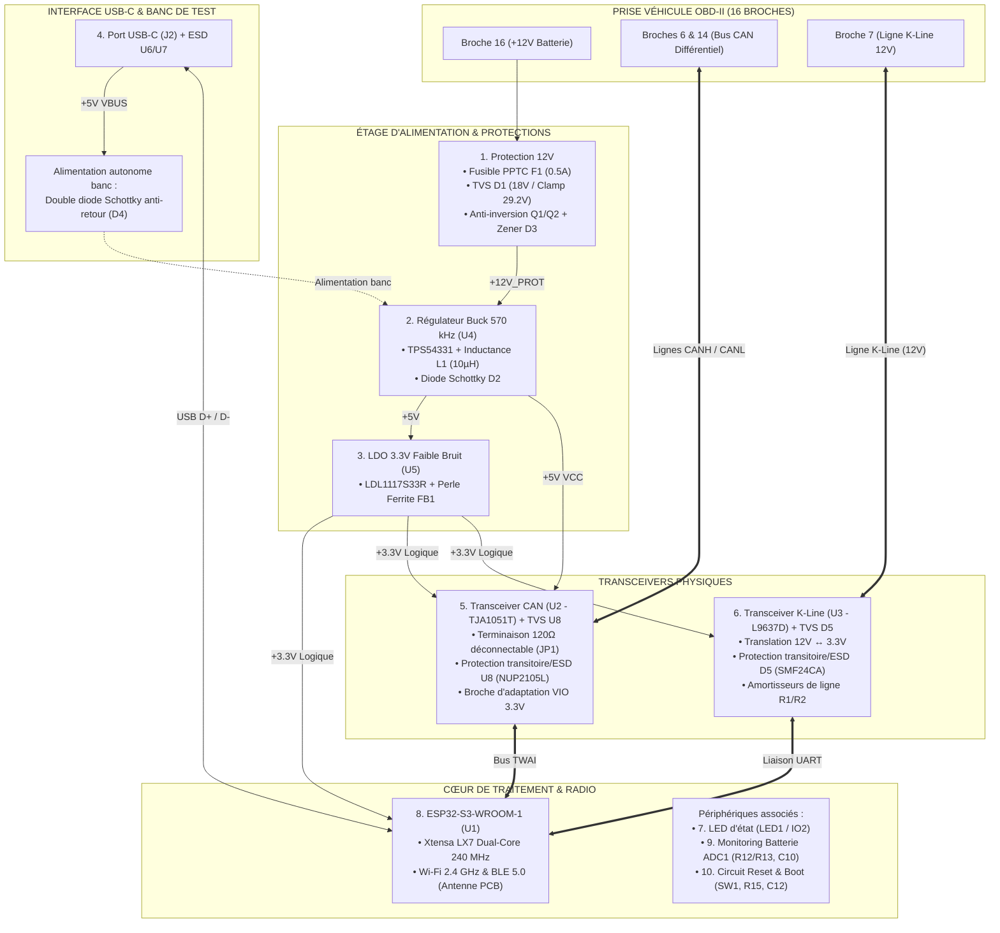
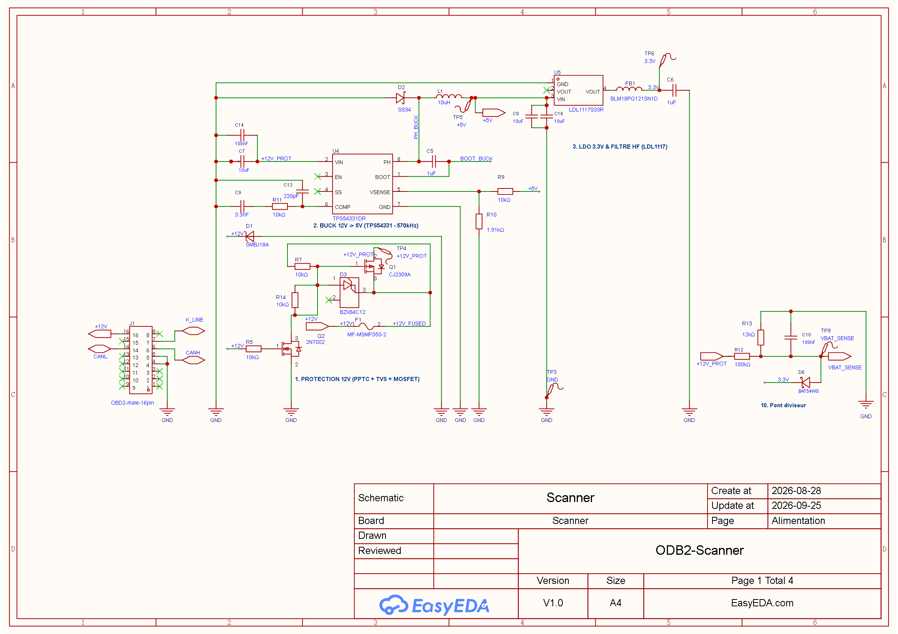
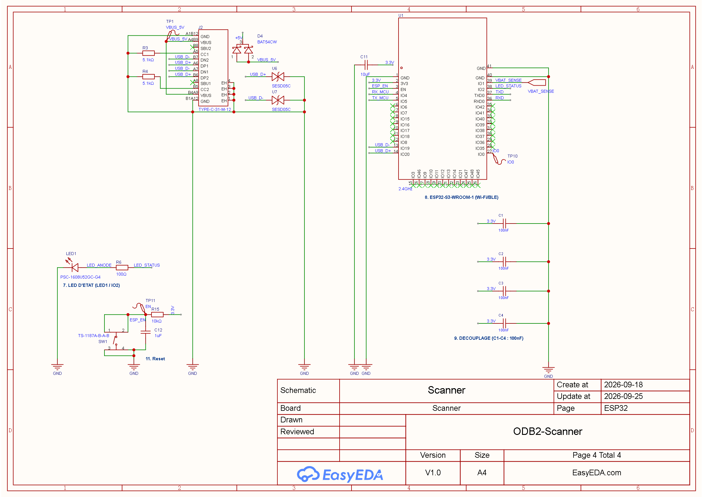

# Scanner OBD-II ESP32

Projet de conception matérielle (schématique et PCB) et logicielle d'un scanner de diagnostic automobile OBD-II intelligent, communicant et sécurisé.

---

## 1. Objectifs & Périmètre du Projet

> [!IMPORTANT]
> **Périmètre d'application exclusif : Voitures particulières (Réseau 12V)**
> L'ensemble du matériel est conçu et dimensionné exclusivement pour les véhicules légers équipés d'un **réseau de bord 12V** (batterie 12V nominale, prise standard SAE J1962 Type A). Il **ne doit en aucun cas** être raccordé à des réseaux **24V** (poids lourds, engins de chantier, bus ou prises Type B), ni soumis à des boosters 24V.

Le projet s'articule autour de deux ensembles complémentaires : le **Scanner physique communicant** (développement matériel et logiciel actuel) et son **Banc de test compagnon** (environnement de simulation d'ECU à développer pour la qualification sur table).

---

### 1.1 Le Scanner OBD-II (Matériel & Firmware en cours de conception)

Module autonome compact venant s'enficher directement sur la prise diagnostic du véhicule :

* **Diagnostic moteur multi-protocoles :**
  * **Bus CAN (ISO 15765-4) :** Diagnostic haute vitesse (500 kbps et 250 kbps) pour véhicules récents, via transceiver dédié `U2` (TJA1051T) et contrôleur TWAI de l'ESP32-S3.
  * **Ligne K-Line (ISO 9141-2 / ISO 14230 KWP2000) :** Liaison mono-fil bidirectionnelle 12V calibrée spécifiquement pour le calculateur Daewoo Kalos (2003) et calculateurs historiques, via transceiver `U3` (L9637D).
* **Cœur de traitement & Connectivité sans fil :** SoC **ESP32-S3-WROOM-1** (Xtensa LX7 Dual-Core 240 MHz, 16 Mo Flash, 8 Mo PSRAM) assurant les liaisons Bluetooth Low Energy (BLE 5.0) et Wi-Fi 2.4 GHz avec antenne méandre PCB intégrée.
* **Architecture d'alimentation hybride sécurisée :**
  * Étage primaire robuste face aux transitoires automobiles : fusible réarmable PPTC `F1` (0.75A/1.1A), diode TVS `D1` (SMBJ16A/18A), protection anti-inversion par MOSFETs `Q1`/`Q2`.
  * Double étage de régulation : convertisseur Buck haute fréquence 570 kHz (`U4` TPS54331) 12V → 5V (rendement > 85%), suivi d'un LDO ultra-faible bruit 3.3V (`U5` LDL1117) filtré par perle de ferrite `FB1`.
  * Alimentation autonome sur port USB-C protégée contre les retours par diode Schottky de puissance `D4`.

#### Profils & Cas d'Utilisation du Scanner

| Profil d'Usage | Prise OBD ($J_1$) | Port USB-C ($J_2$) | Cavalier CAN ($JP1$) | Canaux de Communication | Source d'Alimentation Active |
| :--- | :---: | :---: | :---: | :--- | :--- |
| **1. Diagnostic Nominal** | Prise véhicule (12V) | Déconnecté | **OUVERT** *(Open)* | BLE 5.0 (App smartphone conducteur) | 100% Véhicule 12V (Buck 5V + LDO 3.3V) |
| **2. Debug In Situ (Roulage)** | Prise véhicule (12V) | Câble relié au PC portable | **OUVERT** *(Open)* | BLE (App) + USB Série (Logs / Traces brutes) | Véhicule 12V prioritaire (anti-retour $D_4$) |
| **3. Banc de Test (Bench)** | Prise simulateur ECU (12V) | Câble relié au PC dev | **FERMÉ** *(Shunt 120Ω)* | USB Série/JTAG + Bus CAN/K-Line simulés | 12V banc ou USB-C (selon banc actif) |
| **4. Labo / Flash sur table** | Déconnectée (0V) | Câble relié au PC dev | Indifférent | USB-C (Flashage ROM / Debug JTAG natif) | 100% USB-C $V_{BUS}$ (5V via diode $D_4$) |
| **5. Passerelle & OTA** | Prise véhicule (Contact mis) | Déconnecté | **OUVERT** *(Open)* | Wi-Fi 2.4 GHz (Réseau local atelier / OTA) | 100% Véhicule 12V |

---

### 1.2 Le Banc de Test « OBD2 Bench » (Simulateur d'ECU — Sous-projet à développer)

Module électronique et logiciel compagnon destiné à émuler le comportement physique et logique d'un ou plusieurs calculateurs moteur (ECU) d'un véhicule particulier :

* **Raison d'être & Objectifs du Bench :**
  * Développer, tester unitairement et valider le firmware du scanner sur table en laboratoire sans risquer de décharger la batterie du véhicule, ni manipuler l'électronique de bord en roulage.
  * Rejouer des scénarios de pannes contrôlées et valider la remontée des codes défauts (DTCs).
* **Fonctionnalités cibles prévues :**
  * **Émulation physique des bus automobiles :**
    * Bus CAN haute vitesse avec résistance de terminaison 120 Ω intégrée et génération de trames périodiques d'ECU (vitesse, régime, couple).
    * Ligne K-Line 12V avec répondeur matériel pour les séquences d'initialisation lentes (5-baud init ISO 9141-2) et rapides (*Fast-Init* ISO 14230 KWP2000).
  * **Serveur de diagnostic OBD-II simulé :**
    * Réponse aux requêtes normalisées Mode 01 (PIDs moteur temps réel : RPM, vitesse véhicule, température LDR, avance allumage).
    * Gestion des codes d'anomalie : injection de défauts (Mode 03 / Mode 07) et effacement de défauts (Mode 04).
    * Simulation de freeze frames (Mode 02).
  * **Interface d'interaction opérateur :**
    * Potentiomètres physiques ou interface Web/CLI pour faire varier dynamiquement les PIDs (ex. simuler une accélération, une surchauffe moteur ou une sonde lambda défectueuse).
  * **Injection d'anomalies de tension batterie (Stress-Test) :**
    * Fourniture d'une ligne d'alimentation 12V régulée vers la prise femelle OBD-II du banc.
    * Simulation de creux de tension lors du démarrage (*cranking* à ~9V) et de transitoires alternateur (~14.4V à 15V) pour éprouver la résistance au reset/brownout du scanner.

---

## 2. Architecture Fonctionnelle Globale

---

## 3. Visuels du Projet

### Schéma Électronique Modulaire (4 Blocs Fonctionnels)

#### 1. Étage d'Alimentation & Protections 12V

#### 2. Transceiver CAN (TJA1051T & Terminaison 120Ω)

#### 3. Transceiver K-Line (L9637D Daewoo Kalos)

#### 4. Microcontrôleur ESP32-S3 & Périphériques

### Circuit Imprimé (PCB)

### Modélisation 3D

---

## 4. État Actuel (work in progress) & Prochaine Étape

* **Schématique :** Schéma complet modulaire découpé en 4 pages fonctionnelles (Alimentation, Transceiver CAN, Transceiver K-Line, ESP32-S3), 60 composants au total avec intégration des protections transitoires/ESD `U8` (CAN) et `D5` (K-Line), résistance `R6` ajustée à 100 Ω pour visibilité LED plein jour, ERC strict = 0 sous EasyEDA Pro.
* **Placement PCB :** Placement 2D validé pour l'ensemble des composants avec connecteur OBD-II `J1` coudé à 90°, prise USB-C `J2` affleurante et contour de carte ajusté (81.28 × 35.56 mm), DRC = 0.
* **Prochaine étape immédiate :** Synchroniser le layout PCB depuis le schéma (`Design > Update PCB`) pour instancier les empreintes de `U8` (SOT-23) et `D5` (SOD-123FL), finaliser le placement au plus près de `J1`, puis engager le routage des pistes prioritaires (paires différentielles USB/CAN, signaux critiques, rails de puissance).

---

## 5. Guide de Navigation du Dépôt

L'ensemble de la documentation technique et opérationnelle est structuré dans les documents dédiés suivants :

| Document | Description |
| :--- | :--- |
| 📋 **[TODO.md](TODO.md)** | **Feuille de route active & checklist complète** : suivi détaillé des 8 phases de conception (mécanique, schéma, floorplanning, routage, plans de masse, contrôles, fabrication). |
| 📦 **[BOM.md](BOM.md)** | **Nomenclature complète des 63 composants** : références fabricants, codes LCSC, boîtiers d'empreinte et sélection des pièces de base JLCPCB (*Basic Parts*). |
| 📑 **[DATASHEETS.md](DATASHEETS.md)** | **Référentiel constructeur & Audit de conformité des ICs** : synthèse des 6 datasheets officielles (`datasheet/`), caractéristiques électriques, limites absolues, règles d'implantation PCB et matrice de conformité. |
| 📐 **[floorplan.json](floorplan.json)** | **Configuration formelle du layout machine-readable** : source unique de vérité physique (dimensions, keepout RF, clusters CEM, règles de proximité et coordonnées d'implantation 2D) pilotant le skill `pcb-placer`. |
| 🧠 **[circuit_semantics.json](circuit_semantics.json)** | **Référentiel sémantique & intention de schéma machine-readable** : source unique de vérité électrique (rôles fonctionnels des composants, contraintes critiques, tolérances, tensions de service et politiques de substituabilité) pilotant les skills `stingy-schematics`, `review` et `pcb-placer`. |
| 🔬 **[HARDWARE.md](HARDWARE.md)** | **Architecture matérielle & anatomie détaillée** : guide pédagogique des 11 blocs, calculs théoriques (Buck, LDO, pont diviseur, Zener), table complète des nets, répertoire des points de test (`TP1` à `TP11`) et règles de layout. |
| 🤖 **[AUTOMATION.md](AUTOMATION.md)** | **Automatisation IA via EasyEDA Pro** : architecture du pont Node.js, extension `.eext`, configuration des hooks de cycle de vie Antigravity et règles de routage IA. |
| 💡 **[LEARNINGS.md](LEARNINGS.md)** | **Capitalisation technique** : journal d'apprentissage, spécificités d'API EasyEDA Pro, formats d'unités et pièges évités. |
| 📜 **[AGENTS.md](AGENTS.md)** | **Règles de gouvernance IA** : découplage strict des skills (règle 0), exécution obligatoire sous `uv`, sécurité du pont et protocole de dépouillement. |
| 📥 **[review/](review/guidelines.md)** | **Sas d'entrée pour revues techniques** : répertoire réceptacle des fichiers de revue (`reviewXXX.md`), encadré par [`guidelines.md`](review/guidelines.md). Les revues y sont dépouillées, arbitrées puis supprimées après intégration dans `TODO.md`. |
| 📁 **`OBD2.eprj2`** | **Fichier projet natif EasyEDA Pro v2** : contient le schéma schématique `P1` et la carte de circuit imprimé `PCB1`. |

---

## 6. Outils & Skills Spécialisés d'Automatisation

Le projet intègre et exploite 5 compétences logicielles dédiées (*Skills*) pour assister l'agent IA et fiabiliser les étapes critiques de modélisation théorique, d'audit, de CAO, d'agencement physique et d'optimisation des coûts d'assemblage :

| Skill | Emplacement | Rôle & Fonctionnalités |
| :--- | :--- | :--- |
| ⚡ **`buck-compensation`** | [`.agents/skills/buck-compensation/`](.agents/skills/buck-compensation/SKILL.md) | **Modélisation petit-signal & Stabilité Buck :** Outil de calcul mathématique et d'optimisation paramétrique du réseau de compensation Type II pour le régulateur TI TPS54331 (évaluation Bode, fréquence de coupure fco, marge de phase ≥ 45°, marge de gain ≥ 10 dB, et sélection optimale du triplet Rz, Cz, Cp sur le catalogue Basic Parts JLCPCB). Exécuté via `uv run`. |
| 🔌 **`easyeda-api`** | [`.agents/skills/easyeda-api/`](.agents/skills/easyeda-api/SKILL.md) | **Contrôle programmatique EasyEDA Pro :** Pont bidirectionnel local (WebSocket/HTTP sur port 49620) permettant d'interroger, d'auditer et d'automatiser le schéma et le PCB en temps réel sans manipulation manuelle à risque, avec accès aux 120+ classes de l'API officielle. |
| 📐 **`pcb-placer`** | [`.agents/skills/pcb-placer/`](.agents/skills/pcb-placer/SKILL.md) | **Moteur Agnostique d'Auto-Placement par Contraintes :** Algorithme déterministe d'agencement 2D en une passe pour les composants du PCB sous EasyEDA Pro. Moteur générique découplé (aucun composant en dur), piloté via `uv run` avec l'argument obligatoire `--config floorplan.json`. Intègre les contraintes CEM (découplage < 2 mm), thermiques (boucle Buck), d'exclusion RF (antenne ESP32-S3), d'audit géométrique et d'injection en direct. |
| 🔍 **`review`** | [`.agents/skills/review/`](.agents/skills/review/SKILL.md) | **Audit Matériel, Validation & Triage :** Moteur méthodologique et outillé pour la conduite de revues techniques matérielles (Axe 1 à 6, règle d'or Tabula Rasa / oubli de mémoire). Outil CLI agnostique (`review_tool.py`) extrayant le template depuis `review/guidelines.md`, validant la structure des rapports face aux standards et automatisant le dépouillement vers `TODO.md` avec détection de collisions. Exécuté via `uv run`. |
| 💰 **`stingy-schematics`** | [`.agents/skills/stingy-schematics/`](.agents/skills/stingy-schematics/SKILL.md) | **Optimiseur SMT & Gardien Sémantique de Schéma :** Moteur d'audit et de réduction des coûts de fabrication JLCPCB PCBA. Analyse la BOM et `circuit_semantics.json` pour proposer de basculer des pièces Extended vers des Basic Parts sans compromis de qualité ni de sécurité (substitutions 1-to-1, recalculs de ponts diviseurs E24/E96, et contrôle de synchronisation continue via `sync_semantics.py`). Exécuté via `uv run`. |

---

## 7. Démarrage Rapide

1. **Ouvrir le projet :** Lancer EasyEDA Pro (version bureau ou web) et ouvrir le fichier `OBD2.eprj2`.
2. **Contrôle d'intégrité :**
   - Schéma : Menu `Design` → `Check ERC` (doit retourner 0 erreur, 0 avertissement).
   - PCB : Menu `Design` → `Check DRC` (doit retourner 0 erreur).
3. **Pilotage IA :** Démarrer le pont local via le skill EasyEDA pour activer la manipulation automatisée (voir [AUTOMATION.md](AUTOMATION.md)).