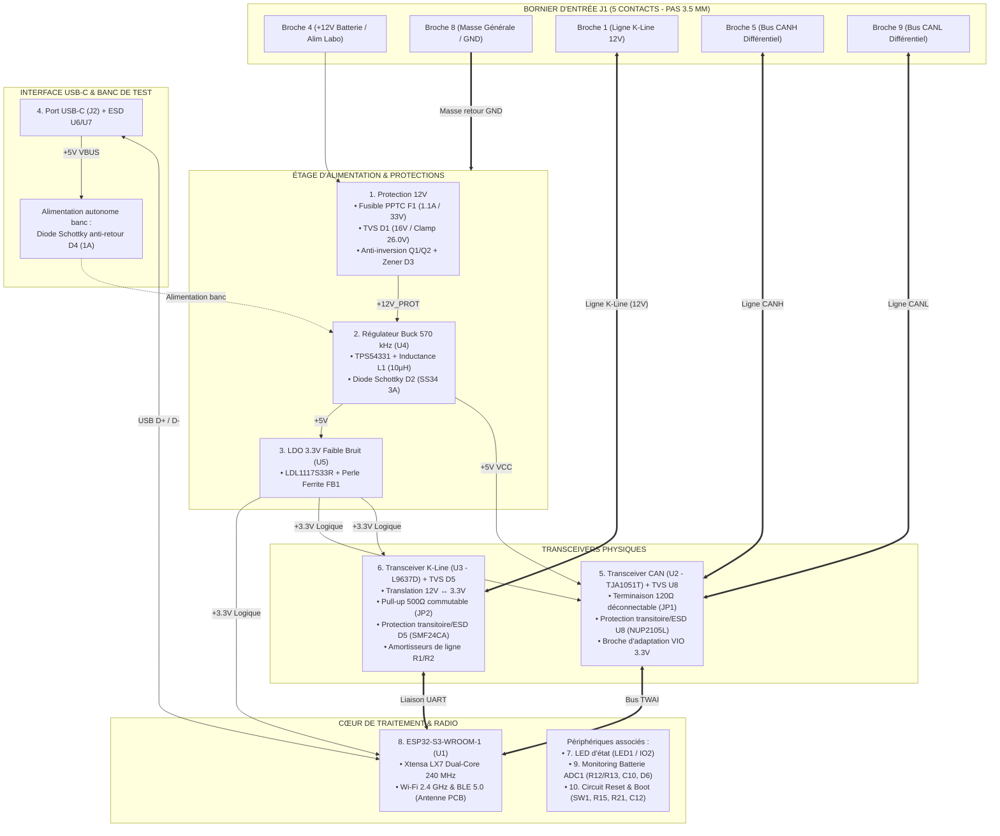
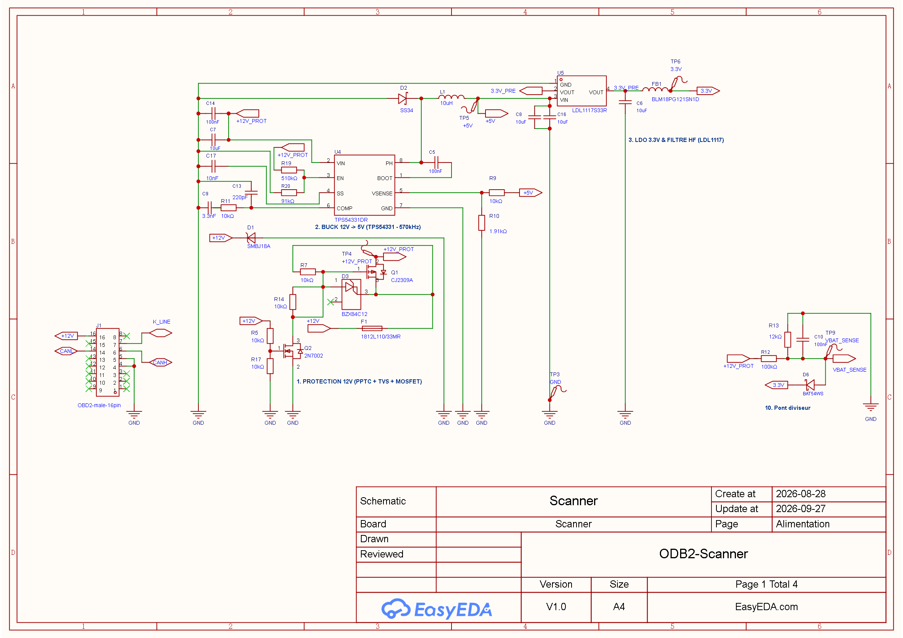
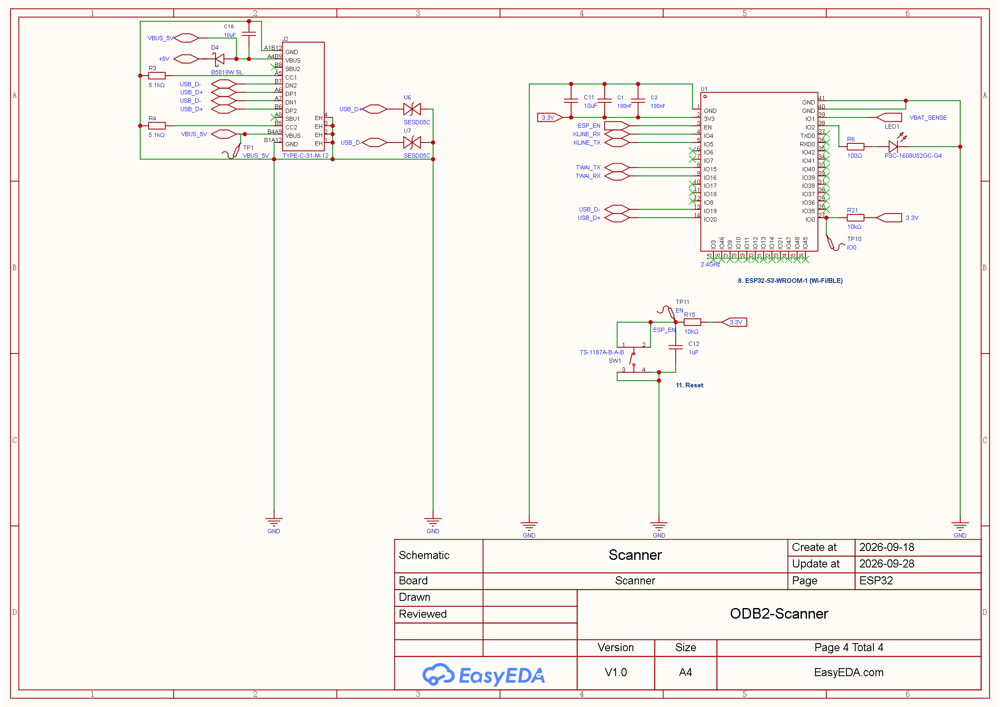
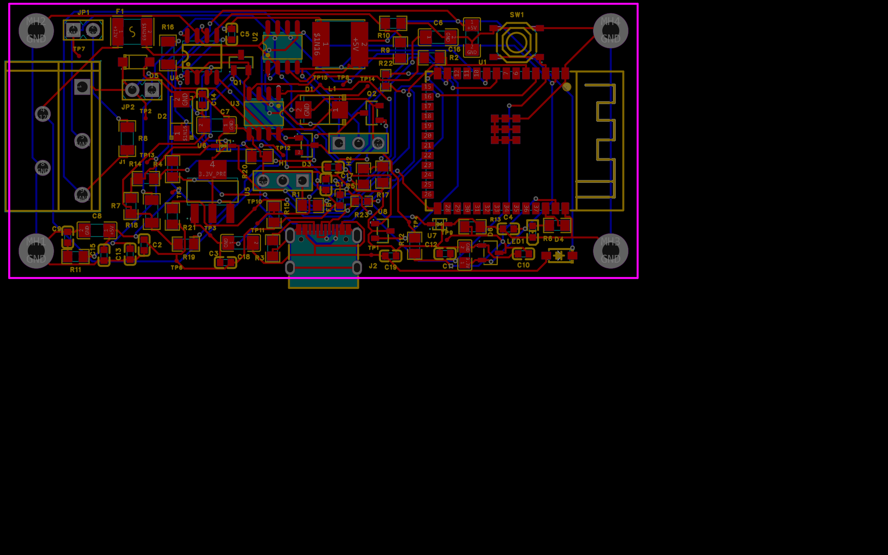
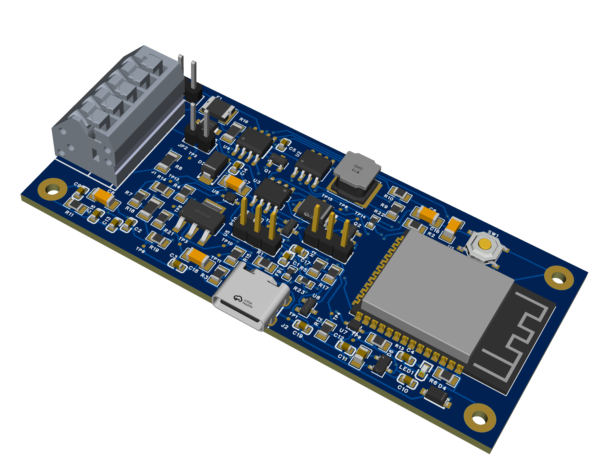

# Scanner OBD-II ESP32

Projet de conception matérielle (schématique et PCB) et logicielle d'un scanner de diagnostic automobile OBD-II intelligent, communicant et sécurisé.

---

## 1. Objectifs & Périmètre du Projet

> [!IMPORTANT]
> **Périmètre d'application exclusif : Voitures particulières (Réseau 12V)**
> L'ensemble du matériel est conçu et dimensionné exclusivement pour les véhicules légers équipés d'un **réseau de bord 12V** (batterie 12V nominale, prise standard SAE J1962 Type A). Il **ne doit en aucun cas** être raccordé à des réseaux **24V** (poids lourds, engins de chantier, bus ou prises Type B), ni soumis à des boosters 24V.

Le projet est conçu pour opérer et se qualifier selon **trois cas d'usage et de test opérationnels** :
1. **Cas 1 : Nominal Véhicule (Usage Conducteur / Atelier) :** Diagnostic autonome enfiché sur la prise OBD-II SAE J1962 (12V) du véhicule, communication 100% sans fil (BLE 5.0 / Wi-Fi), alimentation directe par la batterie du véhicule avec coupure de sécurité UVLO à 8.01 V, cavaliers CAN `JP1` et K-Line `JP2` obligatoirement ouverts.
2. **Cas 2 : Nominal + Debug In Situ (Roulage d'Essai & Traces Brutes) :** Raccordé au véhicule avec câble USB-C vers PC portable de diagnostic sur batterie interne pour capture des traces en roulage, arbitrage d'alimentation prioritaire 12V via diode anti-retour `D4`, règle d'isolation de masse stricte (anti-boucle de terre).
3. **Cas 3 : Banc d'Essais Bi-Cartes Miroir (Qualification Labo & Simulation ECU) :** Deux cartes face à face interconnectées via leurs borniers 5 contacts `J1` (Carte Scanner face à Carte Simulateur d'ECU) sous alimentation de laboratoire 12V DC et double liaison USB-C, terminaison CAN `JP1` fermée à 120 Ω sur les deux cartes (60 Ω équivalents) et pull-up K-Line 500 Ω activée sur le simulateur via `JP2`.

---

### 1.1 Le Scanner OBD-II (Matériel & Firmware en cours de conception)

Module autonome compact venant s'enficher directement sur la prise diagnostic du véhicule :

* **Diagnostic moteur multi-protocoles :**
  * **Bus CAN (ISO 15765-4) :** Diagnostic haute vitesse (500 kbps et 250 kbps) pour véhicules récents, via transceiver dédié `U2` (TJA1051T) et contrôleur TWAI de l'ESP32-S3.
  * **Ligne K-Line (ISO 9141-2 / ISO 14230 KWP2000) :** Liaison mono-fil bidirectionnelle 12V calibrée spécifiquement pour le calculateur Daewoo Kalos (2003) et calculateurs historiques, via transceiver `U3` (L9637D).
* **Cœur de traitement & Connectivité sans fil :** SoC **ESP32-S3-WROOM-1** (Xtensa LX7 Dual-Core 240 MHz, 16 Mo Flash, 8 Mo PSRAM) assurant les liaisons Bluetooth Low Energy (BLE 5.0) et Wi-Fi 2.4 GHz avec antenne méandre PCB intégrée.
* **Architecture d'alimentation hybride sécurisée :**
  * Étage primaire robuste face aux transitoires automobiles : fusible réarmable PPTC `F1` (0.75A/1.1A), diode TVS `D1` (SMBJ16A/18A), protection anti-inversion par MOSFETs `Q1`/`Q2`.
  * Double étage de régulation : convertisseur Buck haute fréquence 570 kHz (`U4` TPS54331) 12V → 5V (rendement > 85%), suivi d'un LDO ultra-faible bruit 3.3V (`U5` LDL1117) filtré par perle de ferrite `FB1`.
  * Alimentation autonome sur port USB-C protégée contre les retours par diode Schottky de puissance `D4`.

#### Profils & Cas d'Utilisation Cibles du Scanner

Pour le détail exhaustif des schémas de câblage, des règles de sécurité électrique et des diagrammes d'interconnexion, consulter le **[Guide d'Architecture des Cas d'Usage (HARDWARE.md §8)](HARDWARE.md#8-architecture-des-cas-dusage-cibles--câblage-opérationnel)** :

| Cas d'Usage Cible | Bornier 5P (`J1`) | Port USB-C (`J2`) | Cavalier CAN (`JP1` 120 Ω) | Cavalier K-Line (`JP2` 500 Ω) | Canaux de Communication | Source d'Alimentation |
| :--- | :---: | :---: | :---: | :---: | :--- | :--- |
| **Cas 1 : Nominal Véhicule** | Faisceau pigtail vers prise SAE J1962 | **DÉCONNECTÉ** | **OUVERT** *(Sans shunt)* | **OUVERT** *(Sans shunt)* | BLE 5.0 (App smartphone) / Wi-Fi | 100% Batterie véhicule 12V |
| **Cas 2 : Nominal + Debug In Situ** | Faisceau pigtail vers prise SAE J1962 | Relié au **PC sur batterie** | **OUVERT** *(Sans shunt)* | **OUVERT** *(Sans shunt)* | USB Série (Logs PC) + BLE 5.0 (App) | 12V véhicule prioritaire (anti-retour `D4`) |
| **Cas 3 : Banc d'Essais Bi-Cartes Miroir** | Relié au Banc ECU + Alim Labo 12V | Relié au PC dev | **FERMÉ** *(Shunt 120 Ω)* | **OUVERT** *(Scanner)* / **FERMÉ** *(ECU)* | USB Série natif / JTAG + Headers `H1`/`H2` | Alim Labo 12V (relais USB-C via `D4`) |

> [!CAUTION]
> **Règle vitale d'isolation de masse (Cas 2) :** Lors d'une session de débogage in situ sur véhicule, le PC portable relié au port USB-C `J2` doit fonctionner **exclusivement sur sa batterie interne**. Le branchement sur secteur 230V avec terre est strictement interdit (danger de destruction immédiate par boucle de terre entre la prise murale et la carrosserie du véhicule).

---

### 1.2 La Carte en Mode Simulateur d'ECU (Qualification sur Table & Banc d'Essais)

> [!IMPORTANT]
> **Une seule et même carte matérielle universelle :**
> Le projet ne nécessite aucune conception matérielle séparée. La même carte électronique, produite à l'identique, incarne soit le rôle de **Scanner de diagnostic (Client)**, soit le rôle de **Simulateur d'ECU automobile (Serveur)** selon la configuration de ses cavaliers matériels (`JP1`, `JP2`) et le firmware téléversé dans son microcontrôleur ESP32-S3.

Dans le **Cas 3 (Banc d'Essais Bi-Cartes Miroir)**, une seconde carte configurée en simulateur reproduit fidèlement le comportement d'un calculateur moteur (ECU) et de son réseau de bord :

* **Configuration Matérielle Dédiée au Rôle Simulateur d'ECU :**
  * **Cavalier CAN `JP1` (Terminaison 120 Ω) : FERMÉ (avec shunt)** — Fournit la terminaison de ligne indispensable à l'extrémité du bus CAN simulé (la carte Scanner fournissant les autres 120 Ω, formant les 60 Ω équivalents de la norme ISO 11898-2).
  * **Cavalier K-Line `JP2` (Pull-Up 500 Ω) : FERMÉ (avec shunt)** — Active le pont de rappel normalisé 500 Ω (`R16` // `R18`) tiré vers le `+12V_PROT`, polarisant activement la ligne K-Line mono-fil ISO 9141-2 / ISO 14230 (rôle normalement dévolu à l'ECU du véhicule).
  * **Bornier 5 contacts `J1` :** Raccordé en direct au bornier `J1` de la carte Scanner (lignes CANH, CANL, K_LINE) et alimenté par une alimentation 12V DC de laboratoire (rails +12V et GND).
  * **Port USB-C `J2` :** Relié au PC de développement pour le pilotage interactif (CLI / logs) et l'injection dynamique de scénarios.
  * **Embases de Diagnostic (`H1` et `H2`) :** Permettent le branchement d'un analyseur logique USB pour espionner simultanément les trames CAN et UART au niveau logique 3.3V.

* **Fonctionnalités Logicielles du Firmware Simulateur d'ECU :**
  * **Émulation TWAI CAN (ISO 15765-4) :**
    * Diffusion cyclique de trames périodiques d'ECU (régime moteur RPM, vitesse véhicule, couple, température liquide de refroidissement).
    * Répondeur ISO-TP et serveur de diagnostic OBD-II : traitement des requêtes Mode 01 (PIDs temps réel), Mode 02 (*Freeze Frames*), Mode 03 / 07 (codes défauts DTCs émulés), et Mode 04 (effacement des défauts).
  * **Émulation K-Line (ISO 9141-2 / ISO 14230 KWP2000) :**
    * Répondeur d'initialisation lente 5-baud et rapide (*Fast-Init* 25 ms).
    * Émulation de la pile protocolaire constructeur Daewoo Kalos (calculateurs ECM `0x10`, TCM `0x28`, ABS `0x58`).
  * **Console Interactive CLI (Série USB-C / Web BLE) :**
    * Commandes de variation dynamique des PIDs pour simuler une accélération, une surchauffe moteur, ou une dérive de sonde.
    * Injection interactive de pannes moteur et génération de DTCs spécifiques (`P0300`, `P0420`, `P1xxx`).

---

### 1.3 Référentiel Normatif & Évaluation de la Conformité (Design Compliance)

Le matériel et le firmware sont développés en référence stricte aux standards internationaux de l'ingénierie automobile. La grille ci-dessous évalue le **niveau de conformité par conception** (*Design Compliance*) atteint par l'architecture :

* 🟢 **Pleine conformité matérielle (100%) :** Le circuit respecte rigoureusement les tolérances géométriques, dynamiques et électriques imposées par la norme.
* 🟡 **Conformité ciblée VL (85% – 95%) :** Dimensionné et éprouvé pour les conditions réelles d'une voiture particulière 12V (VL), avec limites physiques explicitement tracées.
* 🔵 **Conformité matérielle prête / Dépendant du firmware :** Le hardware est 100% capable et dimensionné ; la conformité finale dépend de la stack logicielle (Phase 5).

| Domaine | Norme / Standard | Titre & Périmètre Couvert | Statut | Justification Matérielle & Choix de Conception | Limite / Condition d'Usage |
| :--- | :--- | :--- | :---: | :--- | :--- |
| **Connectique** | **SAE J1962 / ISO 15031-3** | Bornier de diagnostic & banc | 🟢 **100%** | • Bornier PCB à ressort sans vis 5 contacts au pas 3.5 mm (`WJ250B-3.5-05P-11-00A`, 250V 8A) pour raccordement faisceau véhicule pigtail ou banc d'essais. • Brochage direct : 4 (+12V), 8 (GND), 1 (K_LINE), 5 (CANH), 9 (CANL). | Raccordement direct par fils dénudés ou nappe. |
| **Bus CAN** | **ISO 11898-2** | Couche physique différentielle CAN High-Speed | 🟢 **100%** | • Transceiver certifié NXP **TJA1051T/3/1J** avec broche logique `VIO` (3.3V). • Paires différentielles symétriques 120 Ω. • Terminaison 120 Ω (`R8`) commutable par cavalier `JP1` (obligatoire). | Cavalier `JP1` impérativement **ouvert** sur véhicule. |
| **Bus K-Line** | **ISO 9141-2 & ISO 14230 (KWP2000)** | Ligne K-Line mono-fil bidirectionnelle 12V | 🟢 **100%** | • Transceiver dédié STMicroelectronics **L9637D** conforme ISO 9141. • Pull-up normalisée à 500 Ω (`R16` // `R18` boîtiers 1206) garantissant tr < 2 µs sur 2 nF. • Compatible init lente 5-baud et *Fast-Init* 25 ms. | Débit limité à 10.4 kbps (spécification ISO). |
| **Diagnostic OBD** | **ISO 15765-4 & SAE J1979** | Diagnostic CAN (ISO-TP) et PIDs normalisés | 🔵 **Prêt 100%** *(Firmware)* | • Contrôleur TWAI matériel de l'ESP32-S3 compatible trames 11-bit et 29-bit. • Prêt pour débits standard 500 kbps et 250 kbps (Modes 01 à 0A). | Dépend de l'implémentation de la pile logicielle FreeRTOS. |
| **Transitoires 12V** | **ISO 7637-2** | Perturbations électriques conduites sur faisceau 12V | 🟢 **95%** *(Niveau III / Classe A)* | • **Impulsion 1 (–100 V inductif) :** Bloqué par MOSFET P-MOS `Q1` (tenue 60V, Vgs borné par `D3` 12V et diviseur `R5`/`R17`). • **Impulsion 2a (+50 V) :** Écrêté sous 26.0 V par TVS `D1` (SMBJ16A). • **Impulsions 3a/3b (–150 V / +100 V HF) :** Filtré par TVS `D1` + capacités d'entrée `C14`, `C7`. | Conçu pour impédance de source automobile standard. |
| **Environnement VL** | **ISO 16750-2** | Contraintes électriques pour véhicules légers (12V) | 🟡 **90%** *(Ciblé 12V)* | • **Inversion polarité (§4.7, –14 V) :** Bloqué à 100% par P-MOS `Q1` (aucun courant inverse). • **Démarrage / Cranking (§4.6.3) :** Coupure sous 8.01 V via pont UVLO `R19`/`R20` et démarrage progressif 4.0 ms (`C17`) pour protéger la Flash NVS. • **Load-Dump centralisé (§4.6.4, 35 V) :** Écrêté à 26.0 V par `D1` sous la limite absolue de 30.0 V du Buck TPS54331. | Interdiction formelle du réseau 24V et surtensions *Jump-Start* 24V prolongées (> quelques s). |
| **Immunité ESD** | **ISO 10605 / IEC 61000-4-2** | Décharges électrostatiques (Contact & Air) | 🟢 **100%** *(Niveau 4 : ±8 kV contact / ±15 kV air)* | • Bus CAN : Diode double TVS `U8` (NUP2105L, qualifiée ISO 10605 jusqu'à ±30 kV). • K-Line : Diode TVS `D5` (SMF24CA 24V bidirectionnelle, 400 W crête). • Port USB-C : Diodes ESD ultra-rapides `U6`, `U7` (SESD05C, Cj < 1.0 pF). | Nécessite un plan de masse PCB continu avec vias de couture. |
| **Radiofréquence** | **IEEE 802.11 b/g/n & BLE 5.0** | Connectivité sans fil 2.4 GHz et Bluetooth Low Energy | 🟢 **100%** *(Certifié)* | • Module pré-certifié FCC/CE/SRRC par Espressif Systems. • Antenne méandre PCB intégrée accordée à 50 Ω. | Respect rigoureux du Keepout RF PCB (zone sans cuivre multicouche). |

---

## 2. Architecture Fonctionnelle Globale

```mermaid
%%{init: {
  'themeVariables': {
    'fontFamily': 'Consolas, "Courier New", monospace',
    'fontSize': '12px'
  },
  'flowchart': {
    'curve': 'stepBefore',
    'nodeSpacing': 30,
    'rankSpacing': 40
  }
}}%%
flowchart TD
    subgraph J1_BLOCK["BORNIER D'ENTRÉE J1 (5 CONTACTS - PAS 3.5 MM)"]
        PIN4["Broche 4 (+12V Batterie / Alim Labo)"]
        PIN8["Broche 8 (Masse Générale / GND)"]
        PIN1["Broche 1 (Ligne K-Line 12V)"]
        PIN5["Broche 5 (Bus CANH Différentiel)"]
        PIN9["Broche 9 (Bus CANL Différentiel)"]
    end

    subgraph POWER["ÉTAGE D'ALIMENTATION & PROTECTIONS"]
        direction TB
        F1["1. Protection 12V\n• Fusible PPTC F1 (1.1A / 33V)\n• TVS D1 (16V / Clamp 26.0V)\n• Anti-inversion Q1/Q2 + Zener D3"]
        BUCK["2. Régulateur Buck 570 kHz (U4)\n• TPS54331 + Inductance L1 (10µH)\n• Diode Schottky D2 (SS34 3A)"]
        LDO["3. LDO 3.3V Faible Bruit (U5)\n• LDL1117S33R + Perle Ferrite FB1"]
        F1 -->|"+12V_PROT"| BUCK
        BUCK -->|"+5V"| LDO
    end

    subgraph TRANSCEIVERS["TRANSCEIVERS PHYSIQUES"]
        CAN_IC["5. Transceiver CAN (U2 - TJA1051T) + TVS U8\n• Terminaison 120Ω déconnectable (JP1)\n• Protection transitoire/ESD U8 (NUP2105L)\n• Broche d'adaptation VIO 3.3V"]
        KLINE_IC["6. Transceiver K-Line (U3 - L9637D) + TVS D5\n• Translation 12V ↔ 3.3V\n• Pull-up 500Ω commutable (JP2)\n• Protection transitoire/ESD D5 (SMF24CA)\n• Amortisseurs de ligne R1/R2"]
    end

    subgraph MCU["CŒUR DE TRAITEMENT & RADIO"]
        ESP["8. ESP32-S3-WROOM-1 (U1)\n• Xtensa LX7 Dual-Core 240 MHz\n• Wi-Fi 2.4 GHz & BLE 5.0 (Antenne PCB)"]
        PERIPH["Périphériques associés :\n• 7. LED d'état (LED1 / IO2)\n• 9. Monitoring Batterie ADC1 (R12/R13, C10, D6)\n• 10. Circuit Reset & Boot (SW1, R15, R21, C12)"]
    end

    subgraph USB_DEBUG["INTERFACE USB-C & BANC DE TEST"]
        USBC["4. Port USB-C (J2) + ESD U6/U7"]
        D4["Alimentation autonome banc :\nDiode Schottky anti-retour D4 (1A)"]
        USBC -->|"+5V VBUS"| D4
        D4 -.->|Alimentation banc| BUCK
        USBC <-->|"USB D+ / D-"| ESP
    end

    PIN4 --> F1
    PIN8 ===>|"Masse retour GND"| POWER
    PIN5 <==>|"Ligne CANH"| CAN_IC
    PIN9 <==>|"Ligne CANL"| CAN_IC
    PIN1 <==>|"Ligne K-Line (12V)"| KLINE_IC

    LDO -->|"+3.3V Logique"| ESP
    LDO -->|"+3.3V Logique"| CAN_IC
    LDO -->|"+3.3V Logique"| KLINE_IC
    BUCK -->|"+5V VCC"| CAN_IC

    CAN_IC <==>|"Bus TWAI"| ESP
    KLINE_IC <==>|"Liaison UART"| ESP
```

---

## 3. Visuels du Projet

### Schéma Électronique Modulaire (4 Blocs Fonctionnels)

#### 1. Étage d'Alimentation & Protections 12V

#### 2. Transceiver CAN (TJA1051T & Terminaison 120Ω)

#### 3. Transceiver K-Line (L9637D Daewoo Kalos)

#### 4. Microcontrôleur ESP32-S3 & Périphériques

### Circuit Imprimé (PCB)

### Modélisation 3D

---

## 4. État Actuel (work in progress) & Prochaine Étape

* **Schématique :** Schéma complet modulaire découpé en 4 pages fonctionnelles (Alimentation, Transceiver CAN, Transceiver K-Line, ESP32-S3), 67 composants physiques à assembler (82 composants avec les mires de test TP), intégration des cavaliers de configuration bi-mode (`JP1` 120 Ω CAN, `JP2` 500 Ω K-Line), connecteurs de diagnostic USB (`H1`, `H2`), et contrôle ERC strict = 0 sous EasyEDA Pro.
* **Placement PCB :** Placement 2D pour l'ensemble des composants avec bornier d'entrée `J1` 5 contacts (`WJ250B-3.5-05P`), prise USB-C `J2` affleurante et contour de carte ajusté (81.28 × 35.56 mm).
* **Prochaine étape immédiate :** Synchroniser le layout PCB depuis le schéma (`Design > Update PCB`) pour instancier les empreintes des nouveaux composants (`U8`, `D5`, `JP1`, `JP2`, `H1`, `H2`, `R18`, `C19`, et `J1` 5P), finaliser le placement, puis engager le routage des pistes prioritaires (paires différentielles USB/CAN, signaux critiques, rails de puissance).

---

## 5. Guide de Navigation du Dépôt

L'ensemble de la documentation technique et opérationnelle est structuré dans les documents dédiés suivants :

| Document | Description |
| :--- | :--- |
| 📋 **[TODO.md](TODO.md)** | **Feuille de route active & checklist complète** : suivi détaillé des 8 phases de conception (mécanique, schéma, floorplanning, routage, plans de masse, contrôles, firmware et fabrication). |
| 📦 **[BOM.md](BOM.md)** | **Nomenclature complète des 67 composants physiques (82 avec mires de test)** : références fabricants, codes LCSC, boîtiers d'empreinte et sélection des pièces de base JLCPCB (*Basic Parts*). |
| 📑 **[DATASHEETS.md](DATASHEETS.md)** | **Référentiel constructeur & Audit de conformité des ICs** : synthèse des 6 datasheets officielles (`datasheet/`), caractéristiques électriques, limites absolues, règles d'implantation PCB et matrice de conformité. |
| 📐 **[floorplan.json](floorplan.json)** | **Configuration formelle du layout machine-readable** : source unique de vérité physique (dimensions, keepout RF, clusters CEM, règles de proximité et coordonnées d'implantation 2D) pilotant le skill `pcb-placer`. |
| 🧠 **[circuit_semantics.json](circuit_semantics.json)** | **Référentiel sémantique & intention de schéma machine-readable** : source unique de vérité électrique (rôles fonctionnels des composants, contraintes critiques, tolérances, tensions de service et politiques de substituabilité) pilotant les skills `stingy-schematics`, `review` et `pcb-placer`. |
| 🔬 **[HARDWARE.md](HARDWARE.md)** | **Architecture matérielle & anatomie détaillée** : guide pédagogique des 11 blocs, calculs théoriques (Buck, LDO, pont diviseur, Zener), table complète des nets, répertoire des points de test (`TP1` à `TP15`) et règles de layout. |
| 🤖 **[AUTOMATION.md](AUTOMATION.md)** | **Automatisation IA via EasyEDA Pro** : architecture du pont Node.js, extension `.eext`, configuration des hooks de cycle de vie Antigravity et règles de routage IA. |
| 💡 **[LEARNINGS.md](LEARNINGS.md)** | **Capitalisation technique** : journal d'apprentissage, spécificités d'API EasyEDA Pro, formats d'unités et pièges évités. |
| 📜 **[AGENTS.md](AGENTS.md)** | **Règles de gouvernance IA** : découplage strict des skills (règle 0), exécution obligatoire sous `uv`, sécurité du pont et protocole de dépouillement. |
| 📥 **[review/](review/guidelines.md)** | **Sas d'entrée pour revues techniques** : répertoire réceptacle des fichiers de revue (`reviewXXX.md`), encadré par [`guidelines.md`](review/guidelines.md). Les revues y sont dépouillées, arbitrées puis supprimées après intégration dans `TODO.md`. |
| 📁 **`easyeda/OBD2.epro2`** | **Fichier projet natif EasyEDA Pro v2** : contient le schéma schématique `P1` et la carte de circuit imprimé `PCB1`. |

---

## 6. Outils & Skills Spécialisés d'Automatisation

Le projet intègre et exploite 5 compétences logicielles dédiées (*Skills*) pour assister l'agent IA et fiabiliser les étapes critiques de modélisation théorique, d'audit, de CAO, d'agencement physique et d'optimisation des coûts d'assemblage :

| Skill | Emplacement | Rôle & Fonctionnalités |
| :--- | :--- | :--- |
| ⚡ **`buck-compensation`** | [`.agents/skills/buck-compensation/`](.agents/skills/buck-compensation/SKILL.md) | **Modélisation petit-signal & Stabilité Buck :** Outil de calcul mathématique et d'optimisation paramétrique du réseau de compensation Type II pour le régulateur TI TPS54331 (évaluation Bode, fréquence de coupure fco, marge de phase ≥ 45°, marge de gain ≥ 10 dB, et sélection optimale du triplet Rz, Cz, Cp sur le catalogue Basic Parts JLCPCB). Exécuté via `uv run`. |
| 🔌 **`easyeda-api`** | [`.agents/skills/easyeda-api/`](.agents/skills/easyeda-api/SKILL.md) | **Contrôle programmatique EasyEDA Pro :** Pont bidirectionnel local (WebSocket/HTTP sur port 49620) permettant d'interroger, d'auditer et d'automatiser le schéma et le PCB en temps réel sans manipulation manuelle à risque, avec accès aux 120+ classes de l'API officielle. |
| 📐 **`pcb-placer`** | [`.agents/skills/pcb-placer/`](.agents/skills/pcb-placer/SKILL.md) | **Moteur Agnostique d'Auto-Placement par Contraintes :** Algorithme déterministe d'agencement 2D en une passe pour les composants du PCB sous EasyEDA Pro. Moteur générique découplé (aucun composant en dur), piloté via `uv run` avec l'argument obligatoire `--config floorplan.json`. Intègre les contraintes CEM (découplage < 2 mm), thermiques (boucle Buck), d'exclusion RF (antenne ESP32-S3), d'audit géométrique et d'injection en direct. |
| 🔍 **`review`** | [`.agents/skills/review/`](.agents/skills/review/SKILL.md) | **Audit Matériel, Validation & Triage :** Moteur méthodologique et outillé pour la conduite de revues techniques matérielles (Axe 1 à 6, règle d'or Tabula Rasa / oubli de mémoire). Outil CLI agnostique (`review_tool.py`) extrayant le template depuis `review/guidelines.md`, validant la structure des rapports face aux standards et automatisant le dépouillement vers `TODO.md` avec détection de collisions. Exécuté via `uv run`. |
| 💰 **`stingy-schematics`** | [`.agents/skills/stingy-schematics/`](.agents/skills/stingy-schematics/SKILL.md) | **Optimiseur SMT & Gardien Sémantique de Schéma :** Moteur d'audit et de réduction des coûts de fabrication JLCPCB PCBA. Analyse la BOM et `circuit_semantics.json` pour proposer de basculer des pièces Extended vers des Basic Parts sans compromis de qualité ni de sécurité (substitutions 1-to-1, recalculs de ponts diviseurs E24/E96, et contrôle de synchronisation continue via `sync_semantics.py`). Exécuté via `uv run`. |

---

## 7. Démarrage Rapide

1. **Ouvrir le projet :** Lancer EasyEDA Pro (version bureau ou web) et ouvrir le fichier `easyeda/OBD2.epro2`.
2. **Contrôle d'intégrité :**
   - Schéma : Menu `Design` → `Check ERC` (doit retourner 0 erreur, 0 avertissement).
   - PCB : Menu `Design` → `Check DRC` (doit retourner 0 erreur).
3. **Pilotage IA :** Démarrer le pont local via le skill EasyEDA pour activer la manipulation automatisée (voir [AUTOMATION.md](AUTOMATION.md)).